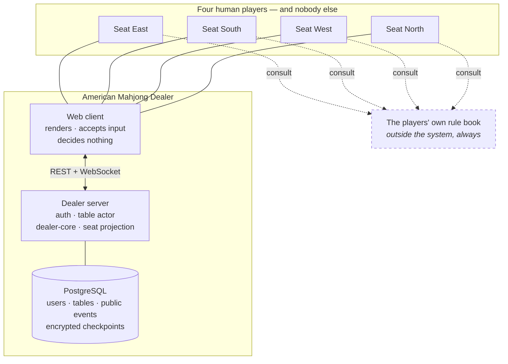

# American Mahjong Dealer — Design Documentation

> **The Dealer moves the tiles. The Players play the game.**
>
> The system knows physical facts, not Mahjong judgments.

| | |
|---|---|
| **Project** | American Mahjong Dealer |
| **Document** | PROJECT_DESIGN_README.md |
| **Status** | Design complete — implementation underway (Phase 0-3 complete; Phase 4's table actor, now including its REST surface, and Phase 5's gateway started) |
| **Last Updated** | 2026-09-02 |
| **Role in SSOT** | Entry point and map. Owns no architectural decision of its own; every statement here is a summary of a decision owned by a numbered chapter or an ADR. If this file and a chapter disagree, **the chapter wins**. |

---

## 1. What this repository is

This repository contains the **complete design documentation** for a web application called
**American Mahjong Dealer**. It contains no application code. The application will be implemented
later, from scratch, by human developers or by AI coding agents, working from these documents.

If you are an implementation agent, read [§9 Instructions for implementation agents](#9-instructions-for-implementation-agents) first.

---

## 2. What the application is

American Mahjong Dealer digitally recreates the experience of sitting at a physical American
Mahjong table with a human dealer. It is a **digital table plus a digital dealer** for four human
players.

Its entire responsibility is the *mechanical* half of a Mahjong game — the part a physical table
and a physical dealer perform:

- Hold a complete tile set and keep every tile accounted for
- Shuffle, build the wall, deal
- Let players draw, discard, expose, retract, swap, and pass tiles
- Track whose turn the table is at
- Keep concealed hands concealed
- Keep four players synchronized in real time
- Survive disconnects and reconnects

The players supply everything else. They bring the rule book, they know the rules, they decide what
is legal, they decide who won, and they resolve their own disputes — exactly as they would around a
physical table where the dealer's job is to move tiles, not to referee.

### 2.1 The one-sentence definition

> A neutral table that moves tiles when players tell it to, keeps hidden things hidden, and never
> has an opinion about the game.

---

## 3. What the application is emphatically not

These are not omissions or future work. They are **permanent architectural exclusions**, catalogued
as numbered negative requirements (`NR-###`) in [SCOPE_BOUNDARIES.md](SCOPE_BOUNDARIES.md) and
enforced by a dedicated CI test category.

| Not a… | Meaning |
|---|---|
| **Rules engine** | The system does not know the rules of American Mahjong and must never learn them |
| **Judge or referee** | It never decides whether a move, call, exposure, joker use, pass, or declaration is legal |
| **Winning-hand validator** | It never decides whether a hand wins |
| **Scoring system** | It computes no score, value, or result beyond "the players concluded the game" |
| **Financial system** | There are no points, wallets, ledgers, prices, purchases, transfers, or currency of any kind |
| **Rule book** | It neither ships, stores, interprets, nor enforces any rule book or card |
| **Assistant** | It never suggests, recommends, sorts, groups, arranges, analyzes, or optimizes anything for a player |
| **Spectator platform** | There is no observer role, no live viewer, no broadcast, and no external game-viewing API |
| **Replay system** | v1 ships no replay, because a faithful replay reconstructs concealed hands |

Why this matters enough to put in the third section of the entry document: the single largest risk
to this project is **drift**. An engineer or an AI agent handed a codebase named "Mahjong" will
reach instinctively for Mahjong rules. Every structure in this documentation set — the negative
requirements, the responsibility matrix, the validation boundary table, the absence test suite — is
built to make that drift visible and mechanically detectable.

---

## 4. Architecture summary

Fuller treatment in [docs/03_System_Architecture.md](docs/03_System_Architecture.md); each claim
below is owned by the chapter named beside it.

| Concern | Summary | Owner |
|---|---|---|
| Stack | TypeScript end-to-end. React client, Node + Fastify server, PostgreSQL, native WebSocket. No Redis in v1. | `03`, `ADR-0015`, `ADR-0014` |
| Shape | Four packages: `shared` (wire contract), `dealer-core` (pure mechanics), `server`, `web` | `03` |
| Authority | Server-authoritative. One in-process actor owns each table; commands are serialized, so ordering needs no locks | `05`, `ADR-0005` |
| Rule agnosticism | The server validates *mechanics and authorization*; it never validates *Mahjong rules* | `02`, `ADR-0002` |
| Privacy | Three visibility classes (`PUB` / `OWN` / `SRV`), one seat-view serializer, branded types that make a leak a compile error | `14`, `ADR-0006`, `ADR-0013` |
| Tiles | 152-tile equipment set; every tile individually tracked; addressed over the wire by opaque per-game handles | `07` |
| Randomness | Cryptographic seed, unbiased Fisher–Yates; a commitment hash is published at deal time and never revealed | `08`, `ADR-0008` |
| Real time | REST for everything outside a live table; WebSocket for the table itself; ticketed bind, per-seat frames | `12`, `ADR-0007` |
| Integrity | `cmdId` idempotency + per-connection `cseq` + one authoritative `seq` + stale-state rejection | `13`, `ADR-0009` |
| Persistence | Authoritative in memory; encrypted checkpoints for crash recovery; public-only event log; private material purged at game close | `16`, `ADR-0010` |
| Corrections | Bounded, unanimous, consent-based rewind — with a wall reshuffle when it crosses a wall draw | `05`, `ADR-0016` |
| Identity | Registered accounts; host-created private tables joined by a six-character code | `04` |

### 4.1 System context

The dashed line is the most important line in this repository. The rule book is consulted by
**people**, never by the software.

---

## 5. Documentation map

### 5.1 Root documents

| File | What it owns |
|---|---|
| [README.md](README.md) | Repository landing page. Exists because GitHub renders `README.md`; points here. Owns nothing. |
| [PROJECT_DESIGN_README.md](PROJECT_DESIGN_README.md) | This map. Owns nothing normative. |
| [SCOPE_BOUNDARIES.md](SCOPE_BOUNDARIES.md) | The `NR-###` negative-requirement catalog and the Physical vs Digital Responsibility Matrix |
| [DESIGN_DECISIONS_SUMMARY.md](DESIGN_DECISIONS_SUMMARY.md) | Every `D-CC-##` and every ADR in one table |
| [INHERITANCE_AND_EXCLUSION_ANALYSIS.md](INHERITANCE_AND_EXCLUSION_ANALYSIS.md) | What was taken from the reference project, what was redesigned, what was removed |
| [REQUIREMENTS_TRACEABILITY_MATRIX.md](REQUIREMENTS_TRACEABILITY_MATRIX.md) | Requirement → document → component → test |
| [SECURITY_REQUIREMENTS_MATRIX.md](SECURITY_REQUIREMENTS_MATRIX.md) | `SEC-###` controls and their enforcement points |
| [PRIVACY_THREAT_MODEL.md](PRIVACY_THREAT_MODEL.md) | `PT-##` — threats to concealed tiles, surface by surface |
| [THREAT_MODEL.md](THREAT_MODEL.md) | `T-##` — general STRIDE threat model |
| [DEFINITION_OF_DONE.md](DEFINITION_OF_DONE.md) | The eight gates a feature must pass |
| [IMPLEMENTATION_READINESS_CHECKLIST.md](IMPLEMENTATION_READINESS_CHECKLIST.md) | What must be answerable before code is written |

### 5.2 Numbered chapters

Chapters are numbered in dependency order: why → what → how → operate.

| # | Chapter | Owns |
|---|---|---|
| 00 | [Project Overview](docs/00_Project_Overview.md) | Objectives `OBJ-##`, constraints `C-##`, glossary, documentation governance |
| 01 | [Product Requirements](docs/01_Product_Requirements.md) | `FR-###` and `NFR-###` catalogs |
| 02 | [System Scope](docs/02_System_Scope.md) | The three contracts, responsibility matrix, validation boundary |
| 03 | [System Architecture](docs/03_System_Architecture.md) | Package decomposition, runtime topology, dependency law |
| 04 | [User Roles and Access](docs/04_User_Roles_and_Access.md) | Roles, permission matrix, table access model |
| 05 | [Game Table Architecture](docs/05_Game_Table_Architecture.md) | Table lifecycle, seating, table actor, correction bounds |
| 06 | [Digital Dealer Architecture](docs/06_Digital_Dealer_Architecture.md) | The dealer's complete mechanical duty list |
| 07 | [Tile Model](docs/07_Tile_Model.md) | Equipment spec, tile identity, opaque handles, conservation invariant |
| 08 | [Shuffle and Deal Architecture](docs/08_Shuffle_and_Deal_Architecture.md) | Randomization, wall construction, commitment scheme |
| 09 | [Game State Machine](docs/09_Game_State_Machine.md) | Table machine, game machine, overlay flags |
| 10 | [Player Action Model](docs/10_Player_Action_Model.md) | The complete command catalog |
| 11 | [Tile Interaction UX](docs/11_Tile_Interaction_UX.md) | Fidelity Contract, pointer model, free vs binding acts |
| 12 | [Realtime WebSocket Architecture](docs/12_Realtime_WebSocket_Architecture.md) | Connection lifecycle, envelopes, backpressure, resume |
| 13 | [Input Integrity](docs/13_Input_Integrity.md) | Idempotency, sequencing, stale state, hostile input |
| 14 | [Player Privacy](docs/14_Player_Privacy.md) | Visibility classes, policy matrix, the `SRV` boundary |
| 15 | [Security Architecture](docs/15_Security_Architecture.md) | AuthN, authZ, sessions, rate limiting, isolation |
| 16 | [Data Architecture](docs/16_Data_Architecture.md) | What is stored, where authority lives, retention |
| 17 | [Database Design](docs/17_Database_Design.md) | Tables, columns, constraints, encryption |
| 18 | [API Design](docs/18_API_Design.md) | REST conventions and endpoint catalog |
| 19 | [WebSocket Event Catalog](docs/19_WebSocket_Event_Catalog.md) | The normative wire catalog and naming law |
| 20 | [Logging and Observability](docs/20_Logging_and_Observability.md) | What may be logged, what never may, how to debug safely |
| 21 | [Error Handling and Recovery](docs/21_Error_Handling_and_Recovery.md) | Error taxonomy, client contract, server recovery |
| 22 | [Disconnect and Reconnect](docs/22_Disconnect_and_Reconnect.md) | Detection, grace, auto-pause, resume, abandonment |
| 23 | [Performance Requirements](docs/23_Performance_Requirements.md) | Targets, each with a measurement method |
| 24 | [Accessibility](docs/24_Accessibility.md) | Keyboard model, contrast, motion, assistive technology |
| 25 | [Testing Strategy](docs/25_Testing_Strategy.md) | What is tested, what deliberately is not, gates |
| 26 | [Test Architecture](docs/26_Test_Architecture.md) | Harness design, fixtures, frame inspection |
| 27 | [Deployment Architecture](docs/27_Deployment_Architecture.md) | Topology, environments, CI/CD, the multi-node seam |
| 28 | [Operations](docs/28_Operations.md) | Runbooks, monitoring, administration |
| 29 | [Disaster Recovery](docs/29_Disaster_Recovery.md) | Backup, restore, RPO/RTO, in-flight game policy |
| 30 | [Risk Register](docs/30_Risk_Register.md) | `RR-##` risks, owners, triggers, residual risk |

### 5.3 Subdirectories

| Directory | Contents |
|---|---|
| [docs/31_ADR/](docs/31_ADR/) | 16 Architecture Decision Records, an index, and the template |
| [docs/32_UX/](docs/32_UX/) | Screen inventory, table layout, tile component spec, interaction patterns |
| [docs/33_API/](docs/33_API/) | REST endpoint catalog, wire protocol contract, error code catalog |
| [docs/34_Testing/](docs/34_Testing/) | Privacy and absence suites; integrity and randomization suites |

---

## 6. Implementation principles

These are binding on the future implementation. Each is owned by a chapter; violating one is a
design defect, not a style disagreement.

1. **The documentation is the specification.** If code and documentation disagree, the documentation
   is right and the code is a bug — until the documentation is formally amended (`00 §12`).
2. **The server is authoritative; the client renders.** The client never decides, judges, or
   authorizes, and never predicts state. (`03`, `C-06`)
3. **Mechanics are validated; rules are not.** Before adding any check, find it in the validation
   boundary table in `02 §5`. If it is not on the left-hand side, do not add it. (`02`)
4. **Absence is a requirement.** `NR-###` entries are as binding as `FR-###` entries and are tested.
   (`SCOPE_BOUNDARIES.md`)
5. **One serializer.** Exactly one function converts authoritative state into something a client may
   receive, and it takes a seat. No other code path writes to a socket. (`14`)
6. **Concealed material never leaves its lane.** Not to another player, not to an administrator, not
   to a log, a metric, a trace, a crash report, an analytics event, or a backup that outlives the
   game. (`14`, `20`)
7. **`dealer-core` is pure.** No clock, no randomness, no I/O, no environment. Randomness and time
   are injected by the host. (`03`, `06`)
8. **Every performance target has a measurement method.** An unmeasurable target is a wish. (`23`)
9. **The player arranges their own hand.** The system never sorts, groups, or rearranges tiles on a
   player's behalf. (`11`, `NR-301`)
10. **Prefer the simpler mechanism.** This application serves four people at one table. Any
    distributed-systems machinery must earn its place against that fact. (`27`)

---

## 7. How to read this documentation

**If you are new to the project**, read in this order: this file → `SCOPE_BOUNDARIES.md` →
`docs/00` → `docs/02` → `docs/06` → `docs/09`. That is enough to understand what is being built and,
more importantly, what is not.

**If you are about to implement a feature**, read: the `FR-###` in `docs/01` → the chapter that owns
the feature → the relevant ADRs → the acceptance criteria in `docs/01 §7` → `DEFINITION_OF_DONE.md`.

**If you are reviewing a change**, read: `SCOPE_BOUNDARIES.md` → `DEFINITION_OF_DONE.md` →
`docs/14` if the change touches any player data at all.

---

## 8. Documentation conventions

Every chapter opens with the same five-row front-matter table and follows the same section skeleton;
the full convention, including the amendment process, is specified in
[docs/00_Project_Overview.md §12](docs/00_Project_Overview.md).

Identifier schemes, all globally unique:

| Scheme | Meaning | Owner |
|---|---|---|
| `OBJ-##` | Project objectives | `00` |
| `C-##` | Non-negotiable constraints | `00` |
| `FR-###` | Functional requirements | `01` |
| `NFR-###` | Non-functional requirements | `01` |
| `NR-###` | **Negative requirements** — things that must never exist | `SCOPE_BOUNDARIES.md` |
| `D-CC-##` | Design decision `##` made in chapter `CC` | each chapter |
| `SEC-###` | Security requirements | `SECURITY_REQUIREMENTS_MATRIX.md` |
| `PT-##` | Privacy threats | `PRIVACY_THREAT_MODEL.md` |
| `T-##` | General threats | `THREAT_MODEL.md` |
| `RR-##` | Risk register rows | `30` |
| `S-##` | Screens | `32_UX/Screen_Inventory.md` |
| `AC-###` | Acceptance criteria | `01` |
| `TC-###` | Test cases | `25`, `26`, `34_Testing/` |
| `ADR-####` | Architecture Decision Records | `31_ADR/` |

---

## 9. Instructions for implementation agents

This documentation is deliberately **AI-agent neutral**. It assumes no particular tool, no
vendor-specific command, and no persistent agent memory. Everything needed to implement the system
correctly is written down here.

### 9.1 Before writing any code

Work through [IMPLEMENTATION_READINESS_CHECKLIST.md](IMPLEMENTATION_READINESS_CHECKLIST.md). If you
cannot answer one of its questions from the documentation, that is a documentation defect — report
it rather than inventing an answer.

### 9.2 The rule that matters most

You are implementing a Mahjong **table**, not a Mahjong **game**. Your training data is full of
Mahjong rules, hand patterns, scoring tables, and legality checks. **None of it belongs in this
codebase.**

Before you add any conditional that mentions a Mahjong concept, apply this test:

> Could a person who has never heard of Mahjong, looking only at the physical tiles and the table,
> determine the answer?

- "Does this seat hold this tile?" — yes, you can see it. **Implement it.**
- "Is this tile already in the discard pile?" — yes, you can see it. **Implement it.**
- "Is this a legal exposure?" — no, you would need the rules. **Do not implement it.**
- "Does this hand win?" — no, you would need the rules. **Do not implement it.**

The full boundary is tabulated in [docs/02_System_Scope.md §5](docs/02_System_Scope.md).

### 9.3 When the documentation seems to be missing a rule

It is not missing. Its absence is the design. If the deal places thirteen tiles and says nothing
about what happens when a player ends up with fourteen, that silence is deliberate: hand size is a
rule, and the system does not enforce rules. Do not fill the gap.

If you genuinely believe a mechanical behaviour is unspecified — not a rule, a mechanism — raise it
as a documentation question. Do not resolve it by writing code.

### 9.4 Things you may be tempted to add, and must not

Sorting a player's tiles "for convenience." Highlighting matching tiles. Graying out "invalid"
actions. Warning that a discard "looks like a mistake." Counting how close a hand is to anything.
Suggesting a move. Auto-passing on a timer. Auto-arranging after a draw. Detecting a win to save the
players a click. Every one of these is a negative requirement, and every one has a test that will
fail. See [SCOPE_BOUNDARIES.md §4](SCOPE_BOUNDARIES.md).

### 9.5 Traceability

Every module you write should be attributable to a requirement. The
[REQUIREMENTS_TRACEABILITY_MATRIX.md](REQUIREMENTS_TRACEABILITY_MATRIX.md) maps every `FR`, `NFR`,
`NR` and `SEC` identifier to its owning document, its component, and its tests. If you are writing
code that no requirement calls for, stop and ask why.

---

## 10. Status and provenance

This is a **new, independent project**. An earlier and different application, "American Mahjong
Online," was inspected read-only as a source of architectural and documentation patterns. Nothing
was copied from it: no code, no schema, no rule configuration, no business logic. What was taken,
what was redesigned, and what was deliberately discarded is recorded in
[INHERITANCE_AND_EXCLUSION_ANALYSIS.md](INHERITANCE_AND_EXCLUSION_ANALYSIS.md).

Implementation has begun, in the order `IMPLEMENTATION_READINESS_CHECKLIST.md §6` prescribes: a
`pnpm` workspace with the five packages named in `§4`, strict compiler configuration, and
lint-enforced dependency and purity gates (Phase 0); and, in `dealer-core`, the full mechanical
command catalog (Phase 2) — tile-set construction (`buildTileSet`), opaque handle minting, the
unbiased Fisher–Yates shuffle with rejection sampling, the SHA-256 commitment scheme, the atomic
opening deal, the conservation invariant, checkpoint serialize/restore, and the seat projector
(`project`, with a proof file confirming its output is rejected by a `NoConcealed<T>` sink).

All four `GameState` lifecycles are modeled (`idle`, `in_play`, `concluding`, `concluded`, the last
purging concealed material per `docs/16 §5.5`), along with the three overlay flags (`docs/09 §5`) and
23 of the catalog's commands: `start_deal`, `draw_tile`, `discard_tile`, `claim_discard`,
`expose_tiles`, `retract_exposure`, `swap_exposed_tile`, `arrange_hand`, the pass-round family
(`open_pass_round`/`commit_pass`/`withdraw_pass`/`cancel_pass_round`, with atomic execution on the
last commit), the conclusion family (`declare_mahjong`/`reveal_hand`/`respond_declaration`/
`withdraw_declaration`/`propose_end_game`/`respond_end_game`), the correction family
(`propose_correction`/`respond_correction`, including the wall-draw reshuffle from `docs/05 §8.4`),
`request_pause`/`request_resume`, and `send_table_message`/`send_signal` — each validated against the
closed vocabulary in `docs/02 §3.1`.

Two scope boundaries, both documented in code: `set_ready`, `clear_ready`, and `close_table` belong
to the table entity (`docs/05`) and its actor (`server`, Phase 4), not this game-mechanics core; and
`bind`/`resume`/`ping` change no game state and belong to the gateway (`docs/12`, Phase 5). Since
`dealer-core` retains no history of its own (it is pure — `docs/03 §5`), `propose_correction` and
`respond_correction` take two host-supplied fields beyond the wire-facing command shape (the oldest
retained checkpoint sequence, and the checkpoint to restore to) — the same pattern `start_deal`
already established for injected entropy.

The rest of Phase 1 (`docs/03 §4.2`'s "wire protocol: command shapes, frame shapes, event shapes,
error codes, close codes... schema validators for every inbound command") is now built in `shared`,
transcribed field-for-field from `docs/19_WebSocket_Event_Catalog.md` and
`docs/33_API/Wire_Protocol_Contract.md`: the 30-command catalog (`ClientFrame`, one discriminated
union over `cmd`) with a `zod` validator per command enforcing exactly the stated structural bounds
(1-20 unique handles, 2-4 distinct-`from` routing entries, 1-512 character messages — never a
group-shape or count rule, per `docs/33_API §4.1`); the 7 server frame types; a 39-event table
catalog with PUB fields required and OWN fields optional on one merged type per event, matching
`docs/19 §6`'s "one event, four payloads" model; the rejection (17), close (8), and notice (3) code
catalogs; and the wire seat-view schema. Two catalogs (commands, events) carry a compile-time
exhaustiveness check — a witness object or a type-level key-set equality — so a name added to the
union but not the roster (or vice versa) fails the build, which is what `docs/19 §9`'s "name
inventory" check asks for.

Three judgment calls worth flagging against the SSOT rather than treated as settled: (1) a
row-by-row transcription of `docs/19 §6.1`-`§6.7` gives 39 events, not the "38" in that document's
own revision history — recorded as a likely off-by-one in the doc, not reconciled by dropping a row;
(2) `docs/33_API §5`'s illustrative seat-view example shows exposure tiles as bare faces, but
`swap_exposed_tile`'s `exposedHandle` parameter has no other source, so `WireExposure` carries
handles too; (3) that same example shows only a `declaration` field with no `endGame` counterpart,
though `propose_end_game`/`respond_end_game` is a distinct PUB process from a declaration
(`docs/10 §7`) — a `WireEndGame` field was added for symmetry. None of these needed inventing new
behavior, only a documented choice where the tables didn't fully specify the shape.

`dealer-core`'s own `SeatView`/`DealerEvent` types (built in Phase 2, before this wire contract was
transcribed) do not yet match these wire shapes field-for-field — composing a table's `tableState`
with a game's projected fields into the exact wire `WireSeatView`, and `dealer-core`'s internal
events into `TableEvent`, is the table actor's job (Phase 4/5), not a gap in either layer.

Library versions were pinned at TypeScript 5.9.3 rather than the newly-released 7.x line, so that
`typescript-eslint` — which the dependency-law and purity lint gates depend on — remains compatible;
this is an implementation-time choice under `ADR-0015`, not a revision of it.

**Phase 4's table actor** is started, in `server` (`docs/05_Game_Table_Architecture.md §6`; skipping
ahead of Phase 3's `db`/auth, since the actor can run against an in-memory table and injected
entropy without either): `table/table.ts` (the four-seat entity, `docs/05 §3`-`§5`, seat assignment
in fixed order, host-on-first-seat, readiness); `table/actor.ts` (`TableActor`, a synchronous
`submit` pipeline — Node's single-threaded, run-to-completion event loop gives "one writer, no
locks" for free, docs/05 §6.1, so no explicit queue data structure was needed); `table/checkpoints.ts`
(a bounded ring buffer for correction, `docs/05 §8.3`'s "last 10 public actions"); `table/events.ts`
and `table/view.ts` (the reconciliation flagged as follow-up above: mapping `dealer-core`'s internal
`DealerEvent`/`SeatView` onto the wire `TableEvent`/`WireSeatView`); and a `TableHarness`
(`docs/26 §3`) for driving it in tests with no transport.

The actor also implements the three commands `dealer-core` deliberately left out —
`set_ready`/`clear_ready`/`close_table` — since those belong to the table entity, not game mechanics.
One design point worth flagging: `dealer-core`'s `GameState.seq` restarts at 1 on every `start_deal`
(fresh game), but the wire `seq` must never reset for a table's life (`docs/33_API §6`, `docs/19
§3.2`). The actor therefore keeps its **own** monotonic `seq`, separate from `dealer-core`'s, and
translates between the two spaces at exactly the one place they meet: `propose_correction`'s
`rewindTo` and `respond_correction`'s resulting `CorrectionApplied.restoredSeq`, both expressed to
the client in the actor's seq space, translated to `dealer-core`'s own seq space (and back) via the
actor's checkpoint history. `ack` frames are not modeled here since they require a client `cmdId`,
an idempotency/gateway concern (`docs/13`) this actor doesn't yet see; the `event` frame delivered to
the acting seat stands in for confirmation in this slice. `bind`/`resume`/`ping`, real accounts and
connect tickets, and asynchronous persistence remain gateway (Phase 5) and `db` (Phase 3) work.

**Phase 3's schema** is started, in `db` (`docs/17_Database_Design.md`): two forward-only SQL
migrations (`docs/17 §3`: an applied migration is immutable, corrections are new migrations) — the
eleven tables in dependency order, six native enumerations, every constraint named in `docs/17 §6`
(one seat per account platform-wide via a partial unique index, at most one live game per table,
single-use tickets, no duplicate sequence in the event log, exactly-once command receipts via a
composite primary key), and append-only triggers on `game_events` and `audit_log`. The second
migration creates the three roles from `docs/17 §7.2` and implements the column-level `REVOKE`/
`GRANT` that denies the general `app` role `SELECT` on either encrypted `private_state` column —
D-17-03's "second barrier behind encryption." Plain SQL files plus a minimal `pg`-based runner
(`migrate`/`listMigrations`) rather than an ORM's migration DSL, for the same proportionality reason
`ADR-0015` gives for Fastify over a heavier framework: this schema's load-bearing detail is exactly
the DDL an ORM abstraction tends to make awkward — column grants, triggers. Also added: `uuidv7()`
(`docs/17 §3`: "Application-generated UUIDv7," since IDs are assigned before the first `INSERT`, not
by a database default) and TypeScript row types mirroring every table.

Registration, login, session issuance, and Argon2id password hashing — the rest of Phase 3 — are
`server`'s job against this schema and are not built. Nor is any live-database integration test:
this environment has two already-running Postgres/Redis containers, but inspecting the Postgres one
showed it belongs to the *other* project on this machine (`~/Projects/American Mahjong` — its tables
include `ledger_postings`, `point_purchases`, `rule_versions`, exactly the subsystems this project's
ADRs exclude), so it was left untouched rather than connected to, and no new database container was
started without being asked. The migrations are therefore verified statically (schema smoke tests
reading the SQL text) rather than by an integration suite against a live database — a real gap
against `docs/26 §7`'s `PersistenceHarness`, worth closing before this schema is trusted in anger.

**Phase 5's gateway** is started, in `server` (`docs/12_Realtime_WebSocket_Architecture.md`,
`docs/13_Input_Integrity.md`), written against a transport-agnostic `SocketLike` interface so the
protocol logic is unit-tested with no real network — the same discipline `dealer-core`'s
`TableHarness` and `db`'s SQL smoke tests already follow — then wired to a real `ws`-based
`attachWebSocketGateway` and proven against an actual socket in a smoke test (including a real
origin-rejection close).

Implemented: ticket-based binding (single-use redemption, one connection per seat with the newest
replacing the older per `D-12-10`, a real `setTimeout`-driven 5-second bind deadline calling an
injected-clock-testable `checkBindDeadline`); the full `docs/13 §9` pipeline in the order it
specifies — `cseq` contiguity (closing on a gap, treating an exact repeat as a retransmission),
per-connection rate limiting (a token bucket, closing after 20 consecutive throttled attempts),
structural schema validation (reusing `shared`'s `COMMAND_SCHEMAS`), `cmdId` idempotency (replaying
the original `ack`/`reject` without touching the actor again), and staleness checking on the five
order-sensitive commands (`claim_discard`, `swap_exposed_tile`, `respond_correction`,
`respond_declaration`, `respond_end_game`); resumption via a 200-event backlog capped in the actor
itself, falling back to a full seat view beyond it; and backpressure tracked as bytes handed to the
socket and not yet flushed (`docs/12 §9.1`'s point that the platform's own buffered-amount metric
detects a stall too late).

Two bugs worth naming because tests caught them, not review: `ping`/`resume` frames were originally
special-cased *before* the `cseq`/rate-limit checks, meaning a flood of pings could bypass sequencing
and throttling entirely — found by a rate-limit test that kept passing for the wrong reason (pings
never reached the limiter). And `arrange_hand` — the one command that broadcasts nothing (`docs/10
§5.7`) — advances the actor's `seq` without any client's delivery cursor moving, which would have made
every connection look spuriously "stale" on its very next order-sensitive command; fixed by treating
an all-silent broadcast round as evidence nobody actually fell behind.

One design point, not a bug: `dealer-core`'s `GameState.seq` restarts at 1 on every new game, but
the wire `seq` may never reset for a table's life. The table actor (`docs/05 §6`) already resolves
this by keeping its own monotonic `seq`, and the gateway's staleness/resumption cursors are built on
top of *that* number, never `GameState.seq` directly — this is the same seam flagged when the actor
was built, now load-bearing for the gateway too.

Not built at the time of this slice: heartbeat scheduling (`docs/12 §7`) — still true — and
session-revocation polling (`docs/12 §4.3`), which needed a real timer loop and, for revocation, the
session store Phase 3's auth half hadn't built yet. Revocation polling was added once both existed;
see below. `bind`'s own rate limit (10 per session per minute, distinct from the per-connection
command limit) is also not implemented.

**The rest of Phase 3 — registration, login, sessions** — is now in `server/src/auth/`
(`docs/15_Security_Architecture.md`, `docs/04_User_Roles_and_Access.md`,
`docs/33_API/REST_Endpoint_Catalog.md §3`), covering 8 of that catalog's 14 REST endpoints (accounts
and sessions; the 5 table and 6 admin endpoints — the doc's own total is 19 by direct count, another
discrepancy against its stated "fourteen," in the same spirit as the 39-vs-38 event count flagged
above — are not built).

`passwords.ts` hashes with Argon2id (a server-side pepper from `pepper.ts`, parameters set to a
current baseline with a comment flagging the annual review docs/15 §4.1 requires) and enforces the
length-plus-breach-check policy from the same section — the breach list's *source* is
`IMPLEMENTATION_READINESS_CHECKLIST.md §4.2`'s own open item, so `breach-checker.ts` defines the
interface and a null default rather than presupposing an answer. `tokens.ts` generates 256-bit
session tokens and stores only their SHA-256 hash. `lockout.ts` implements the durable, progressive
per-account lockout `docs/15 §7.1` requires live in PostgreSQL rather than memory — the exact curve
(1 minute at 5 failures, doubling every 5 more, capped at an hour) is an implementation default in
the same spirit as several of dealer-core's own defaults, not a value the docs pin down. `csrf.ts`
implements the double-submit check. `service.ts` (`AuthService`) is the business logic — register,
login, logout, session validation with both absolute and idle expiry, password change (revoking
every other session but the initiating one), session listing/revocation — depending only on
`repository.ts`'s interfaces, so it is fully tested against `memory-repository.ts` without a
database. `http.ts` wires it to Fastify (this project's first use of the framework `ADR-0015` named)
and is tested with Fastify's own `inject()`, exercising the real HTTP pipeline without a live
listener.

`postgres-repository.ts` is the real implementation, written against `db`'s schema — but, like `db`'s
own migrations, **not exercised against a live database** in this environment, for the reason
recorded in project memory: the only running Postgres on this machine belongs to a different,
unrelated project and was left untouched. Also not implemented: `POST /accounts/me/password`'s own
durable per-account rate limit (`docs/18 §6`) — there is no schema column for it, unlike login's
`failed_logins`/`locked_until` — and the gateway's periodic session-revocation re-check
(`docs/12 §4.3`) that would consume this session store to close a revoked session's live socket
within 5 seconds.

One bug worth naming: an early draft of the equivalent-work timing defense for unknown-account login
attempts (`D-15-05` — identical response and timing for a wrong password and a nonexistent account)
used a hand-written string made to *look* like a real Argon2id hash. It would have parsed
differently from a genuine one and quietly defeated the timing equalization it existed for; fixed by
computing it once, for real, from an actual call to the hashing function, rather than typing out a
plausible-looking constant.

**Phase 4's table actor now has its REST-facing half**, in `server/src/tables/`
(`docs/33_API/REST_Endpoint_Catalog.md §4`): the remaining 5 of the catalog's 14 endpoints —
`POST /tables`, `POST /tables/join`, `GET /tables/mine`, `DELETE /tables/{id}`, and
`POST /tables/{id}/connect-ticket` — bringing the REST surface to 13 endpoints (only the 6-endpoint
administrative half, Phase 7 territory, remains against the 19-by-direct-count total flagged above).

A `TableManager` holds one live `TableActor`/`TicketStore`/`TableGateway` triple per table in a plain
`Map`, keyed by table id — the same "exactly one process owns a table" reasoning `owner_node`
(`docs/17 §5.4`) already encodes, so no lookup service is needed. `TableService` follows the actor's
own direction of truth: it mutates the live `TableActor` first (`occupySeat`, the actor's own
`close_table` command), and only on success mirrors the result into a new `TableRepository`
(`tables`/`table_seats`, `docs/17 §5.4`, §5.5) — never the other way around, so the durable rows can
never show a seat the actor itself refused to grant. Join codes (`codes.ts`) use the 32-character,
visually-unambiguous alphabet `docs/15 §7.2` specifies, generated with the platform's CSPRNG and, like
a session token, stored only as a SHA-256 hash (`D-17-07`). A full table on `POST /tables/join` is
folded into the same uniform `404` as a wrong code or an unknown table (`docs/18 §4.2`) rather than a
distinguishable `TABLE_FULL` — deliberately, so the failure reveals nothing. `GET /tables/mine`'s
`connected` field reuses a small new `TableGateway.isConnected` query against the same connection map
`bind`/`resume` already populate.

The CSRF/session double-submit check that guarded only `auth/http.ts`'s own routes was pulled out
into `auth/session-guard.ts` so this second route module authenticates state-changing requests the
same way rather than a second, divergent implementation of a security-critical comparison.

Not built: the live table registry's crash-recovery reconstruction from a checkpoint (docs/29) — a
table created in an earlier process lifetime is invisible to a restarted process's `TableManager`,
which this slice flags rather than papers over; `Idempotency-Key` on `POST /tables` (`D-18-10`); and,
as before, `postgres-repository.ts`'s table-facing counterpart is written against the schema but not
exercised against a live database, for the same reason the auth one isn't.

One bug worth naming here too: an early version of the `GET /tables/mine` test built `AuthService`
and `TableService` against two *separate* `InMemoryAccountRepository` instances, so a seated guest's
display name — resolved by `TableService` against the accounts store — never resolved, because the
account had only ever been written into the auth side's copy. Fixed by sharing one repository
instance between both services, which is also now a wiring note on `TableService` itself: in
production this means one `AccountRepository` (one connection pool), not two.

**`gateway/multi-table-router.ts` now routes a real socket to the right table.**
`attachWebSocketGateway` (`ws-server.ts`) serves exactly one `TableGateway` — fine for its own smoke
test, but a real deployment has many live tables, each a separate entry in `tables/manager.ts`'s
`TableManager`. A connect ticket already carries its `tableId` (`TicketClaims`), so
`attachMultiTableGateway` peeks that claim — via a new, non-consuming `TicketStore.peek`, added
alongside the existing consuming `redeem` — to find the right `TableGateway` *before* that gateway
ever sees the socket, then replays the same bind frame into that gateway's own
`acceptConnection`/`handleBind`, which performs the real, consuming redemption against that same
`TicketStore` instance. `gateway.ts` itself is untouched beyond exporting the two small frame-parsing
helpers both modules now share, so its own test suite needed no changes.

One design point, not a bug: once routed, the destination gateway's own 5-second bind-deadline check
becomes trivially satisfied, because its internal `connectedAt` is captured at the (slightly later)
moment `acceptConnection` is finally called, not when the socket actually opened. The router carries
its own deadline instead, measured from the real connection time — the same "must send a
recognizable bind frame within 5 seconds" property the single-table server enforces, just enforced
one layer up rather than by the reused logic underneath it.

**Session revocation (docs/12 §4.3) is now built.** `TableGateway.checkSessionRevocation` closes any
bound connection whose session has been revoked or expired, with `4004`, the same "callable check a
real timer drives" pattern `checkBindDeadline` already established — snapshotting the connection list
before awaiting anything and reusing `handleBind`'s own "a newer bind already replaced this one"
identity guard, so a since-superseded connection can't wrongly evict its replacement from the map. A
real `setInterval` in `ws-server.ts` drives it for the single-table server; `multi-table-router.ts`
drives one shared interval across every table in `TableManager`, re-reading `TableManager.all()` on
each tick so a table created after the server was attached is covered without re-registering
anything. The poll interval (2s, an unpinned implementation default the same way `lockout.ts`'s curve
is) is overridable per attach call, which is what lets the real-socket tests in both files finish in
milliseconds instead of waiting out a real interval.

The check itself is backed by a new `AuthService.isSessionActive(sessionId)`, deliberately lighter
than `validateSession`: it takes a session id rather than a raw token — the gateway only ever has the
id, carried in a connect ticket's own server-side claims, minted after the token was already verified
once at REST time — and it never calls `touch()`, so a live socket doesn't silently reset its own idle
timer just by existing. It enforces exactly the two invariants docs/12 §4.3 requires (revocation, and
the account still being real and enabled) and deliberately leaves idle expiry to REST activity, as it
already is — a distinction the test suite pins down explicitly rather than leaving to be discovered
by accident. `Connection` gained a `sessionId` field to carry this (mirroring `seat`), which meant
reordering its constructor's parameters — its one call site, `handleBind`, was the only thing to
update.

**Auto-pause on disconnection (docs/22 §5) is now built**, following the design already recorded in
dealer-core's own `state.ts` module comment: "the host issues the same `request_pause` this module
implements once it detects an absence." `TableGateway.onClose` calls the new `autoPauseOnAbsence`,
and `handleBind` calls `autoResumeOnReturn` on every (re)bind; both simply submit dealer-core's own
`request_pause`/`request_resume` for the affected seat and let dealer-core's own guards decide
whether anything happens — `applyRequestPause` already rejects outside `in_play`/`concluding` or while
already paused, and `applyRequestResume` already rejects for any seat but the one that holds the
pause, so the gateway needs no lifecycle awareness of its own. Both call `deliverNewFrames()` on
success, so already-connected seats see `TablePaused`/`TableResumed` live, the same delivery path any
player-issued command uses.

Building the first test surfaced two gaps, both left unfixed and documented rather than papered over
in the test:

- **`PauseState` holds exactly one seat** (`requestedBy`, dealer-core Phase 2). If seat A is already
  auto-paused and seat B also goes absent, B's own `request_pause` is rejected — the table stays
  paused (already the correct externally-visible state) but B's absence is never itself recorded, so
  docs/22 §5.2's "if both hold, stays paused until both clear" isn't fully realized. Fixing it needs a
  multi-holder `PauseState`, a dealer-core model change this slice didn't make.
- **The wire event's `reason` field reads `"requested"`, never docs/22 §5's `"seat_absent"`** — a test
  had to be corrected to expect the former after first asserting the latter. `toWireEvent` hardcodes
  the string because dealer-core's own `request_pause` command and `TablePaused` event carry no reason
  at all; distinguishing the two needs a reason to travel through dealer-core's command/event types,
  which is its own small design question (command-supplied, or actor-overridden after the fact?) left
  to a future slice.

Still not built: heartbeat scheduling (docs/12 §7) — without it, only a *clean* socket close reaches
`onClose`; an unclean network loss goes undetected — and the admin REST endpoints.

284 tests passing overall. No client code exists yet.

---

## 11. Revision History

| Version | Date | Author | Changes |
|---|---|---|---|
| 0.1 | 2026-09-02 | Design (architect role), owner-approved | Initial design documentation package |
| 0.2 | 2026-09-02 | Design (architect role), owner-approved | Added `/README.md` to the root documents map; it is a repository landing page for platform convention and owns nothing normative |
