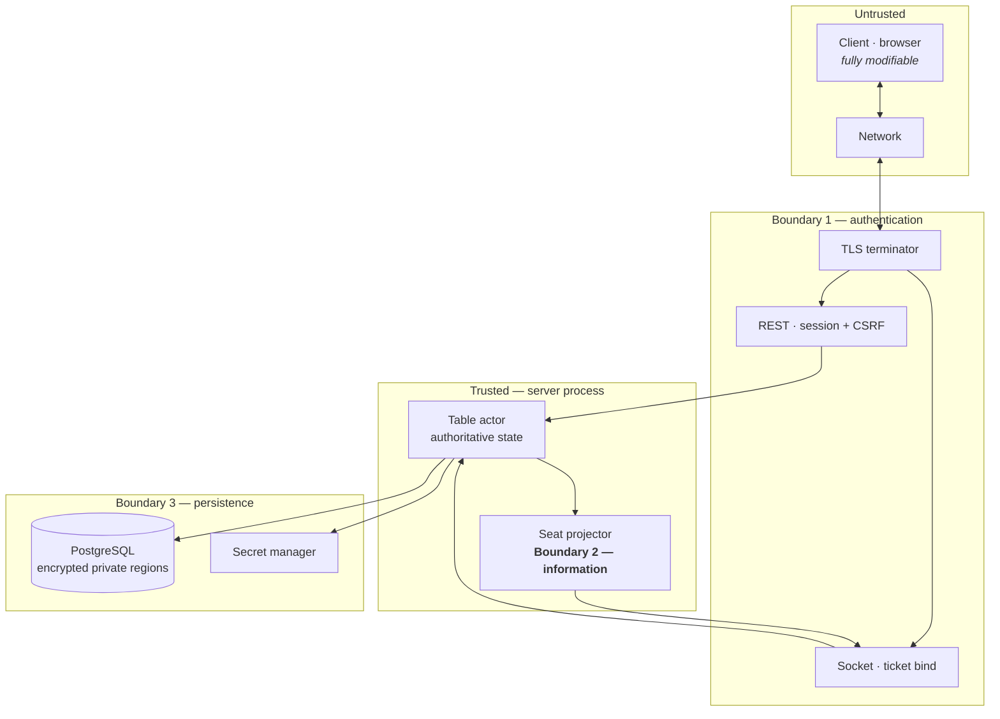

# Threat Model

| | |
|---|---|
| **Project** | American Mahjong Dealer |
| **Document** | THREAT_MODEL.md |
| **Status** | Normative — binding on all implementation |
| **Last Updated** | 2026-09-02 |
| **Role in SSOT** | Owns the general `T-##` security threat analysis using STRIDE. Does **not** own the concealed-tile analysis (`PRIVACY_THREAT_MODEL.md`), the controls' design (`docs/15`), or the requirement matrix (`SECURITY_REQUIREMENTS_MATRIX.md`). |

---

## 1. Scope and method

**Methodology**: STRIDE — Spoofing, Tampering, Repudiation, Information disclosure, Denial of
service, Elevation of privilege — applied to the trust boundaries in `§3`.

Information disclosure of **concealed tiles** is analysed separately and in far more depth in
`PRIVACY_THREAT_MODEL.md`, because it is the system's primary asset and has its own adversary model.
This document covers everything else, and cross-references rather than duplicating.

### 1.1 What makes this model unusual

The asset inventory is short. There is **no money** (`ADR-0003`), nothing saleable, no transaction
that cannot simply be repeated, and no regulated data. What remains is account credentials, live
game state, and service availability.

That has two consequences. Whole threat categories that dominate most models — financial fraud,
transaction tampering, regulatory exposure — are **absent by construction** rather than mitigated.
And the categories that remain get proportionate rather than exhaustive treatment: the honest
assessment of a denial-of-service attack here is that four people cannot finish a game of Mahjong,
which is annoying and not more.

**Likelihood** 1 remote – 5 near-certain. **Impact** 1 negligible – 5 critical.

---

## 2. Assets

| Asset | Value | Loss impact |
|---|---|---|
| Account credentials | Access to an account; reuse elsewhere | 4 |
| Session tokens | Impersonation | 4 |
| Concealed hands, live | Advantage in a game | 5 — see `PRIVACY_THREAT_MODEL.md` |
| Wall order | Complete knowledge of a game | 5 — see `PRIVACY_THREAT_MODEL.md` |
| Live game state | An in-progress game | 3 |
| Join codes | Entry to a private table | 3 |
| Service availability | Ability to play | 3 |
| Audit records | Accountability | 3 |
| Display names | Minimal | 1 |
| **Money** | **None exists** | — |

---

## 3. Trust boundaries

| Boundary | Separates | Enforced by |
|---|---|---|
| **1 — Authentication** | Anonymous from authenticated | Sessions, CSRF, tickets, rate limits (`docs/15 §4`) |
| **2 — Information** | Authoritative state from what a seat may see | The single projector (`docs/14 §5`) |
| **3 — Persistence** | Application from stored data | Encryption plus column privilege (`docs/17 §7`) |

Boundary 2 is the unusual one and the most important: it sits **inside** the trusted zone, because
the primary adversary is a legitimate player (`PRIVACY_THREAT_MODEL.md §3`).

---

## 4. Threats

### 4.1 Spoofing

| ID | Threat | Asset | L | I | Score | Mitigation | Residual |
|---|---|---|---|---|---|---|---|
| **T-01** | Credential stuffing or brute force | Credentials | 4 | 4 | 16 | Argon2id + server-side pepper; **durable** per-account lockout; per-address limits; breach-list rejection; uniform failure responses | **Low** |
| T-02 | Session token theft | Sessions | 2 | 4 | 8 | 256-bit opaque tokens hashed at rest; `HttpOnly`, `Secure`, host-prefixed, `SameSite=Lax`; strict CSP | Low |
| T-03 | Session fixation | Sessions | 1 | 4 | 4 | A fresh token issued on every authentication | Low |
| T-04 | Connect-ticket capture and replay | Seat access | 2 | 4 | 8 | Single use enforced by a unique constraint; 30 s expiry; **never in a URL** | Low |
| T-05 | Acting as another seat | Game state | 2 | 5 | 10 | **No seat parameter exists** (`NR-601`); the binding decides; `TC-I01` | **Low** |
| T-06 | Account enumeration via registration or login | Credentials | 3 | 2 | 6 | Uniform responses and timing; duplicate registration returns success and notifies the owner | Low |

`T-01` is the highest-scoring threat in the model, which is the correct result for a system with no
money: credentials are the most valuable thing an external attacker can obtain, mostly because people
reuse them elsewhere.

### 4.2 Tampering

| ID | Threat | Asset | L | I | Score | Mitigation | Residual |
|---|---|---|---|---|---|---|---|
| T-10 | A client asserts false state | Game state | 4 | 4 | 16 | Server-authoritative; the client's report of state is never accepted (`C-05`); the five mechanical validations (`docs/02 §3.1`) | **Low** |
| T-11 | A client chooses its own tiles | Game fairness | 3 | 5 | 15 | No command names a tile to draw; wall order is `SRV`; `TC-R02` | Low |
| T-12 | A client influences the shuffle | Game fairness | 2 | 5 | 10 | No client input path to entropy; static audit `TC-R05`; seed injection compiled out `TC-R06` | Low |
| T-13 | Command replay causing double application | Game state | 3 | 3 | 9 | `cmdId` idempotency; receipts in checkpoints; `TC-I04` | Low |
| T-14 | Command reordering | Game state | 2 | 3 | 6 | `cseq` contiguity; a gap closes the socket; `TC-I05` | Low |
| T-15 | Cross-site request forgery | Account | 2 | 3 | 6 | Double-submit token on every non-safe method; `SameSite` cookies | Low |
| T-16 | SQL injection | All data | 2 | 5 | 10 | Parameterized queries throughout; no dynamic SQL construction | Low |
| T-17 | Script injection via chat | Sessions | 3 | 4 | 12 | Chat rendered as **plain text always**; strict CSP with no inline script; never persisted | Low |
| T-18 | Audit record tampering | Accountability | 1 | 3 | 3 | Append-only enforced by database trigger | Low |
| T-19 | A modified client plays automatically | Fairness | 3 | 1 | 3 | Cannot be prevented (`docs/13 §3.1`). Rate limits bound the speed; a bot would need the rules, which the client does not have | Accepted |

`T-19` is stated honestly and accepted. A player could automate their own client. Since the client
contains no game logic (`docs/03 §4.1`) and the system provides no rule knowledge, such a bot would
have to bring its own — at which point the player has built a Mahjong engine to cheat at a game with
no stakes. The threat is real and the incentive is not.

### 4.3 Repudiation

| ID | Threat | Asset | L | I | Score | Mitigation | Residual |
|---|---|---|---|---|---|---|---|
| T-20 | A player denies an action | Game state | 3 | 1 | 3 | Public event log attributes every action to a seat, in order | Low |
| T-21 | An administrator denies an action | Accountability | 2 | 3 | 6 | Append-only audit log; **mandatory reason** enforced by the endpoint | Low |
| T-22 | An operator denies altering a wall | Game fairness | 1 | 3 | 3 | Commitment published before play; recomputable in an audit (`docs/08 §5.2`) | Low |

Repudiation scores low throughout, and the reason is structural: with nothing of value at stake,
there is little to repudiate. `T-22` is the one that matters, and the commitment scheme exists
precisely to answer it (`ADR-0008`).

### 4.4 Information disclosure

Concealed tiles are covered in `PRIVACY_THREAT_MODEL.md` — 34 threats. Everything else:

| ID | Threat | Asset | L | I | Score | Mitigation | Residual |
|---|---|---|---|---|---|---|---|
| T-30 | Table enumeration via join codes | Table access | 2 | 3 | 6 | Rate limits per account and per address; irreversible storage; uniform `404`; short validity (`docs/15 §7.2`) | Low |
| T-31 | Email disclosure to other players | Account data | 2 | 2 | 4 | Only display names are projected; email appears in no table surface | Low |
| T-32 | Internal detail in error responses | Reconnaissance | 3 | 2 | 6 | Closed error-code catalog; `500` carries a correlation identifier only | Low |
| T-33 | Secrets in logs or configuration | All data | 2 | 5 | 10 | Secret manager; startup refusal on defaults; log scanner | Low |
| T-34 | Version and stack disclosure | Reconnaissance | 3 | 1 | 3 | Minimal response headers; no framework banners | Low |

### 4.5 Denial of service

| ID | Threat | Asset | L | I | Score | Mitigation | Residual |
|---|---|---|---|---|---|---|---|
| T-40 | Connection flood | Availability | 3 | 3 | 9 | Per-session bind limits; per-address limits; platform-level protection | Medium |
| T-41 | Command flood on a bound socket | Availability | 3 | 2 | 6 | 5/s with burst 10; close after 20 consecutive throttles | Low |
| T-42 | Slow-consumer memory exhaustion | Availability | 2 | 3 | 6 | Backpressure measured as bytes handed off; close at 1 MB (`docs/12 §9`) | Low |
| T-43 | Oversized frames | Availability | 2 | 2 | 4 | 16 KB maximum enforced by the platform | Low |
| T-44 | Table exhaustion by mass creation | Availability | 3 | 2 | 6 | 10 tables per hour per account; one seat per account | Low |
| T-45 | Correction-proposal spam | Table usability | 3 | 2 | 6 | One open proposal at a time; 3 per minute per seat | Low |
| T-46 | Database exhaustion via checkpoint churn | Availability | 2 | 3 | 6 | One row per table overwritten; bounded correction window | Low |
| **T-47** | **Single-process failure** | Availability | 4 | 3 | 12 | Checkpoints; automatic restart; lossless graceful deploy; documented seam (`docs/27 §8`) | **Medium** |

`T-47` is the accepted consequence of `ADR-0014` and retains a medium residual honestly. `T-40`
likewise: an attacker with sufficient resources can prevent people from reaching the service, and the
mitigation is platform-level rather than architectural.

The overall impact ceiling for this category is 3, and that is the model's most distinctive feature.
Successful denial of service means four people cannot finish a game.

### 4.6 Elevation of privilege

| ID | Threat | Asset | L | I | Score | Mitigation | Residual |
|---|---|---|---|---|---|---|---|
| **T-50** | A player reaches another seat's data | Concealed hands | 3 | 5 | 15 | No seat parameter; projector takes a seat; ownership checks; `TC-I01`, `TC-I02`, `TC-P01` | **Low** |
| T-51 | A player reaches a table they hold no seat at | Game state | 2 | 4 | 8 | Tickets issued only to seat occupants; uniform `404` | Low |
| T-52 | A player gains administrative capability | All data | 1 | 5 | 5 | Role is a column; administrators created out of band; second factor required | Low |
| T-53 | An administrator reaches game content | Concealed hands | 2 | 5 | 10 | **No such path exists** (`docs/04 §3.3`); `TC-P02` | Low |
| T-54 | A compromised dependency reads state | All data | 2 | 5 | 10 | Minimized client dependencies; vulnerability scanning; denied install scripts; reviewed updates | **Medium** |
| T-55 | Container escape | Infrastructure | 1 | 5 | 5 | Non-root, read-only filesystem, all capabilities dropped | Low |

`T-54` retains a **medium** residual and cannot be reduced further by design: any code in the server
process can read authoritative state, and any code in the client can read what the client received.
This is inherent to running third-party code.

---

## 5. Summary

| Residual | Threats |
|---|---|
| **Medium** | `T-40` connection flood · `T-47` single-process failure · `T-54` dependency compromise |
| **Accepted** | `T-19` client automation |
| **Low** | The remaining 33 |

### 5.1 Highest-scoring threats before mitigation

| Score | Threat |
|---|---|
| 16 | `T-01` credential attacks · `T-10` client asserting false state |
| 15 | `T-11` client choosing tiles · `T-50` cross-seat access |
| 12 | `T-17` script injection via chat · `T-47` single-process failure |

The distribution is informative. Three of the top six are about a **player at the table** rather than
an external attacker — `T-10`, `T-11`, `T-50` — which reflects the model's central finding: in a
hidden-information game with no money, the adversary you should design against is a participant.

### 5.2 Threats absent by construction

| Category | Why absent |
|---|---|
| Financial fraud, payment tampering, chargeback abuse | No economy (`ADR-0003`) |
| Transaction repudiation | No transactions |
| Regulatory or compliance exposure | No regulated data |
| Rule manipulation to force a win | No rules to manipulate (`ADR-0002`) |
| Spectator surface abuse | No spectators (`ADR-0004`) |
| Replay exfiltration | No replay (`ADR-0012`) |
| Cross-seat parameter tampering | No seat parameter (`NR-601`) |

Seven categories that would dominate a comparable platform's threat model, absent here because the
capability does not exist. That is the strongest argument for the scope decisions in `ADR-0001`
through `ADR-0004`: the smallest system has the smallest attack surface, and a capability that was
never built cannot be attacked.

---

## 6. Cross References

| Document | Focus |
|---|---|
| `PRIVACY_THREAT_MODEL.md` | 34 threats to concealed tiles |
| `SECURITY_REQUIREMENTS_MATRIX.md` | `SEC-###` controls and their verification |
| `docs/15_Security_Architecture.md` | The controls' design |
| `docs/13_Input_Integrity.md` | Tampering mitigations |
| `docs/04_User_Roles_and_Access.md` | Privilege model |
| `docs/30_Risk_Register.md` | Project risks, distinct from adversarial threats |

## 7. Revision History

| Version | Date | Author | Changes |
|---|---|---|---|
| 0.1 | 2026-09-02 | Design (architect role), owner-approved | Initial STRIDE model: 37 threats |
