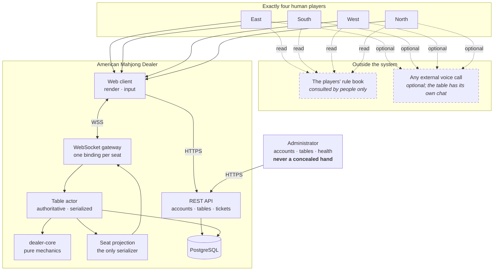

# 00 — Project Overview

| | |
|---|---|
| **Project** | American Mahjong Dealer |
| **Document** | 00_Project_Overview.md |
| **Status** | Ratified v0.2 — approved by the project owner, 2026-09-02 |
| **Last Updated** | 2026-09-02 |
| **Role in SSOT** | Owns the project objectives (`OBJ-##`), the non-negotiable constraints (`C-##`), the glossary, and the documentation governance rules that every other chapter follows. Does **not** own the requirement catalogs (`01`), the scope boundary (`02` and `SCOPE_BOUNDARIES.md`), or any technical design. |

---

## 1. Executive Summary

American Mahjong Dealer is a web application that recreates the experience of sitting at a physical
American Mahjong table with a human dealer. Four people, four seats, one set of tiles, and a dealer
whose job is to shuffle, build the wall, deal, and then get out of the way.

The design principle that governs every decision in this documentation set is that **the software
should disappear**. A player should feel that they are at a table with three other people. The most
visible difference from the physical experience should be that they move tiles with a pointer
instead of their hands.

Achieving that requires the application to be unusually restrained. Software that knows a game's
rules tends to help: it grays out illegal moves, sorts your tiles, tells you when you have won. Each
of those conveniences moves the experience further from a table and closer to a video game, and each
one requires the software to hold an opinion about the game. This application holds none. It does
not know the rules, does not judge moves, does not score, and has no concept of winning beyond
recording that the players said someone did.

What it *is* responsible for is everything physical: that there are exactly 152 tiles and no more,
that a shuffle is genuinely random and cannot be influenced, that a concealed hand is genuinely
concealed, that four clients see a consistent table, and that a dropped connection does not destroy
a game in progress. Those are the dealer's duties, and the application takes them seriously enough
that the majority of this documentation set is about them.

---

## 2. Objectives

### 2.1 Experience objectives

| ID | Objective |
|---|---|
| OBJ-01 | A player who knows how to play at a physical table can play here with no instruction beyond how to move a tile |
| OBJ-02 | The table feels like a table: four seats in fixed positions, tiles in familiar places, actions with physical analogues |
| OBJ-03 | Tile interaction is fast, precise, and predictable enough that players stop thinking about the interface |
| OBJ-04 | Players retain complete agency; the system never decides anything a player would decide |
| OBJ-05 | A game survives an ordinary network hiccup without ceremony, and a dropped player can rejoin the seat they left |

### 2.2 Integrity objectives

| ID | Objective |
|---|---|
| OBJ-06 | A player's concealed hand is visible to that player and to no one else — not another player, not an administrator, not a log, not a backup |
| OBJ-07 | The deal is trustworthy: no participant can influence, predict, or inspect the shuffle |
| OBJ-08 | Every tile is accounted for at every moment; tiles cannot be duplicated, lost, or conjured |
| OBJ-09 | An action takes effect exactly once, in a defined order, and only when the acting player is authorized to perform it |

### 2.3 Engineering objectives

| ID | Objective |
|---|---|
| OBJ-10 | The system remains rule-agnostic permanently, and drift toward rule knowledge is mechanically detectable |
| OBJ-11 | The architecture is proportionate to four players at one table, and additional complexity must be justified against that |
| OBJ-12 | The documentation is sufficient for a competent implementer — human or AI agent — to build the system correctly without consulting its authors |

---

## 3. Scope

**In scope:** identity and private table access; the four-seat table and its lifecycle; the complete
mechanical duties of a dealer; player actions on tiles; real-time synchronization with strict
public/private separation; disconnection and recovery; a neutral game-completion record; an
ephemeral table communication channel; bounded consent-based correction; observability that carries
no private data; administration limited to accounts, tables, and system health.

**Out of scope, permanently:** Mahjong rules in any form; winning-hand validation; scoring; any
economic or point system; the rule book; assistance, recommendation, or automatic arrangement of any
kind; artificial players; spectators; replay.

The authoritative and testable statement of what is excluded is
[SCOPE_BOUNDARIES.md](../SCOPE_BOUNDARIES.md). The reasoning behind the boundary is
[02_System_Scope.md](02_System_Scope.md).

---

## 4. Constraints (non-negotiable)

These bind every chapter and every implementation decision. A design that violates one is wrong,
regardless of its other merits. Changing one requires an ADR and the project owner's approval, and
`C-01` and `C-02` cannot be changed at all without starting a different project.

| ID | Constraint |
|---|---|
| **C-01** | The system does not know, store, interpret, or enforce the rules of Mahjong |
| **C-02** | The system contains no points, currency, wallet, ledger, price, or financial transaction |
| **C-03** | A concealed hand is delivered only to its owner; no other principal or system may receive or reconstruct it |
| **C-04** | Exactly four human players occupy a table; there are no bots, substitutes, or spectators |
| **C-05** | The server is authoritative for all table state; a client's report of state is never trusted |
| **C-06** | The client renders and accepts input; it does not decide, judge, authorize, or predict |
| **C-07** | The client cannot influence, observe, or predict the shuffle |
| **C-08** | The system never performs a binding action on a player's behalf, including on a timer |
| **C-09** | The system never alters a player's chosen tile arrangement |
| **C-10** | This project is independent; no code, schema, or configuration is inherited from any other project |
| **C-11** | The documentation is the specification; code that disagrees with it is a defect |
| **C-12** | The documentation is neutral with respect to implementation tooling and assumes no AI agent's memory |

---

## 5. System Context

Two features of this diagram carry design weight. The rule book is outside the system and reached
only by dashed lines from people. And every byte that reaches a client passes through a single seat
projection component, which is what makes the privacy claim in `C-03` auditable.

---

## 6. Users and roles (preview)

Full treatment in [04_User_Roles_and_Access.md](04_User_Roles_and_Access.md).

| Role | Description |
|---|---|
| **Visitor** | Unauthenticated. May register or log in. Nothing else. |
| **Player** | An authenticated account. May create a table, join one by code, occupy a seat, and act on that seat. |
| **Administrator** | Operational role. May manage accounts and tables and observe system health. Has **no** path to any concealed hand, and no ability to act at a table. |

There is no spectator, observer, support, or auditor role, and none may be added (`NR-401`).

---

## 7. Technology direction (preview)

Binding decisions live in `03` and in the ADRs; this is orientation only.

| Layer | Direction |
|---|---|
| Language | TypeScript throughout, strict configuration |
| Client | React, DOM-first table rendering |
| Server | Node with Fastify; REST plus a native WebSocket gateway |
| Core | `dealer-core`, a pure package with no I/O, clock, or randomness |
| Data | PostgreSQL. **No Redis in v1** (`ADR-0014`) |
| Transport | Native WebSocket with a custom envelope (`ADR-0007`) |

---

## 8. Functional requirements (overview level)

Detailed catalog in [01_Product_Requirements.md](01_Product_Requirements.md). Feature families:

| ID | Family | Chapter |
|---|---|---|
| F-01 | Identity and session | `04`, `15` |
| F-02 | Table creation, joining, and seating | `05` |
| F-03 | Dealing: tile set, shuffle, wall, opening deal | `07`, `08` |
| F-04 | Play: draw, discard, claim, expose, swap | `10` |
| F-05 | Tile passing | `10` |
| F-06 | Hand arrangement and private workspace | `10`, `11` |
| F-07 | Game conclusion | `10` |
| F-08 | Correction | `05` |
| F-09 | Table communication | `05` |
| F-10 | Presence, disconnection, and recovery | `22` |
| F-11 | Administration | `04`, `28` |

---

## 9. Non-functional requirements (overview level)

Detailed catalog with measurement methods in `01 §6` and `23`.

| Area | Direction |
|---|---|
| Responsiveness | Free acts feel instantaneous; binding acts acknowledge within a perceptible-but-comfortable budget |
| Privacy | Structural, not procedural: type-level, single-serializer, encrypted-at-rest, purged at close |
| Integrity | Every accepted action authenticated, authorized, well-formed, sequenced, deduplicated |
| Availability | A crash must not destroy an in-progress table; a reconnection must restore a playable seat quickly |
| Simplicity | Proportionate to four players at one table |

---

## 10. Design Decisions

| ID | Decision | Rationale |
|---|---|---|
| D-00-01 | Adopt "the software should disappear" as the governing experience principle | Gives a tiebreaker for the many small decisions where fidelity and convenience conflict. Rejected: "make it a great digital game," which licenses exactly the automation this project excludes. |
| D-00-02 | State the exclusions as numbered, testable constraints rather than prose | Prose exclusions decay. `C-01` and `C-02` are cited by ADRs and enforced by the absence suite. |
| D-00-03 | Make the documentation the specification, with a formal amendment process | Implementation will be carried out by multiple agents over time, possibly with no shared memory. The written record must be the authority. |
| D-00-04 | Require every chapter to declare what it does *not* own | The failure mode of a large specification is the same decision made twice, differently. The "Role in SSOT" line prevents it cheaply. |
| D-00-05 | Number chapters in dependency order and never renumber | Stable citations. Later material is appended rather than inserted. |

---

## 11. Alternative Designs

| Alternative | Why rejected |
|---|---|
| A rules-aware application with rule enforcement optional | Optional enforcement still requires the rules to exist in the codebase, which is the thing `C-01` forbids. Optionality also invites the "just this one check" erosion that the design is built to prevent. |
| A rules-aware application for a single named rule set | Same objection, plus it makes the software an authority on a disputed matter that belongs to the players. |
| Support for two or three players | Every seat-relative mechanic and the entire table layout would become variable for no requirement. Noted as a future consideration, not a v1 shape. |
| A single combined specification document | Unnavigable for both humans and agents, and impossible to cite precisely. |

---

## 12. Documentation governance and conventions

### 12.1 Structure

| Path | Content class |
|---|---|
| `/README.md` | Repository landing page, present for platform convention only. Points at the entry point. Normative about nothing. |
| `/PROJECT_DESIGN_README.md` | Entry point and map. Normative about nothing. |
| `/*.md` (other root files) | Cross-cutting artifacts: scope, matrices, threat models, definition of done |
| `/docs/NN_Name.md` | Numbered chapters. **Normative.** Each owns a distinct area. |
| `/docs/31_ADR/` | Architecture Decision Records. Normative about the decision they record. |
| `/docs/32_UX/` | Screen- and component-level design detail expanding `11` and `24` |
| `/docs/33_API/` | Interface catalogs expanding `18` and `19`. Normative; machine-checkable. |
| `/docs/34_Testing/` | Suite specifications expanding `25` and `26` |

### 12.2 Identifier conventions

| Scheme | Meaning | Owner |
|---|---|---|
| `OBJ-##` | Objectives | `00` |
| `C-##` | Non-negotiable constraints | `00` |
| `F-##` | Feature families | `00` |
| `FR-###` | Functional requirements | `01` |
| `NFR-###` | Non-functional requirements | `01` |
| `AC-###` | Acceptance criteria | `01` |
| `NR-###` | Negative requirements | `SCOPE_BOUNDARIES.md` |
| `R-##` | Responsibility-matrix rows | `SCOPE_BOUNDARIES.md` |
| `D-CC-##` | Design decision `##` in chapter `CC` | each chapter |
| `SEC-###` | Security requirements | `SECURITY_REQUIREMENTS_MATRIX.md` |
| `PT-##` | Privacy threats | `PRIVACY_THREAT_MODEL.md` |
| `T-##` | General threats | `THREAT_MODEL.md` |
| `RR-##` | Risks | `30` |
| `S-##` | Screens | `32_UX/Screen_Inventory.md` |
| `TC-###` | Test cases and categories | `25`, `26`, `34_Testing/` |
| `ADR-####` | Architecture Decision Records | `31_ADR/` |

Identifiers are allocated once and never reused, including after removal. A retired identifier is
struck through and left in place with a note.

### 12.3 Amendment process

1. Propose the change against the **owning** chapter. If it is architectural, write an ADR.
2. Obtain the project owner's approval.
3. Update the chapter text, append a Revision History row, and follow the Cross References to check
   every dependent chapter.
4. Only then may the implementation change.

Completed chapters are never rewritten silently. Documentation is excluded from automatic
formatting, so that every diff in `docs/` is a reviewed amendment rather than a reflow.

### 12.4 Chapter template

In order: front-matter table · Executive Summary · Objectives · *(chapter-specific normative
sections)* · Design Decisions · Alternative Designs · Trade-offs · Risks · Future Considerations ·
Cross References · Revision History.

Chapter-specific normative sections carry the substance and vary by chapter. Mermaid is used
wherever a diagram is clearer than prose.

### 12.5 Status vocabulary

| Status | Meaning |
|---|---|
| `Ratified vX.Y — approved by the project owner, YYYY-MM-DD` | Normative and stable |
| `Proposed — awaiting ratification` | Drafted, not yet binding |
| `Normative — binding on all implementation` | For root artifacts outside the chapter numbering |
| `Detail for ratified chapters — Ch. NN remains authoritative` | For subdirectory documents |

---

## 13. Glossary

| Term | Meaning in this project |
|---|---|
| **Binding act** | A player action with a public, effectively irreversible effect — discard, claim, expose, declare. Requires a deliberate gesture. See `11 §5`. |
| **Checkpoint** | An encrypted snapshot of complete table state at a public action boundary. Serves crash recovery and rewind. `16 §5`. |
| **Commitment** | `SHA-256(wall order ‖ salt)`, published to the four seats at deal time and never revealed. `08 §5`. |
| **Concealed hand** | The tiles a seat holds that are not exposed. Visible to that seat only. |
| **Conservation invariant** | At every moment, the multiset of tiles across wall, hands, discards, exposures and in-flight equals exactly the full tile set. `07 §7`. |
| **dealer-core** | The pure package implementing table mechanics. No I/O, clock, or randomness. |
| **Exposure** | A group of tiles a player has placed face-up in front of their rack. Public. The system attaches no meaning to it. |
| **Free act** | A player action with no public effect — rearranging one's own rack, selecting a tile. Instant, local, never blocked. |
| **Handle** | An opaque random per-game identifier for one physical tile. Reveals nothing about the tile's face. `07 §5`. |
| **Mechanical validation** | Checks the server performs: ownership, availability, authorization, sequencing, turn for wall draws. `02 §5`. |
| **Pass round** | A neutral, simultaneous, secret, atomic exchange of tiles between seats, with routing chosen by the players. `10 §6`. |
| **Rewind** | A bounded, unanimous restoration of an earlier checkpoint. `05 §8`, `ADR-0016`. |
| **Rule validation** | Checks the server never performs: legality, entitlement, validity, winning. `02 §5`. |
| **Seat** | One of four fixed positions: East, South, West, North. A connection binds to exactly one. |
| **Seat view** | The per-seat projection of authoritative state; the only thing a client ever receives. `14 §5`. |
| **Table actor** | The single-threaded owner of one table's authoritative state. `05 §6`. |
| **Turn pointer** | The seat the table believes play is at. Advisory; gates wall draws only. `09 §6`. |
| **Visibility class** | `PUB` (all seats), `OWN` (one seat), `SRV` (server process only). `14 §4`. |
| **Wall** | The ordered sequence of undealt tiles. Its order is `SRV` and never leaves the server. |

---

## 14. Risks

Full register in [30_Risk_Register.md](30_Risk_Register.md). The dominant risk is `RR-01`: **scope
creep into a rules engine**. It is dominant because it is the failure most likely to occur, hardest
to reverse once code depends on it, and most damaging to the product's identity. Its mitigations —
the negative-requirement catalog, the responsibility matrix, the validation boundary table, and the
absence test suite — are the structural backbone of this documentation set.

---

## 15. Future Considerations

Recorded so they are not mistaken for oversights. None is committed.

- Table sizes other than four seats
- Alternate tile-set profiles as an equipment setting
- A privacy-safe post-game review, subject to the conditions in `ADR-0012`
- Native mobile clients; the v1 client is responsive but tuned for pointer input
- Multi-node gameplay, per the seam in `27 §8`

---

## 16. Cross References

| Document | Focus |
|---|---|
| `SCOPE_BOUNDARIES.md` | Negative requirements and the responsibility matrix |
| `01_Product_Requirements.md` | `FR` / `NFR` / `AC` catalogs |
| `02_System_Scope.md` | The three contracts and the validation boundary |
| `03_System_Architecture.md` | Decomposition and dependency law |
| `14_Player_Privacy.md` | The model enforcing `C-03` |
| `30_Risk_Register.md` | `RR-01` and the rest |
| `31_ADR/` | Every architectural decision |

---

## 17. Revision History

| Version | Date | Author | Changes |
|---|---|---|---|
| 0.1 | 2026-09-02 | Design (architect role), owner-approved | Initial chapter |
| 0.2 | 2026-09-02 | Design (architect role), owner-approved | §12.1: added `/README.md` as a platform-convention landing page; narrowed the root glob row to the other root files |
