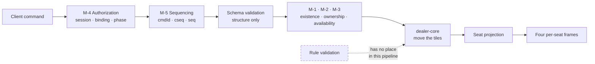

# 02 — System Scope

| | |
|---|---|
| **Project** | American Mahjong Dealer |
| **Document** | 02_System_Scope.md |
| **Status** | Ratified v0.1 — approved by the project owner, 2026-09-02 |
| **Last Updated** | 2026-09-02 |
| **Role in SSOT** | Owns the three contracts that define the project, the mechanical-versus-rule validation boundary, and the reasoning behind the scope. Does **not** own the negative-requirement catalog or the responsibility matrix (both `SCOPE_BOUNDARIES.md`), or the requirement catalogs (`01`). |

---

## 1. Executive Summary

Most software projects are defined by what they do. This one is defined at least as much by what it
refuses to do, and the refusal is not a limitation to be apologized for — it is the product.

The reason is worth stating carefully, because it is the reason a future implementer will be tempted
to override. A physical Mahjong table has no opinions. It does not tell you that your discard was
unwise, does not stop you reaching for a tile you are not entitled to, does not announce that
someone has won. The players do all of that, and the doing of it — the watching, the challenging,
the agreeing — is a substantial part of what playing at a table *is*. Software that takes those
duties over does not produce a better table. It produces a different activity that happens to use
the same tiles.

So the system is built around three contracts. The **Mechanism Contract** says what the server is
authoritative for. The **Absence Contract** says what must never exist. The **Fidelity Contract**
says how to decide the many small interface questions that neither of the other two reaches. Between
them they answer nearly every scope question that will arise during implementation, and §5 answers
the rest with a two-column table.

---

## 2. Objectives

This chapter serves `OBJ-10` — that the system remain rule-agnostic permanently and that drift be
mechanically detectable — by giving the drift a precise definition. You cannot test for a boundary
you have not drawn.

---

## 3. The three contracts

### 3.1 The Mechanism Contract

> The server is authoritative for physical facts, and for nothing else.

A physical fact is one that could be established by a person standing at the table who has never
heard of Mahjong. Where each tile is. Whose rack it is on. Whether the discard pile contains it.
How many tiles remain in the wall. Who is sitting where. Who is present.

The server therefore validates exactly five things, and this list is closed:

| # | Validation | Example |
|---|---|---|
| M-1 | **Existence** — is this a real tile in this game? | The handle resolves to a tile in this game's set |
| M-2 | **Ownership** — does this seat currently hold or control it? | The tile is in this seat's concealed hand |
| M-3 | **Availability** — is the thing being acted on where the actor believes it is? | The claimed tile is still the current discard |
| M-4 | **Authorization** — is this session bound to this seat at this table, and is the table in a phase where this command exists? | The socket binding says seat West; the game is `IN_PLAY` |
| M-5 | **Sequencing** — is this command well-formed, in order, and not already applied? | `cmdId` unseen, `cseq` contiguous, `seq` not stale |

Turn is a special case of M-4 and applies to exactly one command: drawing from the wall. Its
justification is in `§6`.

Anything a validation would need the rules to answer is not a physical fact and is out of contract.

### 3.2 The Absence Contract

> A specification of absence is a specification, and it is tested.

The full catalog is `SCOPE_BOUNDARIES.md §4`: 62 numbered negative requirements across six
families, each phrased as a checkable condition, each mapped to a test case.

The contract has three clauses:

1. **Absence is binding.** An `NR-###` has the same force as an `FR-###`. Adding a forbidden
   capability is a defect, not a feature.
2. **Absence is testable.** Every negative requirement is phrased so that a test can fail on its
   violation. "Do not add a rules engine" is not testable; "no module, function, table, or
   configuration encodes the rules of American Mahjong, verified by symbol and dependency scan" is.
3. **Absence is defended in CI.** The absence and privacy suites are zero-tolerance gates. A build
   that violates one does not ship.

Why the contract needs to exist at all: this project will be implemented substantially by AI coding
agents, and the strongest prior an agent brings to a repository named "Mahjong" is a large body of
Mahjong knowledge. That prior will surface as helpfulness — a legality check here, a convenience
sort there — and each instance will look locally reasonable. A prose instruction not to do it is a
weak defence against a strong prior. A numbered requirement with a failing test is a strong one.

### 3.3 The Fidelity Contract

> When the interface has a choice to make, prefer the physical table.

Seven principles, applied **in order** when they conflict:

| # | Principle | What it rules out |
|---|---|---|
| FC-1 | **Physical familiarity** — an action should resemble its physical counterpart | Abstract menus for things that are gestures at a table |
| FC-2 | **Player control** — the player initiates everything that affects them | Timers that act, defaults that commit |
| FC-3 | **Speed** — interaction should not make a player wait to think | Confirmation dialogs on free acts, network round trips for local effects |
| FC-4 | **Low cognitive overhead** — the interface should not require attention the game needs | Modes, hidden state, actions whose meaning depends on invisible context |
| FC-5 | **No assistance** — the system offers no help with the game | Hints, highlights, warnings, counts of anything meaningful |
| FC-6 | **No hidden automation** — nothing happens that the player did not cause | Auto-sorting, auto-passing, auto-anything |
| FC-7 | **Predictability** — the same gesture always does the same thing | Context-sensitive drops, gestures that change meaning by position |

The ordering matters. `FC-3` (speed) yields to `FC-2` (control): a binding act gets a deliberate
gesture even though that is slower, because an accidental discard cannot be undone except by
unanimous agreement. `FC-1` (familiarity) yields to `FC-7` (predictability): where a physical
gesture would be ambiguous on a screen, the unambiguous version wins.

---

## 4. In scope

Restating `00 §3` at the level of capability, with the owning chapter for each.

| Capability | Chapter |
|---|---|
| Account registration, authentication, sessions | `04`, `15` |
| Private table creation and code-based joining | `05` |
| Four fixed seats, occupancy, readiness, table lifecycle | `05` |
| Tile set custody and the conservation invariant | `07` |
| Shuffle, wall construction, commitment, opening deal | `08` |
| Draw, discard, claim, expose, retract, swap | `10` |
| Neutral simultaneous pass rounds | `10` |
| Private hand arrangement and selection | `10`, `11` |
| Turn pointer maintenance | `09` |
| Neutral game conclusion recording | `10` |
| Bounded unanimous correction | `05` |
| Ephemeral table communication | `05` |
| Real-time synchronization with per-seat projection | `12`, `14` |
| Presence, disconnection, reconnection, crash recovery | `22`, `16` |
| Observability carrying no private data | `20` |
| Administration of accounts, tables, and health | `04`, `28` |

## 5. The validation boundary

This table is the operational form of the Mechanism Contract, and it is the single most-cited
artifact in the documentation set. Before adding any check anywhere in the system, find it here.

| The server **does** decide | The server **never** decides |
|---|---|
| Is this handle a tile in this game? | Is this tile a legal discard? |
| Does this seat hold this tile right now? | Should this seat be holding this many tiles? |
| Is this tile the current discard? | Was this seat entitled to claim it? |
| Is this exposure's target exposure real, and does it contain this tile? | Is this a valid exposure? Is this group well-formed? |
| Is this a joker-shaped tile? *(It never asks this either — see below.)* | May this joker be used here? May it be exchanged? |
| Is the game in a phase where this command exists? | Is this the right phase of the Charleston? |
| Is the turn pointer at this seat? *(Wall draws only.)* | Is it legally this seat's turn under the rules? |
| Have all participating seats committed to this pass round? | Is this pass the right count, direction, or number? |
| Did this seat declare Mahjong? | Is the declaration correct? |
| Did all three other seats accept? | Did they accept *correctly*? |
| Is the wall empty? | Does an empty wall end the game? |
| Is this command authenticated, authorized, well-formed, in sequence, and unseen? | Is this command a good idea? |

**A note on the joker row.** The system stores a joker as a tile face like any other, because the
physical set contains eight of them and the conservation invariant must count them. It never
branches on the face. There is no code path anywhere that asks whether a tile is a joker in order to
decide anything, and `NR-007` makes that testable.

### 5.1 The test to apply to a new check

> Could a person who has never heard of Mahjong, looking only at the tiles and the table, determine
> the answer?

If yes, it may be a mechanical check — add the row to this table and implement it. If no, it is a
rule, and it does not belong in this system at any layer, including the client.

### 5.2 Where the boundary is enforced

There is no stage in this pipeline where a rule check could be inserted without being visible in
review, and no stage where one is expected.

---

## 6. Why the turn pointer is mechanical rather than a rule

The turn pointer is the design's most delicate call, and it deserves its own section because a
future reader will reasonably ask whether it smuggles a rule in.

At a physical table, turn order is not enforced by anything. It is shared attention: everyone knows
roughly whose go it is, and if someone reaches for the wall out of turn, someone else says so. That
is a social mechanism, not a rule the table enforces.

The pointer reproduces the *shared attention*, not the rule. Three properties keep it honest:

1. **It gates exactly one action.** Only drawing from the wall is turn-gated, and only because the
   wall is a single shared resource whose next tile can go to exactly one seat. Two clients drawing
   simultaneously is a mechanical race, not a rule question, and the pointer resolves it
   deterministically.
2. **Anyone can move it.** Claiming the current discard moves the pointer to the claimant,
   regardless of whose turn it was. The system never asks whether the claim was entitled. This is
   how the pointer legitimately jumps out of order — because under the rules it often does, and the
   system does not know why.
3. **It is advisory everywhere else.** Every other action is available to every seat at every
   moment. A player can expose, retract, swap, open a pass round, or declare at any time.

A useful way to see that the pointer carries no rule content: it can be wrong, and the system does
not care. If the players agree that play is actually at a different seat, they claim, or they
rewind. Nothing in the system treats a "wrong" pointer as an error, because the system has no
concept of the pointer being right.

---

## 7. Out of scope

The full, testable list is `SCOPE_BOUNDARIES.md §4`. Grouped by why they are excluded:

**Excluded because they require rule knowledge** — legality of any action, validity of any grouping,
winning-hand determination, scoring, dead hands, penalties, rule-book storage or interpretation, any
configuration surface in which a rule could be expressed.

**Excluded because they contradict the product's identity** — points and every economic construct;
artificial players and substitution; assistance, recommendation, and analysis of any kind; automatic
arrangement of a player's tiles.

**Excluded because they cannot be made privacy-safe** — spectators, observers, live external views,
and replay. Each of these is a mechanism for delivering game information to someone who is not one
of the four seats, or at a time when it should no longer be available. `ADR-0012` records the
conditions a future replay would have to satisfy.

**Deferred without prejudice** — table sizes other than four; alternate tile-set profiles; native
mobile clients; multi-node gameplay. These are excluded from v1 by proportionality, not by
principle, and each has a documented seam.

---

## 8. Applying the contracts: worked examples

Six questions that will arise, and the reasoning that resolves each. The point of this section is to
demonstrate the method, not to enumerate every case.

**"A player has 13 tiles and just drew a 14th. Should we prompt them to discard?"**
No. `FC-5` and `FC-6` forbid it, and `NR-009` makes the underlying premise — that 14 is the wrong
number to be holding — a rule. The system does not know how many tiles a hand should have.

**"Two players claimed the same discard within 40 ms. Should we open an arbitration window?"**
No. Deciding *which* claim should win requires knowing the priority rules. The server serializes and
the first arrival wins, which is a mechanical resolution of a mechanical race. If the outcome is
wrong under the rules, the players say so and rewind. See `10 §5.4`.

**"May we gray out the draw button when it isn't the player's turn?"**
Yes. That is `M-4` made visible: the command genuinely will not be accepted, so showing it as
unavailable is honest feedback about the system's own state, not a judgment about the game. Contrast
with graying out a discard that "looks illegal," which would require rule knowledge and is
forbidden.

**"May we show how many tiles each player holds?"**
Yes. Counts are visible at a physical table and are classified `PUB` (`14 §4`). What must not follow
is any interpretation of the count.

**"A player has clearly misclicked and discarded the wrong tile. May we offer an undo?"**
Not a unilateral one. A discard is public and irreversible at a physical table too. The remedy is
the correction mechanism: propose, and the other three agree. `FC-2` and `ADR-0016`.

**"May we sort the player's tiles after a pass round, since their hand just changed?"**
No, emphatically. `NR-304` names this case specifically. Received tiles append at the end of the
existing order and the player rearranges them if they wish. Their order is their workspace.

---

## 9. Design Decisions

| ID | Decision | Rationale |
|---|---|---|
| D-02-01 | Express scope as three named contracts rather than a single list | A list answers questions it anticipated. A contract answers questions it did not, which is what implementation actually needs. |
| D-02-02 | Close the mechanical validation list at five items | An open list invites additions, and every addition is where a rule would enter. Extending it requires an amendment. |
| D-02-03 | State the boundary as a two-column table rather than prose | Prose boundaries drift under paraphrase. A table forces each new check onto one side. |
| D-02-04 | Give the "never heard of Mahjong" test as the decision procedure | It is memorable, needs no reference to this document, and produces the right answer on cases the table does not list. |
| D-02-05 | Gate only wall draws by turn | The wall is the only genuinely contended shared resource. Gating anything else would require knowing why the turn moves, which is rules. |
| D-02-06 | Resolve simultaneous claims by arrival order, with correction as the remedy | Any other resolution requires priority rules. Arrival order is mechanical, deterministic, and explicable. |
| D-02-07 | Order the Fidelity Contract's principles and state the orderings that matter | Unordered principles are unusable in exactly the conflicts they are needed for. |

---

## 10. Alternative Designs

| Alternative | Why rejected |
|---|---|
| A configurable rule layer, disabled by default | The rules would exist in the codebase and would accumulate maintenance, tests, and eventually users. `C-01` forbids their existence, not their activation. |
| Advisory-only rule hints that never block | Still requires the rules, still constitutes assistance (`NR-203`), and would make the software an authority on a disputed matter. |
| No turn pointer at all | Leaves wall draws as an unresolvable race between two clients, and removes the shared attention cue that a physical table provides for free. |
| An arbitration window for simultaneous claims | Choosing a winner requires priority rules. A window without a winner-selection rule is just a delay. |
| Turn-gating discards as well as draws | Would require knowing that a discard follows a draw, which is a rule. A player may discard whenever they choose. |

---

## 11. Trade-offs

**The system will faithfully execute mistakes.** A player who claims a discard they were not
entitled to will get it. Accepted: this is what a table does, and the correction mechanism is the
remedy. The alternative requires knowing the rules.

**Players must pay attention.** Without a referee, an error nobody notices stands. Accepted, and it
is arguably the point — attention is part of the game at a physical table too.

**Some players will want the conveniences.** Accepted, and refused. A version of this product with
sorting and legality hints is a different product, and it already exists elsewhere.

**A closed validation list will occasionally feel too rigid.** Accepted, and mitigated by the
amendment process. A genuinely mechanical check that the list omits can be added; the friction
exists to ensure the addition is examined.

---

## 12. Risks

| Risk | Mitigation |
|---|---|
| A rule check is added because it "isn't really a rule" | `§5.1` test; the boundary table; `TC-A03` command-path audit |
| Assistance is added to the client, where the server's guarantees do not reach | `NR-2xx` and `NR-3xx` apply to the whole system; `C-06` makes the client non-authoritative |
| The turn pointer is progressively strengthened into turn enforcement | `§6` states its three properties explicitly; `NR-004`, `NR-005` |
| The Fidelity Contract is cited to justify adding a rule, on the grounds that a real table "has rules" | A real table does not enforce them; its *players* do. `SCOPE_BOUNDARIES.md §2` rows R-01 to R-11 |

---

## 13. Future Considerations

If a rules-aware sibling product is ever wanted, it should be a separate application that this one
knows nothing about. The seam is the wire protocol: an external tool could, in principle, consume a
seat's own view and offer that player advice, without this system containing any of it. That is
noted as a possibility, not a plan, and nothing in this system exists to enable it.

---

## 14. Cross References

| Document | Focus |
|---|---|
| `SCOPE_BOUNDARIES.md` | The negative-requirement catalog and responsibility matrix |
| `00_Project_Overview.md` | Constraints `C-01` – `C-12` |
| `01_Product_Requirements.md` | The positive catalogs bounded by this chapter |
| `06_Digital_Dealer_Architecture.md` | The mechanical duties, each justified against `§5` |
| `09_Game_State_Machine.md` | The states, derived from mechanics rather than rules |
| `10_Player_Action_Model.md` | Every command, with its validations drawn from `§3.1` |
| `11_Tile_Interaction_UX.md` | The Fidelity Contract applied |
| `31_ADR/ADR-0002-rule-agnostic-architecture.md` | The decision this chapter elaborates |

---

## 15. Revision History

| Version | Date | Author | Changes |
|---|---|---|---|
| 0.1 | 2026-09-02 | Design (architect role), owner-approved | Initial chapter: three contracts, closed mechanical validation list, validation boundary table, worked examples |
