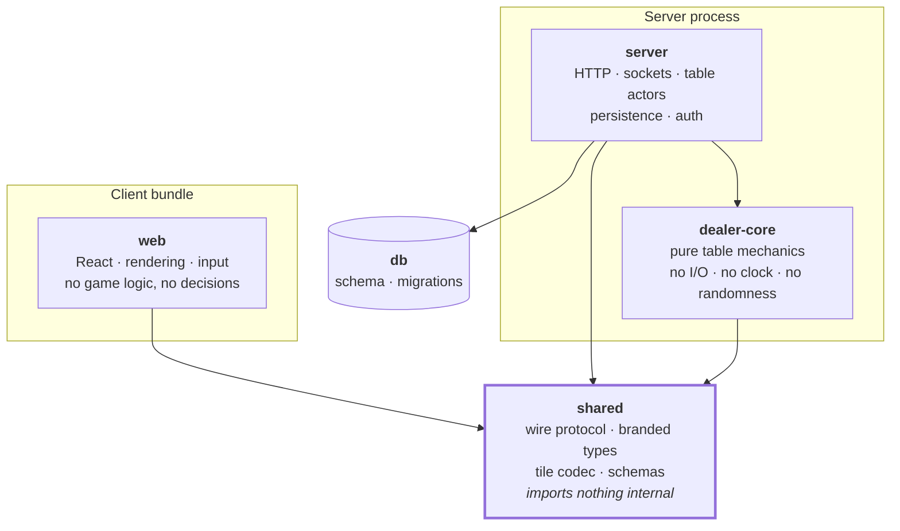
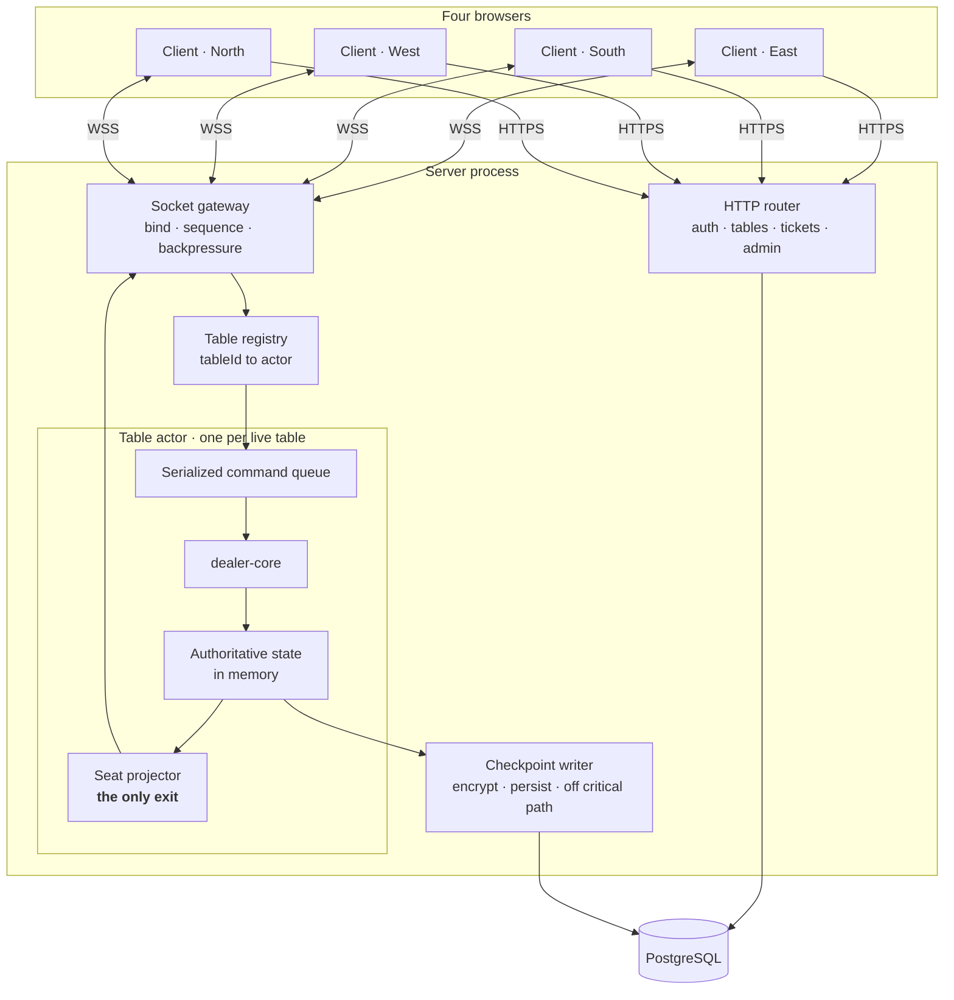

# 03 — System Architecture

| | |
|---|---|
| **Project** | American Mahjong Dealer |
| **Document** | 03_System_Architecture.md |
| **Status** | Ratified v0.1 — approved by the project owner, 2026-09-02 |
| **Last Updated** | 2026-09-02 |
| **Role in SSOT** | Owns the package decomposition, the dependency law, the runtime topology, and the technology selection. Does **not** own the table lifecycle (`05`), the wire protocol (`12`, `19`), the data model (`16`, `17`), or the deployment environment (`27`). |

---

## 1. Executive Summary

The architecture has one organising idea: **push every hard guarantee into a place where it can be
enforced structurally rather than remembered.**

Privacy is not a rule that developers follow; it is a type that will not compile and a serializer
that is the only exit. Determinism is not a testing convention; it is a package that cannot reach a
clock or a random number generator. Ordering is not a locking discipline; it is a single-threaded
actor that owns one table. Rule-agnosticism is not a code-review norm; it is a closed validation
list and a test suite that fails on forbidden symbols.

Everything else follows from being honest about the scale. This system serves four people at one
table. A game generates perhaps four hundred actions over an hour and its complete state fits
comfortably in a few tens of kilobytes. Architecture that would be prudent at a thousand tables per
second is, at this scale, complexity with no offsetting benefit — and complexity is where privacy
bugs live. So: one process owns a table, PostgreSQL is the only external dependency, and the
multi-node design exists as a documented seam rather than as code.

---

## 2. Objectives

| ID | Objective served | How |
|---|---|---|
| OBJ-06 | Concealed hands visible only to their owner | Type-level branding, one serializer, per-seat frames |
| OBJ-08 | Every tile accounted for | A pure core with the conservation invariant as a property |
| OBJ-09 | Actions exactly once, in order, when authorized | One actor per table; command sequencing at the gateway |
| OBJ-10 | Permanent rule-agnosticism | A core package with no rule surface and an absence suite |
| OBJ-11 | Proportionate architecture | One process, one database, no cluster |

---

## 3. Technology selection

Binding. Recorded in `ADR-0015` (language and framework) and `ADR-0014` (topology).

| Layer | Choice | Why |
|---|---|---|
| Language | TypeScript, strict, throughout | One language across the wire boundary means the protocol contract is a shared type rather than two hand-maintained descriptions. Strictness — including no unchecked index access and exact optional properties — is what makes the privacy branding load-bearing. |
| Client | React, DOM-first table rendering | The table is a few dozen interactive elements, not a scene graph. DOM gives accessibility, keyboard focus, and text rendering for free, all of which a canvas would have to reimplement (`ADR-0006`). |
| Server | Node with Fastify | The surface is roughly two dozen REST routes plus a socket gateway. A dependency-injection framework would add more structure than the application has (`ADR-0015`). |
| Realtime | Native WebSocket, custom envelope | Full control over the frame shape, which is what makes the visibility class of every field auditable. A general-purpose realtime library would add a broadcast primitive the design must not have (`ADR-0007`). |
| Core | `dealer-core`, a pure package | Determinism, testability, and a hard boundary against rule creep. |
| Data | PostgreSQL | Transactions, constraints that enforce invariants the application merely intends, and encryption support. Nothing else is needed (`ADR-0010`). |
| Cache / coordination | **None in v1** | With one gameplay process there is nothing for a cache tier to hold. Tickets and lockout counters live in PostgreSQL; per-connection throttles live in process memory (`ADR-0014`). |

---

## 4. Package decomposition and the dependency law

### 4.1 The dependency law

Enforced by lint rules that fail the build, not by convention (`NFR-061`).

| Package | May import | May **not** import |
|---|---|---|
| `shared` | nothing internal | everything internal |
| `dealer-core` | `shared` | `server`, `web`, `db`, any I/O library |
| `server` | `shared`, `dealer-core`, `db` | `web` |
| `web` | `shared` | `dealer-core`, `server`, `db` |
| `db` | `shared` | everything else |

Two consequences are worth naming. `web` cannot import `dealer-core`, so the client physically
cannot contain the game mechanics — which is how `C-06` is enforced rather than merely stated. And
`dealer-core` cannot import anything that performs I/O, so a leak of concealed material out of the
core is not possible from inside the core; it can only happen at the projection boundary, which is
exactly one function.

### 4.2 What lives where

| Package | Contents |
|---|---|
| `shared` | The wire protocol: command shapes, frame shapes, event shapes, error codes, close codes. Branded types (`ConcealedHand`, `WallOrder`, `Salt`, `TileHandle`) and the `NoConcealed<T>` guard. The tile face codec. Schema validators for every inbound command. |
| `dealer-core` | Tile-set construction, the wall, shuffling given injected entropy, dealing, and the state transitions for every mechanical action. The seat-view projector. The conservation invariant. Checkpoint serialization. No rule surface of any kind. |
| `server` | HTTP routes, authentication, sessions, the socket gateway, the per-table actor, checkpointing, the public event log, administration, observability. |
| `web` | Table rendering, tile interaction, connection management, seat-view application. Holds no authoritative state and computes no game outcome. |
| `db` | Schema definition and migrations. |

### 4.3 Why `shared` imports nothing

`shared` is the contract. If it could import from anywhere else, the contract would acquire
dependencies, and a change in an implementation package could change the wire format without anyone
intending it. Keeping it free-standing also means the client bundle contains the protocol and
nothing else from the server side.

---

## 5. The purity contract for `dealer-core`

`dealer-core` is a **mechanism library**. Given a state and a command, it produces a new state and a
list of events. It is pure: no clock, no randomness, no I/O, no environment, no logging.

Banned inside the package, enforced by lint (`NFR-060`):

`Math.random` · `Date` and `Date.now` · `setTimeout` and every timer · `process` · `crypto`'s random
sources · any filesystem, network, or database access · any logger.

Randomness and time are **injected by the host**: the server draws entropy from the platform's
cryptographic source and passes it in; the server reads the clock and passes the timestamp in.

Three things this buys:

1. **Determinism.** The same state and command always produce the same result, so a test can assert
   an exact outcome and a checkpoint can be verified by recomputation.
2. **Testability without infrastructure.** The entire mechanical surface is testable with no
   database, no socket, and no server.
3. **A hard rule boundary.** The package that performs the mechanics has no access to configuration,
   no place to load a rule set from, and no I/O with which to fetch one. Rule creep would have to be
   hard-coded in plain sight, where the absence suite finds it.

---

## 6. Runtime topology

### 6.1 The table actor

Each live table is owned by exactly one actor: a serialized command queue plus the authoritative
state. Commands for a table are processed one at a time, in arrival order, to completion.

This is the simplest correct answer to concurrency here, and it is worth being explicit about what
it removes. There are no locks, because there is no shared mutable state between concurrent
handlers. There are no read-modify-write races on a hand, because there is only one writer. There is
no need for optimistic concurrency on the table row, because the database is not the arbiter of live
state. An entire category of multiplayer bug is designed out rather than defended against.

The cost is that a slow command blocks its table. Given that the slowest operation in the core is a
shuffle over 152 elements, this is not a real constraint. Persistence is deliberately *outside* the
queue: checkpoints are written asynchronously so that disk latency never enters the acknowledgement
path (`NFR-032`).

### 6.2 Table ownership

One process owns every live table, so ownership is not a distributed problem in v1. The table
registry maps table identifier to actor, and an actor is created on the first binding to a table and
retired when the last connection closes and the final checkpoint is durable.

Because ownership will become a distributed problem if the system is ever scaled, the database
schema carries an owner column from the start (`17 §5`). In v1 it always holds the single process's
identity; it exists so the seam in `27 §8` is a change of logic rather than a migration.

### 6.3 Request paths

| Path | Transport | Examples |
|---|---|---|
| Outside a live table | REST over HTTPS | Register, log in, create table, join by code, list own tables, mint connect ticket, administration |
| Inside a live table | WebSocket | Every game command, every table event, presence, chat |

The split is not stylistic. Everything on the REST side is a request with a response and no ordering
relationship to anything else. Everything on the socket side is part of one ordered stream per
table, and mixing the two would create two paths to the same state with no defined ordering between
them.

---

## 7. Cross-cutting mechanisms

### 7.1 The single serializer

Exactly one function converts authoritative state into a client-bound payload. It takes a seat as a
parameter and returns that seat's view. Nothing else in the system writes to a socket
(`NFR-062`, `TC-P07`).

Its inputs include concealed material; its output type is constructed so that another seat's
concealed tiles, the wall order, and the salt have no field to occupy. The privacy claim thus
reduces to auditing one function and one type, which is a claim that can actually be verified. Full
treatment in `14 §5`.

### 7.2 Type-level privacy

`shared` defines branded types for concealed material and a recursive `NoConcealed<T>` mapped type
that renders any concealed-carrying property unusable. Every logging, metrics, and tracing entry
point takes `NoConcealed<T>`, so passing a hand to a logger is a compile error rather than an
incident (`NFR-014`). Full treatment in `14 §6`.

### 7.3 Command integrity

Every inbound command carries a client-generated `cmdId` for idempotency and a per-connection
`cseq` for ordering. The table maintains one authoritative `seq`. Full treatment in `13`.

### 7.4 Checkpointing

The actor emits an encrypted checkpoint at every public action boundary, written asynchronously.
Checkpoints serve crash recovery first and rewind second. Full treatment in `16 §5`.

### 7.5 Error handling

Errors are typed and mapped to a closed catalog of codes. A command rejection never mutates state
and never closes the connection; a protocol violation always closes it. Full treatment in `21`.

---

## 8. Where each guarantee is enforced

The architecture's central claim is that guarantees live in structures rather than in habits. This
table is that claim, itemized — and it is the quickest way for a reviewer to check whether a change
has weakened one.

| Guarantee | Enforced by | Fails how |
|---|---|---|
| Concealed hands stay private | Branded types, one serializer, per-seat frames | Compile error; CI serializer check; frame inspection suite |
| No rule knowledge | Closed validation list, pure core with no config surface | Absence suite; command-path audit |
| No client authority | `web` cannot import `dealer-core`; no seat field on the wire | Lint failure; interface audit |
| Deterministic mechanics | Purity lint on `dealer-core` | Lint failure |
| Action ordering | One actor per table, serialized queue | Design property; concurrency suite |
| Exactly-once application | `cmdId` deduplication | Idempotency suite |
| Tile conservation | Property test over randomized play | Property test failure |
| Shuffle integrity | Server-only entropy, no client input path | Randomization suite; interface audit |
| No private data in telemetry | `NoConcealed<T>` on every sink, plus a log scanner | Compile error; scanner with planted control |

---

## 9. Design Decisions

| ID | Decision | Rationale |
|---|---|---|
| D-03-01 | One actor per table, serialized | Removes lock and race categories entirely rather than defending against them. The workload cannot saturate a single queue. Rejected: optimistic concurrency against the database, which would put disk latency in the acknowledgement path and still need a resolution strategy. |
| D-03-02 | Authoritative state in memory, durability by checkpoint | Keeps acknowledgement latency independent of disk. Crash recovery is bounded to one action. Rejected: database-as-authority, which is slower and adds nothing at four players; rejected: full event sourcing, which retains concealed material permanently (`ADR-0010`). |
| D-03-03 | `dealer-core` is pure, with entropy and time injected | Determinism, infrastructure-free testing, and a structural rule boundary in one decision. |
| D-03-04 | Lint-enforced dependency direction | `web` being unable to import the core is what makes `C-06` structural instead of aspirational. |
| D-03-05 | Fastify directly rather than a DI framework | Two dozen routes. Rejected: NestJS — its module and provider structure would exceed the application's own (`ADR-0015`). |
| D-03-06 | Native WebSocket with a custom envelope | Full control of frame shape, so every field's visibility class is auditable. Rejected: a realtime library, whose broadcast primitive is precisely the thing this design must not have (`ADR-0007`). |
| D-03-07 | No Redis in v1 | With one process there is nothing for it to hold. A rate limit that vanishes on restart is one an attacker waits out, so the durable counter belongs in PostgreSQL regardless (`ADR-0014`). |
| D-03-08 | Carry an owner column from the first migration | Makes the future multi-node move a logic change rather than a schema migration on live data. Costs one unused column. |
| D-03-09 | DOM-first table rendering | Accessibility, focus management, and text come free; a canvas would reimplement all three. The table is a few dozen elements. |

---

## 10. Alternative Designs

| Alternative | Why rejected |
|---|---|
| Serverless functions with an external state store | Every action would pay a state round trip, and long-lived socket connections do not fit the model. |
| Database-as-authority with row locking | Puts disk latency in the acknowledgement path and reintroduces the concurrency problems the actor removes. |
| Full event sourcing | Excellent auditability, but a permanent record containing every concealed hand is a standing liability with no offsetting benefit here (`ADR-0010`). |
| Client-side prediction with reconciliation | The interactions that matter are either free (already instant, locally) or binding (must not appear to have happened before the server agrees). Prediction would buy nothing and could show a player a discard that did not occur. |
| A separate realtime service | Splits authoritative state across a network boundary for four players. |
| Redis-backed sessions and rate limits | Adds a service and a failure mode; PostgreSQL is adequate and durable at this scale. |
| A monorepo with finer package granularity | The seams that matter are the five above; further division would add ceremony without adding enforcement. |

---

## 11. Trade-offs

**One process is a single point of failure.** Accepted, and bounded: checkpoints make recovery
automatic and cap loss at one action, and `29` sets the expectations. Four players noticing a
thirty-second interruption is a very different cost from a payment system losing a transaction.

**In-memory authority means a restart loses up to one action.** Accepted; `NFR-031` states it
plainly rather than implying perfection.

**Purity in the core pushes complexity into the host.** Accepted: it concentrates the impure,
hard-to-test code in one place and leaves the mechanics — where correctness matters most — trivially
testable.

**A custom envelope means writing reconnection, backpressure, and heartbeats by hand.** Accepted:
those are precisely the places where a general library's defaults would be wrong for a four-seat
table, and they are specified in full in `12`.

**No cache tier means every read hits PostgreSQL.** Accepted: live state is in memory, so the
database sees authentication, table metadata, and checkpoint writes. That is a trivial load.

---

## 12. Risks

| Risk | Mitigation |
|---|---|
| A second serialization path is introduced for a "special case" | `NFR-062` CI check; the socket write API accepts only the projector's output type |
| Purity erodes through a convenient import | Lint rule fails the build; reviewed as an architectural change |
| Actor state and checkpoints diverge | Checkpoints are produced by the same core function that produces state; recovery is verified in `TC-F01` |
| The single process becomes a capacity limit | Documented seam in `27 §8`; the owner column already exists |
| Client acquires game logic gradually | Dependency lint; `web` cannot import the core |

---

## 13. Future Considerations

Multi-node gameplay, per the seam in `27 §8`. Extracting the socket gateway from the HTTP process if
their scaling profiles ever diverge. A binary frame encoding, should message size ever matter —
noted only because the current envelope is JSON and the tile counts are small enough that it does
not.

---

## 14. Cross References

| Document | Focus |
|---|---|
| `02_System_Scope.md` | The contracts this architecture enforces |
| `05_Game_Table_Architecture.md` | The table actor's lifecycle and behaviour |
| `06_Digital_Dealer_Architecture.md` | What `dealer-core` does |
| `12_Realtime_WebSocket_Architecture.md` | The gateway in detail |
| `14_Player_Privacy.md` | The serializer and the type-level guard |
| `16_Data_Architecture.md` | Checkpoints, the public event log, retention |
| `27_Deployment_Architecture.md` | Environments and the multi-node seam |
| `31_ADR/ADR-0014`, `ADR-0015` | Topology and stack decisions |

---

## 15. Revision History

| Version | Date | Author | Changes |
|---|---|---|---|
| 0.1 | 2026-09-02 | Design (architect role), owner-approved | Initial chapter |
