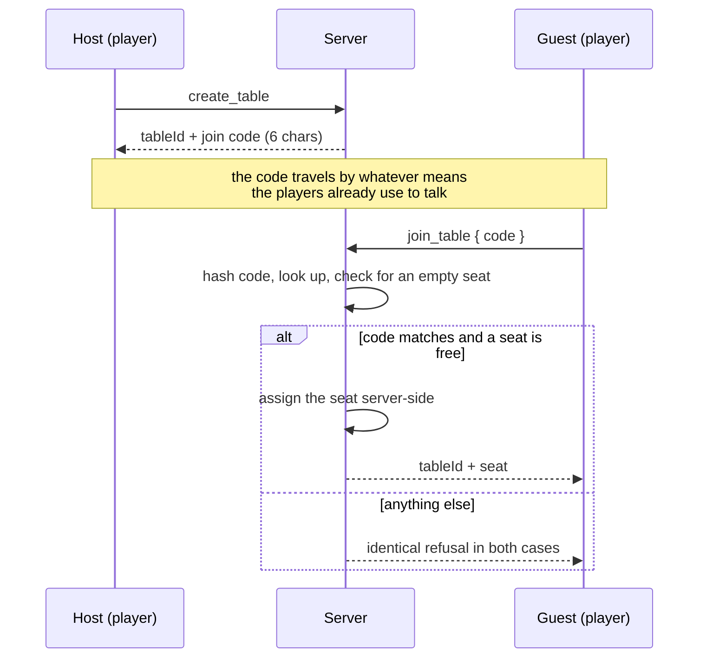

# 04 — User Roles and Access

| | |
|---|---|
| **Project** | American Mahjong Dealer |
| **Document** | 04_User_Roles_and_Access.md |
| **Status** | Ratified v0.1 — approved by the project owner, 2026-09-02 |
| **Last Updated** | 2026-09-02 |
| **Role in SSOT** | Owns the role model, the permission matrix, and the table access model. Does **not** own authentication mechanics (`15`), the privacy model (`14`), or administrative procedures (`28`). |

---

## 1. Executive Summary

The role model is deliberately small: **Visitor, Player, Administrator**. Three roles, and the third
one cannot see a hand or touch a game.

Small role models are usually a sign of an immature system. Here it is a design outcome. Most of the
roles a mature platform accumulates exist to investigate things — a support agent looking into a
disputed transaction, an auditor reconciling a ledger, a moderator reviewing reported content. This
system has no transactions, no ledger, and no persistent content: table chat is never stored, games
leave no concealed record, and there is nothing of value to dispute. The investigative roles have
nothing to investigate, so they do not exist, and their absence removes an entire class of privacy
risk along with them.

The access model is equally small. There is no lobby, no table directory, no matchmaking. A host
creates a table and shares a six-character code with three people they already know. Access to a
table is possession of the code plus an empty seat, and nothing else grants it — not an
administrative role, not a URL, not an API key.

---

## 2. Objectives

Serves `OBJ-06` (concealed hands visible only to their owner) by ensuring no role exists that could
see one, and `OBJ-11` (proportionate architecture) by keeping the authorization surface as small as
the product actually requires.

---

## 3. Roles

### 3.1 Visitor

An unauthenticated request. May reach the registration and login endpoints and the static client.
May reach nothing else. A visitor has no identity, no session, and no visibility of any table's
existence.

### 3.2 Player

An authenticated account. This is the role the product exists for, and nearly every requirement in
`01` is a player capability.

A player may create tables, join tables whose code they hold, occupy at most one seat at a time, act
on that seat, and manage their own account. A player's authority is scoped entirely to **themselves
and the seat they currently occupy**. There is no player who is more privileged than another; the
host of a table is a player with two additional table-management capabilities (`§5.2`), not a
superior role.

### 3.3 Administrator

An operational account, created out of band (`28 §3`), never by self-registration.

An administrator keeps the service running: managing accounts, force-closing stuck tables, watching
system health, and reviewing the security audit log. The role is defined as much by what it cannot
do as by what it can:

| An administrator **cannot** | Enforced by |
|---|---|
| See any concealed hand, ever, through any surface | `NR-406`; no endpoint returns concealed material to any principal but its owner (`TC-P02`) |
| See a live table's tiles, discards, exposures, or events | No administrative read path reaches table state (`14 §7`) |
| Occupy a seat or act at a table | Seat operations require a seat binding, which requires the join code and an empty seat |
| Read table chat | Never persisted; not routed to any non-seat connection (`FR-131`) |
| Impersonate a player or assume a session | No impersonation capability exists |
| Alter game state, other than closing a table entirely | The only state-affecting administrative command is `force_close_table` |
| Recover a closed game's contents | Concealed material is purged at close (`FR-118`) |

The design intent is that an administrator's access to game content is not merely *forbidden* but
*absent*. There is no privileged code path guarded by a role check; there is no code path at all.
That distinction matters, because a guarded path can be reached by a bug in the guard, and an absent
path cannot.

### 3.4 Roles that do not exist

| Role | Why not |
|---|---|
| Spectator / observer / viewer | `NR-401`. Only the four seats receive table information. |
| Support agent | Nothing to support that requires seeing a game; account issues are administrator work. |
| Auditor | Nothing to audit. No economy, no ledger, no financial record. |
| Moderator | No persistent user content exists to moderate. |
| Bot / AI player | `NR-201`. Four human players, always. |
| Guest | Rejected in favour of accounts: reconnection needs a durable identity, and a seat must survive a browser restart. |

---

## 4. Permission matrix

Deny by default: a capability not granted here is denied. `own` means the capability applies only to
the actor's own resource.

| Capability | Visitor | Player | Administrator |
|---|---|---|---|
| **Identity** ||||
| Register an account | ✔ | ✘ | ✘ |
| Log in | ✔ | ✔ | ✔ |
| Log out | ✘ | own | own |
| Change own password / display name | ✘ | own | own |
| List / revoke own sessions | ✘ | own | own |
| View another account's profile | ✘ | ✘ | ✔ (metadata only) |
| Disable / re-enable an account | ✘ | ✘ | ✔ |
| Delete an account | ✘ | own | ✔ |
| **Tables** ||||
| Create a table | ✘ | ✔ | ✘ |
| Join a table by code | ✘ | ✔ | ✘ |
| Take / leave a seat | ✘ | own | ✘ |
| Set / clear readiness | ✘ | own | ✘ |
| List tables one occupies | ✘ | own | ✘ |
| List all tables (identifier, status, seat count only) | ✘ | ✘ | ✔ |
| Close a table one hosts | ✘ | own | ✘ |
| Force-close any table | ✘ | ✘ | ✔ |
| Discover a table without its code | ✘ | ✘ | ✘ |
| **Game** ||||
| Start the deal | ✘ | own table, all ready | ✘ |
| Draw, discard, claim, expose, retract, swap | ✘ | own seat | ✘ |
| Open / commit / cancel a pass round | ✘ | own seat | ✘ |
| Arrange own hand | ✘ | own seat | ✘ |
| Declare Mahjong, reveal, respond | ✘ | own seat | ✘ |
| Propose / respond to a correction | ✘ | own seat | ✘ |
| Send table chat or a signal | ✘ | own seat | ✘ |
| **Information** ||||
| See own concealed hand | ✘ | own | ✘ |
| See another seat's concealed hand | ✘ | ✘ | ✘ |
| See public table state | ✘ | own table | ✘ |
| See the wall order or the salt | ✘ | ✘ | ✘ |
| **Operations** ||||
| View system health and metrics | ✘ | ✘ | ✔ |
| View the security audit log | ✘ | ✘ | ✔ |
| Read application logs | ✘ | ✘ | ✔ (they contain no game content — `20 §4`) |

Three rows have no ✔ in any column. That is deliberate: seeing another seat's hand, seeing the wall
order, and discovering a table without its code are capabilities the system does not offer to
anybody.

---

## 5. The table access model

### 5.1 Access is possession of a code plus an empty seat

Properties that matter:

- **The code is the capability.** No listing, search, directory, or enumeration exists (`FR-030`).
- **The code is stored irreversibly.** A database compromise does not yield usable join codes.
- **Failures are indistinguishable.** A wrong code, a nonexistent table, and a full table return the
  same response after the same amount of work, so the endpoint cannot be used to enumerate tables
  (`SEC-021`).
- **The server assigns the seat.** A client never names a seat; there is no field for it on the wire
  (`NR-601`).
- **Joining is rate-limited per account and per address**, which is what makes a six-character code
  adequate (`§6`).

### 5.2 The host

The host is the player who created the table. They hold exactly two extra capabilities: starting the
deal once all four seats are ready, and closing the table when no game is in progress. They have no
informational privilege whatsoever — the host's seat view is the same shape as everyone else's.

If the host leaves their seat before a game begins, the host role transfers to the longest-seated
remaining player. If no players remain, the table closes.

### 5.3 One seat per account

An account occupies at most one seat across the entire system at any moment, enforced by a database
constraint rather than by application logic alone (`FR-024`). This closes an otherwise awkward
scenario: the same person occupying two seats at one table, which would give them information about
two hands and make the four-player guarantee false.

### 5.4 Access ends

A player's access to a table ends when they leave the seat, when the table closes, or when their
session is revoked. There is no lingering read access to a table one has left — a departed player's
subsequent binding attempt is refused exactly as a stranger's would be.

---

## 6. Authorization enforcement

Three layers, each independently sufficient for the checks it performs.

| Layer | Checks | Failure |
|---|---|---|
| **Session** | Is there a valid, unexpired, unrevoked session? Does the request carry the anti-forgery token where required? | `401`, or socket close on the socket path |
| **Role** | Does the account's role permit this endpoint at all? | `403` |
| **Resource** | Does this account own or occupy the specific resource named? For table operations: is this session's binding at this seat? | `404` where existence is itself sensitive; `403` otherwise |

The resource layer is where cross-player and cross-table attacks are stopped, and its design is
worth stating explicitly: **for every table operation, the seat is derived from the socket binding,
never from the request.** There is no seat parameter to tamper with. An attacker's only lever is
their own binding, which is established server-side from their own session at a table where they
already hold a seat. See `15 §5` and `13 §7`.

Where a resource's *existence* is sensitive — a table identifier, a join code — the failure is
`404`, so that probing cannot distinguish "exists but forbidden" from "does not exist."

### 6.1 Rate limits relevant to access

| Operation | Limit | Rationale |
|---|---|---|
| Login, per account | 5 per minute, then progressive lockout | Credential stuffing; lockout state is durable (`FR-006`) |
| Login, per address | 20 per minute | Distributed attempts |
| Registration, per address | 3 per hour | Account-farming |
| Join by code, per account | 10 per minute | Brute-forcing a six-character code |
| Join by code, per address | 30 per minute | Same, distributed |
| Socket bind, per session | 10 per minute | Reconnection storms |

The join-code limits are what make the code length adequate: a 32-character alphabet over six
positions gives roughly 10⁹ codes, and at 30 attempts per minute an attacker needs on the order of
sixty years of continuous effort to reach a one-in-a-thousand chance of hitting one particular live
table. Full analysis in `15 §7.2`.

---

## 7. Design Decisions

| ID | Decision | Rationale |
|---|---|---|
| D-04-01 | Three roles, with no support or auditor role | Those roles exist to investigate things this system does not have. Every role that can reach player data is a privacy risk, so the right number is the smallest one that runs the service. |
| D-04-02 | Administrators have no path to game content — absent, not merely forbidden | A guarded path fails when the guard fails. An absent path has no failure mode. Rejected: an audited break-glass view, which would require the capability to exist. |
| D-04-03 | Accounts rather than guest seats | Reconnection needs durable identity; a seat must survive a browser restart and a device change. Rejected: guest-only, which weakens reconnection and makes the one-seat-per-account rule unenforceable. |
| D-04-04 | Code-based private tables; no lobby or discovery | Matches how these games are actually arranged — four people who know each other. Removes matchmaking, table browsing, and public exposure of a table's existence in one decision. |
| D-04-05 | The server assigns seats; no seat parameter exists on the wire | Eliminates the cross-seat IDOR structurally rather than checking for it (`NR-601`). |
| D-04-06 | The host is a player with two capabilities, not a role | Avoids a privilege tier at the table. The host has no informational advantage. |
| D-04-07 | One seat per account, enforced in the database | Application-level checks race; a constraint does not. Prevents one person holding two seats and seeing two hands. |
| D-04-08 | Uniform failure responses on table access | Prevents enumeration of tables and codes through response differences. |

---

## 8. Alternative Designs

| Alternative | Why rejected |
|---|---|
| A public lobby with open tables | Introduces discovery, matchmaking, and strangers — none of which the product needs, and all of which enlarge the abuse surface. |
| Guest access by code, no account | Reconnection identity becomes device-bound; a closed tab could lose a seat permanently. |
| A support role with audited access to table state | The audit records the access; it does not undo it. The role would exist only to be used in the rare case, and its existence is the risk. |
| Per-table invitation records instead of a shared code | More machinery for the same outcome; a code shared in an existing group chat matches how the players already coordinate. |
| Host as a distinct role | Would create a privilege tier at a table where all four players are equals. |
| Longer join codes | Six characters is already adequate given the rate limits (`§6.1`), and readability aloud is a genuine usability property. |

---

## 9. Trade-offs

**Requiring accounts adds friction before a first game.** Accepted: the alternative costs
reconnection reliability, which is the more visible failure during play.

**No administrative visibility into a live table makes some support questions unanswerable.**
Accepted deliberately. "What tiles did I have?" cannot be answered by anyone, and that is the
privacy guarantee working rather than a gap in it.

**A shared code is only as private as the players' sharing of it.** Accepted, and mitigated by rate
limits, irreversible storage, and the fact that a table holds no lasting value.

**One seat per account prevents a legitimate case: a household sharing a device.** Accepted. Two
people at one table need two accounts, which is also what makes the reconnection identity correct.

---

## 10. Risks

| Risk | Mitigation |
|---|---|
| Join codes brute-forced | Rate limits per account and per address; irreversible storage; uniform failures; `15 §7.2` analysis |
| An administrative endpoint is added that returns table state | `NR-406`; `TC-P02` asserts no administrative response contains tile data |
| A support role is introduced under pressure | `D-04-01` records the reasoning; introducing one requires an ADR |
| A seat parameter is added to the wire "for convenience" | `NR-601`; interface audit `TC-I01` |
| Host transfer leaves a table with no host | Transfer to longest-seated player; table closes if none remain (`§5.2`) |

---

## 11. Future Considerations

Not committed: player-initiated account deletion with an immediate purge; multi-factor
authentication for players (it is already required for administrators, `15 §8`); named table
invitations for players who prefer not to circulate a shared code.

---

## 12. Cross References

| Document | Focus |
|---|---|
| `01_Product_Requirements.md` | `FR-001` – `FR-030`, `FR-160` – `FR-166` |
| `05_Game_Table_Architecture.md` | Table lifecycle and seating mechanics |
| `14_Player_Privacy.md` | Why no role can reach a concealed hand |
| `15_Security_Architecture.md` | Authentication, sessions, rate limits, isolation |
| `18_API_Design.md` | The endpoints these permissions govern |
| `28_Operations.md` | Administrative procedures |
| `SECURITY_REQUIREMENTS_MATRIX.md` | `SEC-###` rows on isolation and authorization |

---

## 13. Revision History

| Version | Date | Author | Changes |
|---|---|---|---|
| 0.1 | 2026-09-02 | Design (architect role), owner-approved | Initial chapter |
