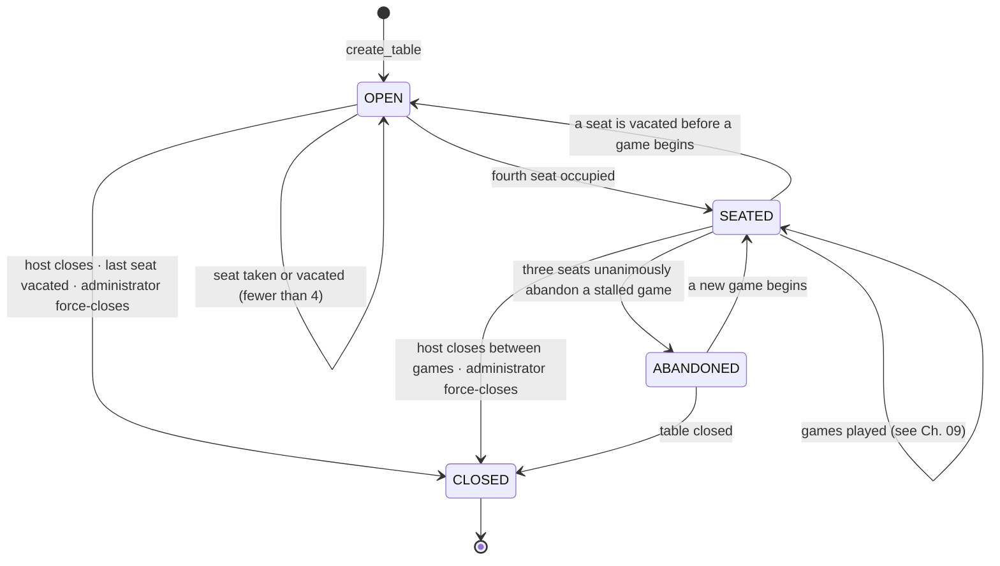
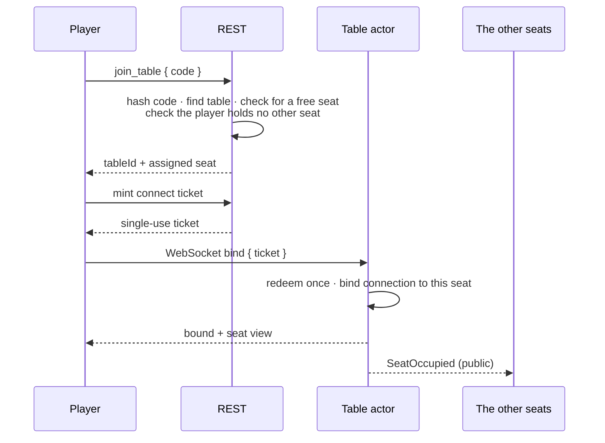
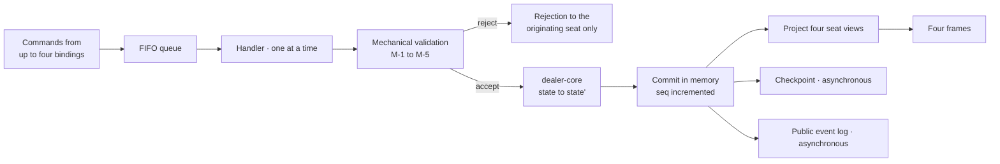
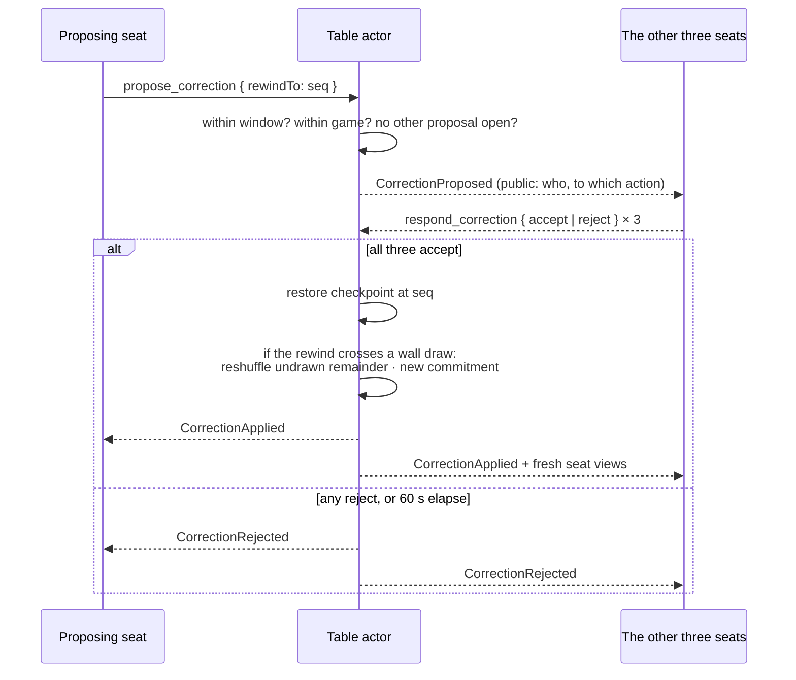

# 05 — Game Table Architecture

| | |
|---|---|
| **Project** | American Mahjong Dealer |
| **Document** | 05_Game_Table_Architecture.md |
| **Status** | Ratified v0.1 — approved by the project owner, 2026-09-02 |
| **Last Updated** | 2026-09-02 |
| **Role in SSOT** | Owns the table as an entity: its lifecycle, its four seats, the table actor, the correction mechanism and its bounds, and the ephemeral communication channel. Does **not** own the state machine's formal definition (`09`), the dealer's mechanics (`06`), the command catalog (`10`), or presence detection (`22`). |

---

## 1. Executive Summary

A table is the unit of everything in this system. It owns four seats, at most one game at a time, one
authoritative state, one command queue, and one communication channel. Players do not exist in the
system except as accounts; *seats* are what act.

Two mechanisms in this chapter deserve attention because they have no counterpart in a
rules-enforcing game.

The first is the **correction mechanism**. A table with no referee will accumulate mistakes: a
misclicked discard, a claim someone was not entitled to, a draw taken out of turn. At a physical
table these are resolved socially — someone says "wait, put that back," everyone agrees, and the
tiles go back. Software that cannot do this makes a single misclick fatal to a game. So the table
supports a bounded, unanimous rewind: any seat proposes, all three others must accept, and state is
restored from a checkpoint. The system never judges whether the correction is warranted; it only
executes what the four players have agreed.

The second is the **table channel**. Because the players adjudicate for themselves, they must be
able to talk. A table without a communication channel is not a neutral table — it is an unusable one
that silently assumes everybody is already on a phone call. The channel is therefore in scope, and
it is deliberately ephemeral: never stored, never logged, never in a checkpoint, gone when the table
closes.

---

## 2. Objectives

| Objective | How this chapter serves it |
|---|---|
| OBJ-02 | Four fixed seats in stable positions, with a lifecycle that mirrors sitting down to play |
| OBJ-04 | Every table-level transition is player-initiated; the system starts nothing |
| OBJ-05 | Auto-pause and automatic resume make an ordinary disconnection uneventful |
| OBJ-09 | One serialized actor per table gives ordering and exactly-once application by construction |

---

## 3. The table entity

| Property | Description | Visibility |
|---|---|---|
| Table identifier | Opaque; never derived from the join code | `PUB` to seated players |
| Join code | Six characters; stored irreversibly | Known only to holders |
| Host | The seat that created the table | `PUB` |
| Status | `OPEN`, `SEATED`, `CLOSED`, `ABANDONED` | `PUB` |
| Seats | Exactly four: East, South, West, North | `PUB` |
| Current game | At most one, or none | `PUB` |
| Table setup | Tile set and opening deal counts (`07 §4`) | `PUB` |
| Sequence | The authoritative monotonic counter | `PUB` |

### 3.1 Seats

Four, fixed, always present whether occupied or not. Seats are identified by compass position, which
is how players at a physical table refer to each other and which gives every seat-relative
description in this documentation a stable vocabulary.

| Seat property | Description | Visibility |
|---|---|---|
| Position | East, South, West, North | `PUB` |
| Occupant display name | The only profile attribute other seats receive | `PUB` |
| Occupancy | Empty or occupied | `PUB` |
| Connection state | Connected, away, absent | `PUB` |
| Readiness | Ready or not | `PUB` |
| Hand size | Number of concealed tiles | `PUB` |
| Concealed hand | Tile faces, in the player's chosen order | `OWN` |
| Rack order | The player's arrangement | `OWN` |
| Selection | Currently selected tiles | `OWN` |
| Exposures | Face-up groups in front of the seat | `PUB` |

Seat positions are permanent for the life of a table. There is no rotation of seats between games,
because rotation is a rule-adjacent convention and the players can simply stand up and swap by
leaving and rejoining if they want to.

### 3.2 Client orientation

Every client renders its own seat at the bottom of the screen, with the other three arranged around
the table in true relative position. So East's client shows South on the right, West across, North
on the left; South's client shows West on the right, North across, East on the left.

This costs nothing and matters a great deal: it is how a physical table looks from a chair, and it
makes seat-relative reasoning — "the player to my left" — visually correct for everyone
simultaneously. Detail in `32_UX/Table_Layout_and_Perspective.md`.

---

## 4. Table lifecycle

| Status | Meaning | Permitted |
|---|---|---|
| `OPEN` | Fewer than four seats occupied | Joining, seating, leaving, closing |
| `SEATED` | All four occupied | Readiness, dealing, play, correction, chat |
| `ABANDONED` | A game was abandoned; the table remains | A new game, or closing |
| `CLOSED` | Terminal | Nothing; bindings closed, concealed material purged |

The game lifecycle nested inside `SEATED` is defined in `09`. A table has at most one game at a
time, and games are strictly sequential.

### 4.1 Closing

Closing is terminal and immediate. All bindings close with a documented code, the actor is retired,
concealed material for any game is purged, and the table's public record is retained only as
metadata (identifier, participants, timestamps) with no game content.

A table cannot be closed while a game is in progress, except by an administrator's force-close
(`FR-161`), which exists for stuck tables and notifies the participants.

---

## 5. Seating

Seat assignment is server-decided. The client never names a seat and there is no field for it
anywhere on the wire (`NR-601`). Assignment fills the lowest unoccupied position in fixed order,
which is arbitrary but predictable — and, unlike a random assignment, gives a group joining together
a stable arrangement.

### 5.1 Readiness

Readiness is a public, revocable flag per seat. The deal can begin only when all four seats are
occupied, all four are ready, and the requester is the host (`FR-027`). Readiness clears when a game
concludes, so each new game requires deliberate agreement to start it — matching the pause at a real
table between hands.

### 5.2 Leaving

A player may leave their seat freely while no game is in progress. During a game they may not; the
equivalent action is to disconnect, which pauses the table (`22 §5`), or for the remaining three to
agree to abandon (`FR-147`). This asymmetry is deliberate: leaving mid-game unilaterally would
destroy three other people's game, and there is no substitution mechanism to cover the gap
(`NR-202`).

---

## 6. The table actor

Each live table is owned by exactly one actor: a serialized command queue plus authoritative state.

### 6.1 Properties

**One writer.** No locks, no read-modify-write races, no optimistic concurrency. An entire class of
multiplayer defect is designed out.

**Total ordering.** Every accepted command increments the table's `seq`. That number is the
authoritative order and the anchor for resumption and correction.

**Rejection is local.** A rejected command produces a rejection frame to the originating seat only.
The other seats learn nothing, which matters because a rejection can reveal intent — the other seats
should not learn that someone tried to discard a tile they did not hold.

**Persistence is off the path.** Checkpoints and event-log writes are asynchronous. Disk latency
never enters the acknowledgement path (`NFR-032`). The cost — up to one action lost to an unclean
crash — is stated in `NFR-031` rather than papered over.

### 6.2 Lifecycle

An actor is created when the first connection binds to a table, restoring from the latest checkpoint
if one exists. It is retired when the last connection closes, the final checkpoint is durable, and a
short grace period passes — the grace period exists so that a brief total disconnection does not
churn the actor.

---

## 7. Table setup

The only configurable properties of a table, fixed at creation and immutable thereafter:

| Setting | Default | Nature |
|---|---|---|
| Tile set | The standard 152-tile American set | Equipment (`07 §3`) |
| Opening deal count, non-dealer seats | 13 | Dealing procedure (`07 §4`) |
| Opening deal count, East seat | 14 | Dealing procedure |

That is the entire configuration surface, and its smallness is a design outcome rather than an
oversight. There is no field here in which a rule could be expressed (`NR-011`) — no call
priorities, no group sizes, no joker conditions, no pass plan, no terminal policies. A table is a
tile set and a way of handing them out.

---

## 8. Correction — bounded consent-based rewind

### 8.1 Why it exists

A rules-enforcing game does not need this: it prevents the illegal action in the first place. A
neutral table must have it, because it will faithfully execute mistakes and a misclicked discard
would otherwise end a game.

The physical analogue is exact. Someone says "hold on, that wasn't your turn"; everyone looks;
everyone agrees; the tiles go back. The software's role is not to decide whether the correction is
warranted — it never knows — but to execute reliably what the four players have agreed, restoring a
state they all remember.

### 8.2 The protocol

While a proposal is open, the table is in the `CORRECTION_PENDING` overlay: game commands are
refused with `CORRECTION_PENDING` so that state does not move under the vote. Chat remains open —
that is precisely when the players need to talk.

### 8.3 Bounds

The bounds are the whole reason this mechanism is safe, and each is load-bearing.

| Bound | Value | Why |
|---|---|---|
| Scope | The current game only, never across a deal | A rewind into a previous game would restore a hand from a game that has concluded and been purged |
| Depth | The last **10** public actions | Deep enough for real mistakes — a misclick is noticed within a turn or two — shallow enough that checkpoint retention is small and memory of the earlier state is fresh |
| Concurrency | One open proposal at a time | Two overlapping rewinds have no coherent meaning |
| Consent | Unanimous among the other three; no default, no timeout-accept | A rewind rolls back other people's actions; anything less than unanimity makes it a weapon |
| Timeout | 60 seconds, expiring as a rejection | An unanswered proposal must not freeze the table |
| Initiation | Player-only | The system never proposes one (`NR-210`, `FR-126`) |
| Visibility | Public, permanently recorded | Everyone sees that a rewind happened, to where, and who proposed it |

### 8.4 The information analysis

A rewind restores state that some seats have already seen. That is worth analysing precisely rather
than waving at, because it is the mechanism's only genuine privacy question — and the analysis
shows the exposure is confined to one case.

| Rewound action | What the rewind restores | Information leaked |
|---|---|---|
| Discard | The tile returns to the discarding seat's hand | **None.** The tile was public when discarded; everyone saw it. The discarder learns nothing new about anyone. |
| Claim | The tile returns to the discard pile | **None.** Public throughout. |
| Exposure | Tiles return to the concealed hand | **None new.** They were seen when exposed; a retraction has the same property (`FR-072`) and is a normal action. |
| Pass round | Tiles return to their original seats | **None.** Each seat sees only what it sent and received, exactly as before. |
| Hand arrangement | Order restored | **None.** Private throughout. |
| **Wall draw** | The tile returns to the wall | **Real.** The drawing seat saw a tile that may now go to a different seat. |

Only the last row is a leak, and it has an exact physical analogue: a player who picks up a tile out
of turn and is made to put it back has seen it, and everyone at a physical table knows this.
Physical players resolve it by reshuffling the remaining wall.

So does the system. **Any rewind that crosses a wall draw reshuffles the undrawn remainder of the
wall and publishes a fresh commitment.** After the reshuffle, the tile the player saw is no longer
in a predictable position, and the leak is neutralized. Dealt hands, discards, and exposures are
untouched — only the undrawn tail is re-randomized (`08 §7`).

This is both the more private answer and the more faithful one, which is a good sign about the
design.

### 8.5 What a rewind is not

It is not an undo button (it requires unanimity), not a dispute resolution mechanism (the system
takes no view), not a way to reach a previous game, and not available to an administrator. There is
no unilateral undo of any binding act, ever.

---

## 9. The table channel

### 9.1 Why it is in scope

Because the players adjudicate for themselves, and adjudication is a conversation. Without a
channel, this design assumes every group is already on a voice call, which makes the product
incomplete rather than minimal.

### 9.2 Design

| Property | Decision |
|---|---|
| Scope | The four bound seats of one table (`NR-402`, `FR-135`) |
| Transport | The existing table socket; no separate service |
| Persistence | **None.** Not stored, not logged, not checkpointed, not exported (`FR-131`) |
| Retention | In memory for the session only; a reconnecting client gets no backlog |
| Lifetime | Dropped entirely when the table closes (`FR-132`) |
| Length | 512 characters |
| Rate | 10 messages per 10 seconds per seat, then throttled |
| Content | Treated as opaque text; rendered as plain text, never as markup |
| Attribution | Sender's seat and display name |

No history means no moderation surface, no export request, no backup exposure, and no record of a
conversation that the players reasonably assume was as ephemeral as speech at a table. A
reconnecting player missing a few messages is a small cost against that.

### 9.3 Signals

A small fixed set of non-verbal signals, rendered as brief animations at the sending seat:

| Signal | Meaning | Physical analogue |
|---|---|---|
| `KNOCK` | "Your turn" / "I'm waiting" | Tapping the table |
| `WAIT` | "Hold on" | A raised hand |
| `ACK` | "Understood" | A nod |

Deliberately no signal carries game meaning. There is no "I want that tile," no "that's not legal,"
and no "you won" — those are conversation, and conversation is what the text channel is for.

---

## 10. Pause

A table pauses automatically when a seat becomes absent during a game (`FR-142`), and resumes
automatically when that seat returns (`FR-146`). Any seat may also request a pause, and the table
resumes when the requesting seat releases it.

While paused, game commands are refused with `TABLE_PAUSED`; chat, signals, and correction remain
available. Pause is an overlay flag rather than a state (`09 §5`) — the table has not moved, it is
simply not accepting movement.

The reason a pause is automatic rather than a vote: at a physical table, when someone stands up,
play stops. Nobody votes on it.

---

## 11. Design Decisions

| ID | Decision | Rationale |
|---|---|---|
| D-05-01 | One serialized actor per table | Ordering and exactly-once application by construction rather than by locking. The workload cannot saturate one queue. |
| D-05-02 | Fixed compass seats, no rotation | Gives a stable vocabulary for every seat-relative description, and rotation is a rule-adjacent convention players can perform themselves. |
| D-05-03 | Each client sees its own seat at the bottom | Free to implement, and it is what a table looks like from a chair. |
| D-05-04 | Server assigns seats in fixed order | Predictable for a group joining together; no seat parameter on the wire (`NR-601`). |
| D-05-05 | Rewind requires unanimity among the other three | It rolls back other people's actions. A majority rule would let three players overrule the fourth's legitimate move. |
| D-05-06 | Rewind depth bounded at 10 public actions | Mistakes are noticed within a turn or two; bounded depth keeps checkpoint retention small and shared memory reliable. |
| D-05-07 | A rewind crossing a wall draw reshuffles the undrawn remainder | Neutralizes the only genuine information leak, and matches what physical players do. Rejected: forbidding such rewinds, which would exclude the most common mistake — drawing out of turn. |
| D-05-08 | Table chat is ephemeral, with no history at all | Removes moderation, export, backup, and retention surfaces in one decision. Players expect table talk to be as transient as speech. |
| D-05-09 | Signals carry no game meaning | A signal set that could express "I claim that" would become a rule-adjacent protocol between players that the system half-understands. |
| D-05-10 | Auto-pause on absence rather than a vote | At a physical table, play stops when someone stands up. |
| D-05-11 | Leaving a seat is forbidden mid-game | There is no substitution (`NR-202`); a unilateral departure would destroy three other games. |
| D-05-12 | Readiness clears when a game concludes | Each game requires deliberate agreement to start, matching the pause between hands. |

---

## 12. Alternative Designs

| Alternative | Why rejected |
|---|---|
| Unilateral undo of one's own last action | A discard is public the instant it lands; unilateral retraction is not something a physical table permits. |
| Majority rewind (three of four) | Lets three players overrule a fourth's legitimate action — a griefing tool. |
| Unbounded rewind | Checkpoint retention grows without limit, memory of the earlier state becomes unreliable, and rewinding across a deal would resurrect purged material. |
| A rewind proposal that expires as an acceptance | Silence is not consent; a disconnected player would be treated as agreeing. |
| Persistent table chat with history | Adds moderation, export, retention, and backup exposure for a channel players expect to be transient. |
| A separate chat service | A second connection, a second authorization surface, and a second place for a leak. |
| Richer signals covering game intentions | Becomes a rule-adjacent side protocol the system half-understands. |
| Seat rotation between games | A convention, not a mechanic; players can swap by leaving and rejoining. |
| Allowing a player to leave mid-game | No substitution exists, so it simply destroys the game for three others. |

---

## 13. Trade-offs

**The correction mechanism is real complexity** — checkpoints, a vote protocol, an overlay state, a
reshuffle path. Accepted: without it a single misclick ends a game, which is a far worse experience
than the complexity is a cost. The checkpoints were required for crash recovery regardless
(`16 §5`), so the marginal cost is the vote and the reshuffle.

**Unanimity means one uncooperative player can block every correction.** Accepted: they can also
simply stop playing, and the remedy for a bad-faith participant at a private table of four
acquaintances is social.

**Ephemeral chat loses messages on reconnection.** Accepted, and it is the smaller cost against
having no retention surface at all.

**Fixed seats mean a player cannot change position without leaving.** Accepted: rotation is a
convention, and leaving and rejoining between games is not onerous.

---

## 14. Risks

| Risk | Mitigation |
|---|---|
| Rewind used to grief a table | Unanimity; one proposal at a time; public and permanently recorded |
| Rewind leaks information about drawn tiles | Reshuffle of the undrawn remainder (`§8.4`); analysed per action type |
| Table chat becomes a persistence or moderation liability | Never stored anywhere; `TC-P03` and `TC-P04` assert its absence |
| The table stalls with a proposal open and a seat absent | 60-second timeout expiring as a rejection; auto-pause is independent |
| The actor and its checkpoints diverge | Checkpoints produced by the same core function as the state; recovery verified by `TC-F01` |
| Table setup grows into a rule surface | `§7` fixes the surface at three values; `NR-011` makes growth a test failure |

---

## 15. Future Considerations

Not committed: a per-table preference for opening deal counts beyond the default; a "call the
table's attention" signal distinct from `KNOCK`; allowing a seated player to swap seats with another
by mutual consent between games.

---

## 16. Cross References

| Document | Focus |
|---|---|
| `04_User_Roles_and_Access.md` | Who may reach a table and how |
| `06_Digital_Dealer_Architecture.md` | What the actor's core does |
| `09_Game_State_Machine.md` | The formal machine, including the overlay flags used here |
| `10_Player_Action_Model.md` | Every command handled by the actor |
| `12_Realtime_WebSocket_Architecture.md` | Bindings, frames, and delivery |
| `16_Data_Architecture.md` | Checkpoints and the public event log |
| `22_Disconnect_and_Reconnect.md` | Presence, grace, auto-pause, resumption |
| `31_ADR/ADR-0016-consent-based-rewind.md` | The correction decision in full |

---

## 17. Revision History

| Version | Date | Author | Changes |
|---|---|---|---|
| 0.1 | 2026-09-02 | Design (architect role), owner-approved | Initial chapter |
