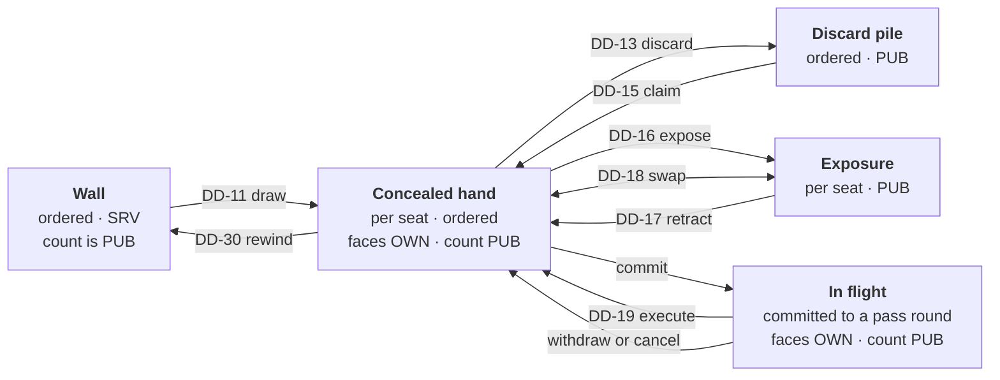

# 06 — Digital Dealer Architecture

| | |
|---|---|
| **Project** | American Mahjong Dealer |
| **Document** | 06_Digital_Dealer_Architecture.md |
| **Status** | Ratified v0.1 — approved by the project owner, 2026-09-02 |
| **Last Updated** | 2026-09-02 |
| **Role in SSOT** | Owns the dealer's complete mechanical duty list and the design of `dealer-core`. Does **not** own the tile model (`07`), randomization (`08`), the state machine (`09`), or the command protocol (`10`). |

---

## 1. Executive Summary

A human dealer at an American Mahjong table does a specific and finite set of things. They open the
tile case, shuffle, help build the wall, deal the opening hands, and then — this is the part that
matters — they stop. For the rest of the game the tiles are moved by the players. The dealer does
not tell anyone what to discard, does not announce that a call was illegal, and does not declare the
winner.

`dealer-core` is the software equivalent, and this chapter enumerates its duties exhaustively. Every
duty is listed with a justification of the form *"this is mechanics because…"*, because that
justification is the thing that keeps the boundary honest. A duty that cannot be justified without
appealing to the rules does not belong here.

The chapter also names the duties a human dealer performs that this one **declines**, and why. Those
are as much part of the specification as the duties it accepts.

---

## 2. Objectives

Serves `OBJ-08` (every tile accounted for) through the conservation invariant, and `OBJ-10`
(permanent rule-agnosticism) by giving the mechanical surface a closed, justified definition against
which drift is visible.

---

## 3. The core's shape

`dealer-core` is a pure function library. Its entire public surface is:

```
apply(state, command, entropy?, now?) -> { state', events[] } | Rejection
project(state, seat) -> SeatView
checkpoint(state) -> bytes        /  restore(bytes) -> state
invariants(state) -> ok | violation
```

**Pure.** No clock, no randomness, no I/O, no environment, no logging. Entropy and time are injected
by the host (`03 §5`).

**Total.** Every command produces either a new state or a typed rejection. There is no partial
application and no exception path that leaves state half-modified.

**Rule-free.** The package has no configuration loader, no rule table, no pattern data, and no
branch on tile face. There is nowhere for a rule to live and no way to fetch one.

### 3.1 Why purity is a privacy property, not only a testing one

A pure core cannot leak. It has no socket, no log, no file handle, and no network. Every byte that
reaches a client passes through `project`, which is one function taking a seat. The privacy
argument therefore reduces to auditing one function rather than auditing a codebase — which is the
difference between a claim that can be verified and a claim that can only be asserted.

---

## 4. The mechanical duty list

Each duty is justified. The test applied throughout is the one from `02 §5.1`: *could a person who
has never heard of Mahjong, looking only at the tiles and the table, perform or verify this?*

### 4.1 Custody duties

| # | Duty | This is mechanics because… |
|---|---|---|
| DD-01 | Construct the complete tile set at game start | What is in the tile case is a property of the equipment, not of the rules. Anyone can count the tiles. |
| DD-02 | Give each physical tile a distinct identity | Two identical-looking tiles are still two objects. Tracking them is bookkeeping. |
| DD-03 | Mint an opaque handle per tile per game | An addressing scheme. Carries no meaning at all, which is the point (`07 §5`). |
| DD-04 | Maintain the conservation invariant at every moment | Counting. A person can verify it without knowing any rules. |
| DD-05 | Refuse any transition that would duplicate, lose, or invent a tile | Physical impossibility, enforced. |

### 4.2 Preparation duties

| # | Duty | This is mechanics because… |
|---|---|---|
| DD-06 | Shuffle the tile set into a random order | Shuffling is a physical act with no rule content. |
| DD-07 | Form the shuffled tiles into an ordered wall with two ends | A wall is an arrangement of tiles. Which end you draw from is the player's choice (`DD-12`). |
| DD-08 | Compute and publish a commitment to the wall order | Bookkeeping that replaces the players' ability to watch the shuffle (`08 §5`). |
| DD-09 | Deal the configured counts into each seat's concealed hand | Handing out tiles. The counts are a dealing procedure, applied once (`07 §4`). |
| DD-10 | Deliver each seat's dealt tiles only to that seat | Physical privacy: tiles go behind a rack. |

### 4.3 Movement duties

Each of these moves tiles between well-defined locations. None inspects a tile's face.

| # | Duty | This is mechanics because… |
|---|---|---|
| DD-11 | Move the next wall tile into a seat's concealed hand on request | Taking a tile from the wall is reaching and picking up. |
| DD-12 | Take from either end of the wall, at the requester's choice | Both ends are physically reachable. The system attaches no meaning to which. |
| DD-13 | Move a tile from a seat's concealed hand to the discard pile | Putting a tile down where everyone can see it. |
| DD-14 | Keep the discard pile ordered and public | A pile has an order and is face-up on the table. |
| DD-15 | Move the current discard into a requesting seat's concealed hand | Reaching for the tile that was just put down. |
| DD-16 | Move tiles from a concealed hand to a public exposure owned by that seat | Laying tiles face-up on the rack ledge. |
| DD-17 | Move an exposure's tiles back into the owning seat's concealed hand | Picking them back up. Physically possible; the information already seen stays seen. |
| DD-18 | Exchange a tile in a concealed hand for a tile in any exposure | Reaching over and swapping two tiles. Whether the swap is *permitted* is a rule; whether it is *possible* is not. |
| DD-19 | Execute a simultaneous, atomic, secret exchange of tiles between seats | Four people pushing tiles across a table at the same moment (`10 §6`). |
| DD-20 | Preserve each seat's chosen tile order across every movement | A dealer does not rearrange anyone's rack (`NR-304`). |

### 4.4 Bookkeeping duties

| # | Duty | This is mechanics because… |
|---|---|---|
| DD-21 | Maintain a turn pointer and move it on a wall draw or a claim | Shared attention, made explicit. Justified at length in `02 §6`. |
| DD-22 | Report the number of tiles remaining in the wall | Anyone can see how much wall is left. |
| DD-23 | Report each seat's hand size | Anyone can see how many tiles are on a rack. |
| DD-24 | Record that the wall became empty | An observable fact. What it means is for the players (`NR-012`). |
| DD-25 | Record each action, in order, attributed to a seat | Bookkeeping. |
| DD-26 | Record a declaration of Mahjong as an action | Recording that someone said a word. Not evaluating it (`NR-003`). |
| DD-27 | Record each seat's response to a declaration | Recording what people said. |
| DD-28 | Record a game's conclusion as a neutral fact | "The players concluded the game." No score, no justification (`NR-013`). |
| DD-29 | Produce a checkpoint of complete state | Bookkeeping for recovery (`16 §5`). |
| DD-30 | Restore a checkpoint on demand | Putting the table back as it was (`05 §8`). |

### 4.5 Projection duties

| # | Duty | This is mechanics because… |
|---|---|---|
| DD-31 | Produce a per-seat view containing exactly that seat's entitlement | The digital equivalent of sightlines: a rack faces its owner. |
| DD-32 | Never place another seat's concealed faces, the wall order, or the salt in any view | There is no vantage point at a physical table from which those are visible. |

Thirty-two duties. That is the entire dealer.

---

## 5. Duties a human dealer performs that this one declines

Worth listing explicitly, because each is something a reasonable implementer might add.

| Human dealers often… | This dealer does not | Because |
|---|---|---|
| Remind a player it is their turn | The turn pointer is displayed; nothing nags | `FC-6` — nothing happens that the player did not cause. A knock signal exists for players to use (`05 §9.3`) |
| Say "that's not a legal call" | Never | `NR-005`. Rule knowledge |
| Say "you have too many tiles" | Never | `NR-009`. Hand size is a rule |
| Announce a winner | Never | `NR-003`. Records the declaration; the players decide |
| Enforce turn order for every action | Only for wall draws | `02 §6`. Everything else would require knowing why the turn moves |
| Push a discard back to a player who erred | Only by unanimous rewind | `05 §8`. The dealer does not know who erred |
| Tidy someone's tiles | Never | `NR-301`–`NR-306` |
| Set a pace or a time limit | Never | `NR-210`. No timer performs a binding action |
| Deal a replacement for a flower | Never automatically | Whether a flower earns a replacement is a rule. The player draws if they want to (`DD-11`) |

The last row is a good illustration of the general method. The physical action — drawing another
tile — is available. What is absent is the *trigger*: the system never notices a flower and never
acts on it.

---

## 6. Tile locations

Every tile is in exactly one location at every moment. This is the structure the conservation
invariant quantifies over.



Five locations, ten transitions. `in flight` exists as a distinct location so that a tile committed
to a pass round is unambiguously accounted for while it belongs to neither the sending nor the
receiving hand — which is what makes the invariant hold *during* the exchange, not merely on either
side of it.

Note the rewind edge from hand back to wall: a rewind is the only transition that returns a tile to
the wall, and it is followed by a reshuffle of the undrawn remainder (`05 §8.4`).

---

## 7. What the core never does

Stated as an explicit non-list, because an implementer's instinct will be to add these.

The core never inspects a tile's face in order to make a decision. It never counts tiles of a kind.
It never compares two tiles for anything but identity and sort order. It never groups, sorts, or
categorizes a hand. It never evaluates a hand against anything. It never rejects an action for being
unwise, unusual, or unexpected. It never acts without a command. It never starts a timer. It never
consults configuration beyond the three table-setup values in `05 §7`.

The strongest single statement: **there is no branch anywhere in `dealer-core` whose condition
depends on what a tile is.** Faces are carried, moved, and projected. They are never examined.
`TC-A03` asserts this by auditing the command paths.

---

## 8. Design Decisions

| ID | Decision | Rationale |
|---|---|---|
| D-06-01 | Enumerate the duties exhaustively, each with a mechanics justification | An enumerated, justified list makes an addition visible as an addition. An informal description would absorb a rule check without anyone noticing. |
| D-06-02 | Name the declined duties as well as the accepted ones | The declined list is where the temptation lives; leaving it implicit invites re-derivation. |
| D-06-03 | Five tile locations with `in flight` as a first-class location | Makes the conservation invariant true during a pass round, not merely before and after. |
| D-06-04 | Never branch on tile face anywhere in the core | The single most testable expression of rule-agnosticism. Any rule must eventually ask what a tile is. |
| D-06-05 | Draws take an end parameter, `head` or `tail` | Both ends of a physical wall are reachable. Providing the choice without attaching meaning keeps a rule-driven distinction out of the system. |
| D-06-06 | Exposure retraction is permitted and public | Physically possible, and forbidding it would require knowing that an exposure is binding — a rule. |
| D-06-07 | Swapping with an exposed tile is a general primitive | Covers the joker exchange without knowing what a joker is. Only ownership and existence are checked. |
| D-06-08 | Wall exhaustion is recorded and nothing follows | Whether an empty wall ends the game is a rule (`NR-012`). |

---

## 9. Alternative Designs

| Alternative | Why rejected |
|---|---|
| A dealer that validates the opening hand size continuously | Hand size is a rule (`NR-009`). Enforcing it after the deal would break legitimate rule variants and constitute rule knowledge. |
| Automatic replacement draws for flowers | Requires recognizing a flower and knowing it earns a replacement. Both are rules. |
| A dealer that advances the turn on every discard | Presumes discarding ends a turn, which is a rule. The pointer moves on wall draws and claims only (`09 §6`). |
| Exposures as an opaque group with a declared type | A type would be rule vocabulary. Exposures are ordered tile lists with an owner and nothing more. |
| No `in flight` location; tiles stay in the sender's hand until execution | Makes hand counts wrong during a pass round and complicates the invariant. |
| A dealer that ends the game when the wall empties | `NR-012`. The players decide. |

---

## 10. Trade-offs

**The core is deliberately unhelpful, so mistakes go through.** Accepted: that is the product, and
the correction mechanism is the remedy (`05 §8`).

**Never branching on tile face rules out some genuinely mechanical conveniences** — for example,
telling a player how many tiles of a kind are visible in the discard pile. That would be countable
by a person at a table. It is nonetheless excluded, because a face-inspecting branch in the core is
the seam through which every rule would eventually arrive, and the bright line is worth more than
the convenience.

**Thirty-two duties is a long list to maintain.** Accepted: it is also the artifact that makes an
addition reviewable.

---

## 11. Risks

| Risk | Mitigation |
|---|---|
| A duty is added without justification | `§4` format requires one; review compares against `02 §5` |
| A face-inspecting branch appears in the core | `D-06-04`; `TC-A03` command-path audit |
| The core acquires a configuration surface | `05 §7` fixes it at three values; `NR-011` |
| Purity erodes via a convenient import | Lint rule fails the build (`NFR-060`) |
| The conservation invariant is checked only in tests | It is a core function (`invariants`) asserted after every transition in non-production builds and property-tested exhaustively (`TC-M01`) |

---

## 12. Future Considerations

Not committed: alternate tile-set profiles, which would extend `DD-01` without altering any other
duty; a mechanical "return the current discard to its discarder" primitive as a lighter alternative
to a full rewind for the single most common mistake.

---

## 13. Cross References

| Document | Focus |
|---|---|
| `02_System_Scope.md` | The validation boundary every duty is justified against |
| `07_Tile_Model.md` | Tile identity, handles, the conservation invariant |
| `08_Shuffle_and_Deal_Architecture.md` | `DD-06` to `DD-09` in detail |
| `09_Game_State_Machine.md` | When each duty is available |
| `10_Player_Action_Model.md` | The commands that invoke these duties |
| `14_Player_Privacy.md` | `DD-31`, `DD-32` in detail |
| `SCOPE_BOUNDARIES.md` | The responsibility matrix this chapter implements |

---

## 14. Revision History

| Version | Date | Author | Changes |
|---|---|---|---|
| 0.1 | 2026-09-02 | Design (architect role), owner-approved | Initial chapter: 32 duties, 9 declined duties, 5 tile locations |
