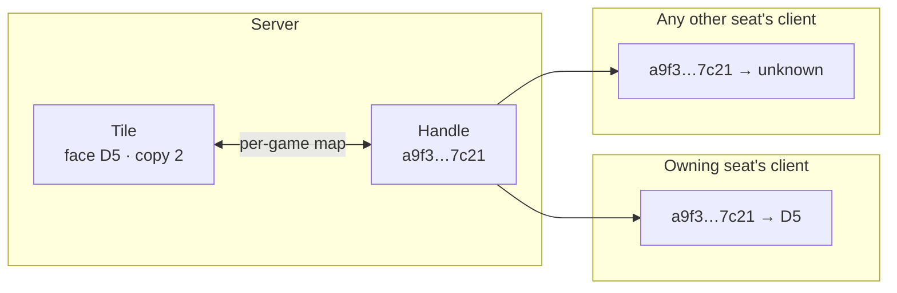
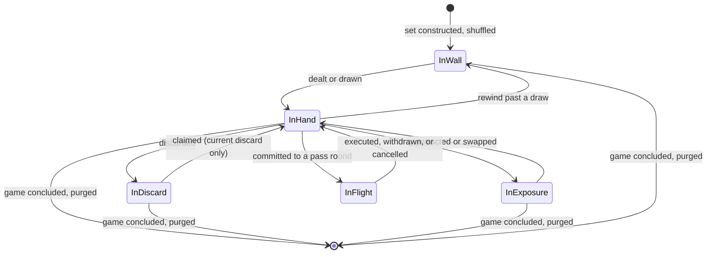

# 07 — Tile Model

| | |
|---|---|
| **Project** | American Mahjong Dealer |
| **Document** | 07_Tile_Model.md |
| **Status** | Ratified v0.1 — approved by the project owner, 2026-09-02 |
| **Last Updated** | 2026-09-02 |
| **Role in SSOT** | Owns the tile-set equipment specification, tile identity, the face codec, opaque handles, the ordering, and the conservation invariant. Does **not** own shuffling or dealing (`08`), tile movement (`06`, `10`), or the visual presentation of tiles (`32_UX/Tile_Component_Spec.md`). |

---

## 1. Executive Summary

The tile model has one job and one trap.

The job is **identity**. A tile is a physical object. There are eight jokers in the case, and they
are eight distinct objects, not one object with a count of eight. Modelling tiles as distinguishable
objects with stable identities is what makes it possible to state — and continuously verify — that
no tile is ever duplicated, lost, or invented. That statement, the conservation invariant, is the
single most valuable correctness property in the system, because it is rule-free, exhaustively
testable, and catches an enormous class of mechanical bug.

The trap is that a tile set looks like a rule. It is not: it is **equipment**. What is in the tile
case is a property of the physical set, the way a deck having fifty-two cards is a property of the
deck rather than a rule of poker. This chapter therefore records the set as an *owner-confirmed
equipment specification* with explicit provenance, rather than deriving it from general knowledge
about how Mahjong is played. The distinction matters both for correctness — an inferred tile count
is an unverified assumption sitting under everything else — and for the scope boundary.

One further decision shapes the rest of the model: on the wire, a tile is an **opaque handle**, not
a face. A client that has not been shown a tile learns nothing from its identifier.

---

## 2. Objectives

Serves `OBJ-08` (every tile accounted for at every moment) through the conservation invariant, and
`OBJ-06` (concealed hands private) through opaque handles, which make a tile identifier useless to a
client not entitled to the tile.

---

## 3. The tile set — equipment specification

> **Provenance.** This inventory was confirmed by the project owner on 2026-09-02 as the physical
> set this application reproduces. It was **not** inferred from general Mahjong knowledge. If the
> intended physical set ever differs, this section is amended first and the implementation follows.

| Group | Faces | Copies | Count |
|---|---|---|---|
| Dots | 1 – 9 | 4 | 36 |
| Bams | 1 – 9 | 4 | 36 |
| Craks | 1 – 9 | 4 | 36 |
| Winds | East, South, West, North | 4 | 16 |
| Dragons | Red, Green, Soap (white) | 4 | 12 |
| Flowers | eight distinct flowers | 1 each | 8 |
| Jokers | joker | 8 | 8 |
| | | | **152** |

### 3.1 This is equipment, not rules

The system knows that the case contains 152 objects and what each looks like. It knows **nothing**
about what any of them mean.

It does not know that jokers substitute for anything, that dragons pair with suits, that flowers are
special, that soap is a white dragon rather than a blank, or that any face outranks any other. Those
are rules. The set is a manifest of physical objects, used for exactly three purposes: constructing
the game's tiles, verifying the conservation invariant, and rendering a picture on a screen.

Consistently with `D-06-04`, **no branch anywhere in `dealer-core` depends on which face a tile
carries.** The groups above are a description of the equipment, not a taxonomy the software reasons
over.

### 3.2 Flowers are eight distinct faces

The eight flowers are modelled as eight distinct faces with one copy each, rather than one face with
eight copies. This mirrors a physical American set, in which the flower tiles carry different
pictures, and it costs nothing. It also avoids a subtle trap: if flowers were interchangeable, a
future implementer might be tempted to treat them as a category, and categories are where rules
begin.

---

## 4. Table setup: the opening deal

| Setting | Default | Nature |
|---|---|---|
| Tile set | The 152-tile set above | Equipment |
| Opening count, non-dealer seats | 13 | Dealing procedure |
| Opening count, East seat | 14 | Dealing procedure |

The counts describe **how the dealer hands tiles out once**, which is a procedure a person could
carry out having been told the numbers and nothing else. They are emphatically not a hand-size rule:
after the deal completes, no hand size is ever enforced, checked, or referenced again (`NR-009`,
`FR-046`). A seat may hold four tiles or forty, and the system has no opinion.

That asymmetry — the count matters once, at the moment of dealing, and never again — is precisely
where the line between procedure and rule falls.

---

## 5. Tile identity

### 5.1 Three layers

| Layer | Shape | Purpose | Visibility |
|---|---|---|---|
| **Face** | What is painted on the tile: `DOT_5`, `WIND_EAST`, `JOKER`, `FLOWER_3` | Rendering; equipment manifest | `OWN` or `PUB` depending on where the tile is |
| **Copy** | Which of the identical tiles this is: 0-based index | Distinguishing physical objects | Internal; carried with the face |
| **Handle** | A random 128-bit value, minted per tile per game | Addressing on the wire | Given to a client only when it is entitled to reference the tile |

A **tile** is a face plus a copy — one physical object. A **handle** is how that object is named on
the wire.

### 5.2 The face codec

Faces have a compact, total, round-trippable text encoding for storage and diagnostics:

| Group | Encoding | Examples |
|---|---|---|
| Dots | `D1` – `D9` | `D5` |
| Bams | `B1` – `B9` | `B9` |
| Craks | `C1` – `C9` | `C1` |
| Winds | `We`, `Ws`, `Ww`, `Wn` | `We` |
| Dragons | `Rred`, `Rgreen`, `Rsoap` | `Rsoap` |
| Flowers | `F1` – `F8` | `F3` |
| Joker | `J` | `J` |

The codec lives in `shared` and exists exactly once (`03 §4.2`). Two properties are deliberate:
dragons use the `R` prefix rather than `D`, so that no prefix is ambiguous with dots and the codec
needs no length-based disambiguation; and every code is fixed-form, so parsing is total.

A physical tile is written `face#copy` — `D5#2`, `J#7`, `We#0` — in checkpoints and in
developer-facing diagnostics. **This form is a privacy hazard by construction**: any log line
containing it is a leak. The log scanner searches for exactly this pattern (`20 §7`, `TC-P03`), and
the branded types make writing one to a logger a compile error (`14 §6`).

### 5.3 Opaque handles

On the wire, a tile is a handle: 128 bits of cryptographically random data, minted fresh for every
tile at the start of every game.



Properties:

- **A handle reveals nothing.** It is random. Possessing one tells you nothing about the face.
- **Handles do not persist across games.** A handle from a previous game is meaningless in this one.
- **Faces attach only for entitled seats.** A client receives `{ handle, face }` for a tile it may
  see and a bare `{ handle }` — or nothing at all — otherwise.
- **A guessed handle fails anyway.** Ownership is checked independently (`M-2`), so guessing a valid
  handle for another seat's tile still yields `NOT_YOUR_TILE`.

This is defence in depth rather than the primary control. The primary control is that another seat's
faces are never sent. Handles ensure that even a bug in the projection — sending a bare handle where
none was intended — leaks nothing, and they remove the temptation to use a face code as a wire
identifier, which would make every reference a potential leak.

#### Why not sequential identifiers

A sequential identifier would leak. Tile 0 through 12 going to the first seat, 13 through 25 to the
second, would let any client infer the deal structure; the position of a handle in the wall would
leak the wall order. Random handles carry no structure to exploit.

---

## 6. Ordering

Tiles need a **total order** for canonical serialization and hashing (`08 §6`). The comparator sorts
by group, then face within group, then copy index — and it is total: it never returns "equal" for
two distinct tiles.

Totality matters more than the specific order chosen. A comparator that returns equal for two
distinct tiles makes the result depend on the runtime's sort stability, which is a property that can
change between engine versions and would silently invalidate every stored hash.

**This order is not a game order.** It has no meaning to a player, appears in no interface, and never
influences a decision. A player's rack order is entirely their own (`FR-101`) and is stored
separately as a list of handles.

---

## 7. The conservation invariant

> At every moment, the multiset of tiles across wall, concealed hands, discard pile, exposures, and
> in-flight pass commitments equals exactly the game's tile set — no duplicates, no omissions.

```
wall ⊎ hands ⊎ discards ⊎ exposures ⊎ inFlight  ==  tileSet
```

This is the system's central rule-free correctness statement, and it is uncommonly good value: a
single property that catches double-spending a tile, losing one in a partially-applied transition,
duplicating one across a rewind, dropping one in a cancelled pass round, and resurrecting one after
a reshuffle.

### 7.1 How it is enforced

| Where | How |
|---|---|
| By construction | Every transition moves tiles between locations; nothing creates or destroys |
| In development and test builds | `invariants(state)` runs after every transition and throws on violation |
| In property tests | Randomized play over thousands of games asserts it after every action (`TC-M01`) |
| At checkpoint restore | Verified before a restored state is accepted (`16 §5`) |
| After a rewind reshuffle | Verified, because the reshuffle rewrites the wall (`08 §7`) |
| In production | Verified at checkpoint boundaries; a violation is a fatal error that pauses the table rather than continuing on corrupt state |

The production stance is deliberate. A conservation violation means the table's state is wrong in a
way that could give a player a tile that does not exist. Continuing would be worse than stopping.

---

## 8. The wall

The wall is an **ordered sequence** of the tiles not yet dealt or drawn, with a head and a tail.

| Property | Visibility | Rationale |
|---|---|---|
| Order | `SRV` | Knowing the order is knowing the future. Never leaves the server (`NR-502`) |
| Length | `PUB` | Visible at a physical table |
| Head and tail identity | `SRV` | Same as order |

The wall is the most sensitive object in the system — more sensitive than any single hand, because
the order plus the public history reconstructs every hand. That is why it is `SRV` rather than
merely private, why the shuffle commitment is never revealed (`08 §5`), and why the checkpoint
encryption covers it.

---

## 9. Tile state through a game



Every arrow corresponds to a duty in `06 §4`. There are no other transitions.

---

## 10. Design Decisions

| ID | Decision | Rationale |
|---|---|---|
| D-07-01 | Record the tile set as an owner-confirmed equipment specification with provenance | An inferred tile inventory is an unverified assumption underneath everything else, and framing it as equipment keeps it clear of the rule boundary. |
| D-07-02 | Model tiles as distinguishable objects (face + copy) rather than counts | Counts cannot express the conservation invariant, cannot track a specific tile through a game, and cannot support a rewind that restores exact state. |
| D-07-03 | Address tiles on the wire by opaque per-game random handles | Defence in depth: even an unintended bare-handle disclosure leaks nothing, and no wire identifier is ever a face code. |
| D-07-04 | Mint handles per game, not globally | A handle from a concluded game is meaningless, so a leaked one has no future value. |
| D-07-05 | Model the eight flowers as eight distinct faces | Matches a physical set and avoids creating a category that invites rule reasoning. |
| D-07-06 | Prefix dragons `R` so no code prefix is ambiguous | Makes the codec total and parseable without length-based disambiguation. |
| D-07-07 | Require a total tile comparator | Otherwise canonical hashing depends on runtime sort stability, which can change between engine versions. |
| D-07-08 | Treat opening deal counts as a procedure applied once, never enforced after | This is precisely where procedure and rule divide (`§4`). |
| D-07-09 | Treat a conservation violation as fatal in production | Continuing on state that miscounts tiles is worse than pausing the table. |
| D-07-10 | Classify wall order as `SRV`, stricter than `OWN` | Order plus public history reconstructs every hand; no client has any entitlement to it. |

---

## 11. Alternative Designs

| Alternative | Why rejected |
|---|---|
| Tiles as `{ face, count }` | Cannot express conservation, cannot track a tile, cannot restore exact state on rewind. |
| Face codes as wire identifiers | Every wire reference becomes a potential face disclosure, and every log line containing one is a leak. |
| Sequential or deterministic tile identifiers | Leak deal structure and wall position by their ordering. |
| Globally unique persistent tile identifiers | A leaked identifier would retain meaning across games for no benefit. |
| A single flower face with eight copies | Creates an interchangeable category, which invites rule reasoning about it. |
| Configurable tile-set profiles in v1 | Adds a configuration surface with no v1 requirement; noted as a future consideration. |
| Checking conservation only in tests | The invariant's value is that it catches production corruption, which is exactly when tests are not running. |

---

## 12. Trade-offs

**Per-game handles mean a lookup on every tile reference.** Accepted: a map lookup against at most
152 entries, on an operation already dominated by network time.

**Modelling 152 distinct objects is more state than counts.** Accepted: the entire tile state of a
game is a few kilobytes.

**A fixed tile set means a table cannot play with a non-standard set.** Accepted for v1 and recorded
as a future consideration; `DD-01` is the only duty that would change.

**Fatal-on-violation in production means a bug can stop a table.** Accepted deliberately: a stopped
table is recoverable from a checkpoint, and a table quietly playing with a duplicated tile is not.

---

## 13. Risks

| Risk | Mitigation |
|---|---|
| A face code reaches a log or a client that should not have it | Branded types (compile error); log scanner with a planted control (`TC-P03`); frame inspection (`TC-P01`) |
| The codec is duplicated and drifts | It exists once in `shared`; the dependency law prevents a second copy from being importable |
| A transition breaks conservation | Property tests over randomized play; runtime assertion; verification at checkpoint restore |
| The tile set is quietly changed | Provenance line in `§3`; amendment required; conservation tests are set-relative and would flag a mismatch against stored checkpoints |
| A face-inspecting branch is added | `D-06-04`; `TC-A03` |

---

## 14. Future Considerations

Alternate tile-set profiles as a table setting. A per-face render manifest so that tile artwork can
be themed without touching the model. Neither is committed, and neither would alter identity,
handles, or the invariant.

---

## 15. Cross References

| Document | Focus |
|---|---|
| `06_Digital_Dealer_Architecture.md` | The duties that move tiles between locations |
| `08_Shuffle_and_Deal_Architecture.md` | Wall construction, shuffling, the commitment |
| `14_Player_Privacy.md` | Visibility classes and the branded types |
| `16_Data_Architecture.md` | Checkpoint contents and encryption |
| `20_Logging_and_Observability.md` | The log scanner and the `face#copy` pattern |
| `32_UX/Tile_Component_Spec.md` | How a tile is drawn |
| `34_Testing/Integrity_and_Randomization_Suites.md` | `TC-M01` conservation, `TC-R*` randomization |

---

## 16. Revision History

| Version | Date | Author | Changes |
|---|---|---|---|
| 0.1 | 2026-09-02 | Design (architect role), owner-approved | Initial chapter; tile inventory confirmed by the project owner 2026-09-02 |
