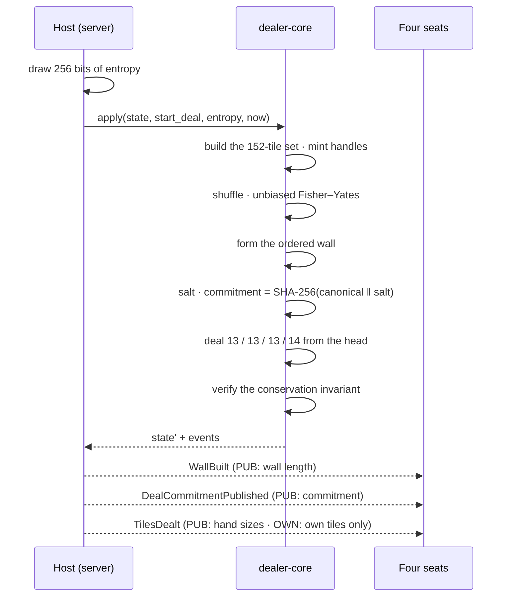
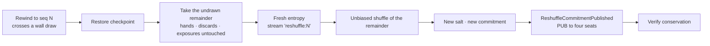

# 08 — Shuffle and Deal Architecture

| | |
|---|---|
| **Project** | American Mahjong Dealer |
| **Document** | 08_Shuffle_and_Deal_Architecture.md |
| **Status** | Ratified v0.1 — approved by the project owner, 2026-09-02 |
| **Last Updated** | 2026-09-02 |
| **Role in SSOT** | Owns randomization, wall construction, the opening deal, the shuffle commitment scheme, and the reshuffle that accompanies a rewind. Does **not** own tile identity (`07`), the state machine (`09`), or checkpoint storage (`16`). |

---

## 1. Executive Summary

This is the chapter where the application asks players to trust it, and it is worth being precise
about what changes when a shuffle moves from a table to a server.

At a physical table, the shuffle is not trusted — it is *witnessed*. Four people push the tiles
around face-down, everybody watches, and the randomness is a shared physical fact nobody has to take
on faith. Digitally, that witnessing disappears completely. The tiles are shuffled invisibly, by
software the players did not write, running on a machine they do not control. The trust model is not
merely weaker; it is a different model.

The response has three parts. **Correctness**: a cryptographically secure source and an unbiased
algorithm, so the shuffle is genuinely uniform rather than approximately so. **Isolation**: no path
from any client to the shuffle, so a player cannot influence, predict, or observe it. And
**tamper-evidence**: a hash commitment to the wall order, published to all four seats before play
begins and retained server-side afterwards, so that the wall provably existed in its final form
before anyone acted and was never reordered mid-game.

The commitment is deliberately **never revealed**. Section 5.3 works through why: revealing the wall
order after a game, even to the participants, reconstructs every concealed hand that was never
shown. The tamper-evidence is worth having; the reveal is not worth its cost.

---

## 2. Objectives

Serves `OBJ-07` (a trustworthy deal that no participant can influence, predict, or inspect) and
supports `OBJ-06`, since the wall order is the most privacy-sensitive object in the system.

---

## 3. Threats to a fair deal

Naming what the design defends against, so each control can be traced to a threat.

| # | Threat | Control |
|---|---|---|
| SD-1 | A player influences the shuffle result | No client input reaches the shuffle; entropy is server-only (`§4.1`) |
| SD-2 | A player predicts the wall order | Cryptographic entropy; no seed material is derived from anything a client supplies or observes |
| SD-3 | A player observes the wall order | `SRV` classification; the order is in no frame, no log, no metric, and no unencrypted store |
| SD-4 | A player requests favourable tiles | No command names a tile to be drawn; draws take an end, not a target (`NR-604`) |
| SD-5 | A player draws from another seat's hand | Ownership check (`M-2`) |
| SD-6 | A biased algorithm favours certain arrangements | Rejection sampling rather than modulo reduction (`§4.2`) |
| SD-7 | The wall is reordered after play begins | Commitment published at deal time (`§5`) |
| SD-8 | A player replays a deal by re-running a known seed | Seed injection is compiled out of production builds (`§4.4`) |
| SD-9 | A rewind lets a player exploit a tile they saw | The undrawn remainder is reshuffled (`§7`) |

---

## 4. Randomization

### 4.1 Entropy

Seed material comes from the platform's cryptographically secure random source, on the server, and
from nowhere else. 256 bits per game.

There is **no** contribution from: any client, any request field, any player identifier, the table
identifier, the wall clock, a process identifier, a counter, or any previous game. This is stated as
a closed list because "mixing in" a client-supplied value is a superficially appealing idea — it
sounds like it distributes trust — and it is exactly the path by which a client would gain
influence.

`dealer-core` is pure and cannot obtain entropy itself (`03 §5`). The host draws it and passes it
in, which means the entropy source is one auditable call site.

### 4.2 The algorithm

Fisher–Yates, descending, with **rejection sampling** for each index.

```
for i from n-1 down to 1:
    j = uniformBelow(i + 1)        # rejection-sampled, never modulo
    swap(a[i], a[j])
```

`uniformBelow(k)` draws machine words from the stream and discards any value that falls in the
biased tail, retrying until one lands in range. The alternative — reducing a random word modulo `k`
— gives lower indices slightly more probability whenever `k` does not divide the word range evenly.

The bias is small, and it would be easy to argue it does not matter for a game with no stakes. The
argument is declined for two reasons: the system's entire claim in this area is that the deal is
fair, and a known-biased shuffle undermines that claim regardless of magnitude; and the correct
implementation is three lines longer than the incorrect one.

### 4.3 Stream separation

Where more than one consumer needs randomness in a game — the initial shuffle, and any later
reshuffle after a rewind — each derives an independent stream:

```
stream(label) = SHA-256(seed ‖ label)
```

So `stream("wall")` and `stream("reshuffle:7")` are independent, and observing the output of one
gives no information about another.

### 4.4 Determinism for testing

`dealer-core` takes entropy as a parameter, so a test can supply a fixed value and obtain an exactly
reproducible wall. This makes the mechanics testable to an exact expected outcome.

The corresponding hazard is obvious, and it is closed structurally: **the code path that accepts an
externally supplied seed is compiled out of production builds** by a build-time flag, and a
production build asserts at startup that no seed-injection path is reachable. A test-only capability
that merely "is not called" in production is a capability an attacker can try to call
(`SD-8`, `SEC-031`).

---

## 5. The commitment scheme

### 5.1 What is computed and published

At deal time, before any tile is dealt:

```
salt       = 256 random bits, server-generated
commitment = SHA-256(canonical(wallOrder) ‖ salt)
```

The **commitment** is published to all four seats in the `DealCommitmentPublished` event. The
**salt** and the **wall order** are retained server-side and are never sent to any client
(`NR-502`, `NR-503`).

`canonical(...)` is the deterministic encoding from `§6`, so the commitment is reproducible from the
same wall.

### 5.2 What this proves, and to whom

The commitment is **tamper-evidence**, not player-verifiable proof, and the documentation should not
overstate it.

| Claim | Does the commitment support it? |
|---|---|
| The wall existed in its final order before any player acted | **Yes.** The commitment is published before the first deal event. |
| The wall was not reordered during the game | **Yes**, for anyone who can recompute it — an operator with the retained wall order and salt. |
| Nobody peeked at the wall | **No.** A commitment says nothing about who read the value. |
| A player can independently verify their deal was fair | **No**, by design. Verification requires the salt, and the salt is never released. |

The honest summary: it converts "the operator says the wall was not altered" into "the operator can
be shown to have not altered the wall, by recomputation, in an audit." That is a real strengthening
of an operational integrity claim. It is not a player-facing proof, and `32_UX` presents it as what
it is.

### 5.3 Why the salt is never revealed — the wall-order leak

This is the analysis that decides the scheme, and it is worth stating in full because the opposite
choice is intuitively attractive.

**Wall order plus public history reconstructs every concealed hand.**

Every tile's journey is either public or derivable:

- The deal is a **known procedure** over the wall: 13 tiles to each seat, 14 to East, from the head,
  in a fixed pattern. Anyone with the wall order can compute exactly which tiles each seat started
  with.
- Every subsequent draw is a **public event** — who drew, from which end, at which sequence number —
  so the drawn tile's identity follows from the wall order and the count of prior draws.
- Every discard, claim, exposure, retraction, and swap is **already public**.
- Pass rounds move tiles between seats along a **publicly routed** path; combined with a known
  starting hand, the movements resolve.

So an observer with the wall order and the public event log can reconstruct **every seat's concealed
hand at every moment of the game**, including hands that were never revealed. Publishing the salt
after a game therefore publishes the losers' hands.

The unanimity gate that was considered — reveal only if all four seats consent — narrows the
exposure but does not remove it. A player might consent under social pressure, or without
understanding that they are disclosing every hand they held. And the capability's mere existence
means the salt must be retained in a form that can be released, which is a standing liability.

**Decision: publish the commitment, retain the salt server-side, never reveal it.** The tamper-
evidence is kept and the reconstruction risk is eliminated. `ADR-0008`.

### 5.4 Options considered

| | A — CSPRNG only | B — Commit, never reveal | C — Commit, reveal on consent |
|---|---|---|---|
| Uniform, unbiased shuffle | ✔ | ✔ | ✔ |
| Client cannot influence or observe | ✔ | ✔ | ✔ |
| Operator tamper-evidence | ✘ | ✔ | ✔ |
| Player-verifiable fairness | ✘ | ✘ | ✔ (if all four consent) |
| Reconstruction risk | none | none | **every unrevealed hand, on consent** |
| Salt must be retained releasably | no | no | **yes** |
| Additional code | none | hash + one event | + consent protocol, reveal path, retention policy |

**B is chosen.** A gives up tamper-evidence for a saving of about ten lines. C buys a
player-facing property that most players will never exercise, at the cost of a permanent
reconstruction capability and a consent flow that can be socially coerced.

A note on convergence: the reference project inspected in
`INHERITANCE_AND_EXCLUSION_ANALYSIS.md` reached the same conclusion independently, from the same
reconstruction argument. Two independent derivations landing on B is reasonable evidence that B is
right.

---

## 6. Canonical encoding

The commitment hashes a canonical byte encoding of the wall order, so that the same wall always
produces the same commitment regardless of language, platform, or serializer version.

| Rule | Reason |
|---|---|
| Tiles encoded as `face#copy` using the `07 §5.2` codec | One codec, total and round-trippable |
| Concatenated head to tail, single-byte separator | Order is the value being committed to |
| No whitespace, no structural punctuation, no version prefix | Nothing that a formatter could alter |
| UTF-8 bytes | Unambiguous |

---

## 7. Wall construction, dealing, and reshuffle

### 7.1 Construction and deal



The deal is a single atomic transition. There is no intermediate state in which some seats hold
tiles and others do not, so there is no window in which a crash could leave a half-dealt table.

`TilesDealt` illustrates the projection rule concretely: all four seats receive the same event with
different content. Each sees every seat's hand *size*; each sees only its own tile *faces*.

### 7.2 Reshuffle after a rewind

When a rewind crosses a wall draw (`05 §8.4`), the undrawn remainder of the wall is reshuffled:



Only the tail is re-randomized. Every tile a player legitimately holds, every discard, and every
exposure is left exactly as restored — a rewind must restore the past, not invent a new one.

The new commitment is published so the tamper-evidence chain remains unbroken: an audit can verify
each segment of the game against the commitment in force at the time.

Why this is the right answer rather than forbidding such rewinds: drawing out of turn is one of the
most common table mistakes, and refusing to correct it would make the correction mechanism useless
in the case it is most needed. Reshuffling is also what physical players do when a tile is
accidentally exposed, so the fix is the faithful one as well as the private one.

---

## 8. Verification

| Property | Method | Case |
|---|---|---|
| Uniform distribution | Chi-squared over face-by-position frequency, 100 000 shuffles, α = 0.001 | `TC-R03` |
| No positional bias | Each tile's position distribution tested against uniform | `TC-R03` |
| No duplicates or omissions | Conservation checked after every shuffle | `TC-R01` |
| Independence between games | Successive shuffles from independent entropy are uncorrelated | `TC-R04` |
| No client influence path | Static audit: no client-derived value reaches the shuffle | `TC-R05` |
| Seed injection absent in production | Build asserts the path is unreachable | `TC-R06` |
| Commitment reproducibility | Recompute from the retained wall and salt; must match | `TC-R07` |
| Reshuffle preserves non-wall state | Hands, discards, exposures byte-identical before and after | `TC-R08` |

---

## 9. Design Decisions

| ID | Decision | Rationale |
|---|---|---|
| D-08-01 | Server-only cryptographic entropy, no client contribution | Any client contribution is a channel for influence. The apparent benefit — distributed trust — is illusory when the server composes the seed anyway. |
| D-08-02 | Rejection sampling rather than modulo reduction | Modulo bias is small but real, and the system's claim in this chapter is fairness. Correct costs three lines. |
| D-08-03 | Publish a commitment, retain the salt, never reveal it | Keeps tamper-evidence; eliminates reconstruction. Full analysis in `§5.3`, options in `§5.4`. `ADR-0008` |
| D-08-04 | Describe the commitment accurately as tamper-evidence, not player-verifiable proof | Overstating it would be a worse failure than not having it. |
| D-08-05 | Compile the seed-injection path out of production builds | A test capability that is merely unused is one an attacker can try to reach. |
| D-08-06 | Domain-separated streams per randomness consumer | A reshuffle must not be predictable from the initial shuffle. |
| D-08-07 | Reshuffle only the undrawn remainder on a rewind | Restoring the past means leaving held tiles alone; re-randomizing the future neutralizes the peek. |
| D-08-08 | Publish a fresh commitment after a reshuffle | Keeps the tamper-evidence chain unbroken across the rewind. |
| D-08-09 | Deal as a single atomic transition | No half-dealt state can be observed or checkpointed. |
| D-08-10 | Canonical encoding with no version prefix or whitespace | Nothing a formatter or serializer change could alter. |

---

## 10. Alternative Designs

| Alternative | Why rejected |
|---|---|
| Mix client-supplied entropy into the seed | Gives clients a channel of influence, for a trust benefit that does not survive the server composing the final seed. |
| Reveal the salt after the game, unconditionally | Publishes every unrevealed hand (`§5.3`). |
| Reveal on unanimous consent | Narrows but does not remove the exposure; consent can be socially coerced and is given without understanding; requires retaining a releasable salt permanently. |
| Publish no commitment at all | Saves ten lines and gives up the ability to demonstrate the wall was not altered. |
| Third-party randomness beacon | An external dependency in the deal path, with an availability failure mode, for randomness the platform already provides. |
| Reshuffle the whole wall on any rewind | Would change tiles players already hold, which is not a restoration of the past. |
| Forbid rewinds that cross a wall draw | Excludes the most common table mistake from the correction mechanism. |
| Deal in visible stages to mimic a physical deal | Creates observable intermediate states and a crash window, for an animation that the client can render from a single event anyway. |

---

## 11. Trade-offs

**Players cannot verify their own deal.** Accepted, and stated plainly rather than obscured by
cryptographic vocabulary. The alternative discloses hands.

**The operator is trusted not to read the wall order.** Accepted and unavoidable: a server that
deals must know the wall. The mitigations are that nothing normal reads it (`14 §7`), it is
encrypted at rest, it never appears in logs or metrics, and it is purged at game close.

**A rewind changes the future.** Accepted: the alternative is either a leak or an uncorrectable
mistake. Players are told a reshuffle occurred.

**Rejection sampling has unbounded worst-case time.** Accepted: the expected number of retries is
below two, and the loop is over 152 elements.

---

## 12. Risks

| Risk | Mitigation |
|---|---|
| A modulo shortcut is introduced during optimization | `D-08-02`; distribution test would detect the bias (`TC-R03`) |
| The seed-injection path survives into production | Compiled out; startup assertion; `TC-R06` |
| Wall order reaches a log or a frame | `SRV` classification; branded types; scanner; frame inspection |
| A client-derived value enters the seed | Static audit `TC-R05`; the entropy source is one call site |
| The commitment is described to players as proof of fairness | `D-08-04`; `32_UX` copy reviewed against `§5.2` |
| A reshuffle alters held tiles | `TC-R08` asserts non-wall state is byte-identical |

---

## 13. Future Considerations

Not committed: a per-game integrity report available to an operator on request, showing commitment
recomputation results without exposing the wall; publishing the commitment algorithm and canonical
encoding publicly so an external reviewer can assess the scheme without access to any game data.

---

## 14. Cross References

| Document | Focus |
|---|---|
| `07_Tile_Model.md` | Tile identity, the codec, the wall, conservation |
| `05_Game_Table_Architecture.md` | The rewind that triggers a reshuffle |
| `14_Player_Privacy.md` | Why wall order is `SRV` |
| `16_Data_Architecture.md` | Where the wall order and salt are stored and when purged |
| `31_ADR/ADR-0008-tile-randomization.md` | The commitment decision |
| `34_Testing/Integrity_and_Randomization_Suites.md` | `TC-R*` |
| `PRIVACY_THREAT_MODEL.md` | `PT-09` wall-order disclosure |

---

## 15. Revision History

| Version | Date | Author | Changes |
|---|---|---|---|
| 0.1 | 2026-09-02 | Design (architect role), owner-approved | Initial chapter; commitment scheme resolved to option B after the `§5.3` leak analysis |
