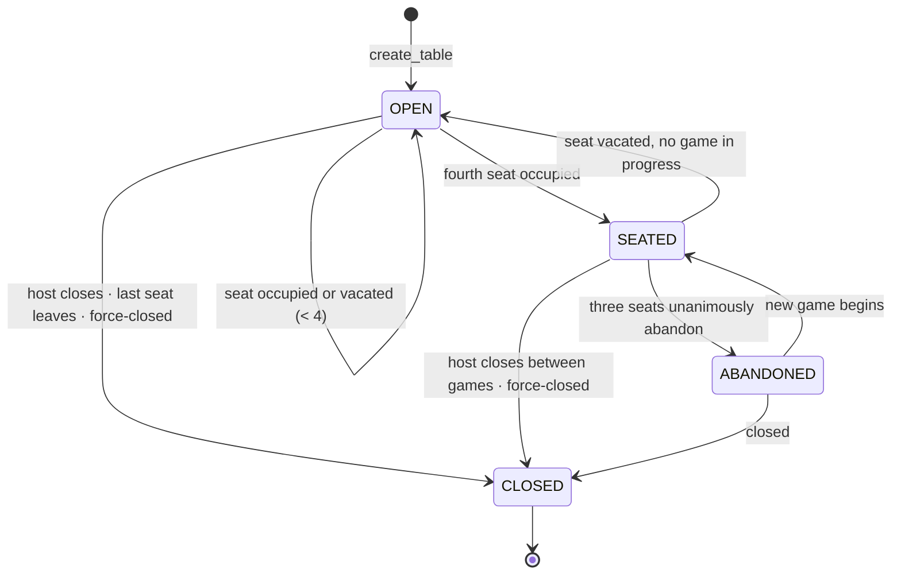
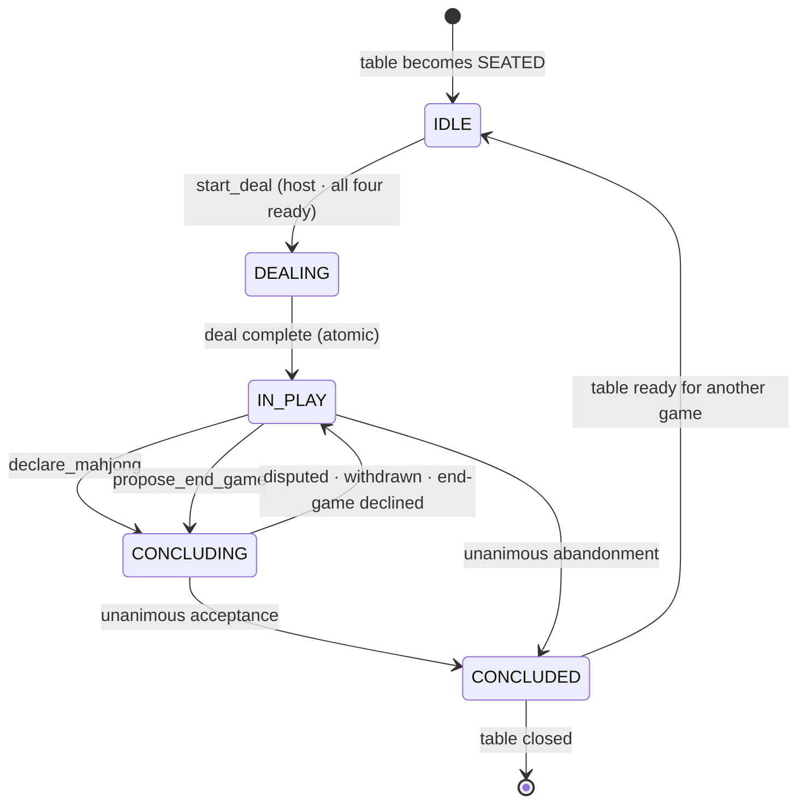
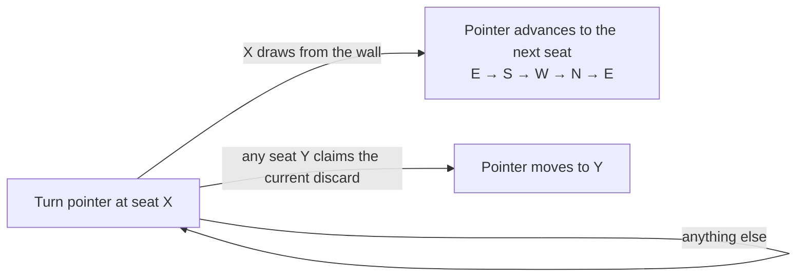

# 09 — Game State Machine

| | |
|---|---|
| **Project** | American Mahjong Dealer |
| **Document** | 09_Game_State_Machine.md |
| **Status** | Ratified v0.1 — approved by the project owner, 2026-09-02 |
| **Last Updated** | 2026-09-02 |
| **Role in SSOT** | Owns the formal state machines — table and game — the overlay flags, the turn pointer's semantics, and the command availability matrix. Does **not** own the table entity (`05`), the commands themselves (`10`), or the wire representation of state (`12`, `19`). |

---

## 1. Executive Summary

Most game state machines encode the rules. Phases named "call window," "exposure resolution," or
"confirmation" exist because the rules say what may happen when. This machine has none of those,
because the system does not know the rules, and the absence is the point: a state that exists to
constrain what a player may do next is a rule wearing a diagram.

What remains is small. A table is open, seated, or closed. A game is idle, dealing, in play,
concluding, or concluded. That is it — five game states, four table states, and one arrow that
matters more than the rest.

Two structural decisions keep it small. Pause, pass rounds, and pending corrections are **overlay
flags, not states**: modelling three independent conditions as states would produce eight
combinations and twenty-odd transitions to describe something that is genuinely three booleans. And
the **turn pointer is a field, not a state**: it changes constantly, gates exactly one command, and
has no bearing on which transitions are available.

---

## 2. Objectives

Serves `OBJ-10` by giving the state model a shape in which a rule-derived phase would be visibly
foreign, and `OBJ-09` by making every transition an explicit consequence of exactly one command or
one presence event.

---

## 3. The table machine

Owned by `05 §4`; restated here in its formal shape because the game machine is nested inside it.

A game exists only while the table is `SEATED` or `ABANDONED`. `CLOSED` is terminal and irreversible.

---

## 4. The game machine

| State | Meaning | What is true |
|---|---|---|
| `IDLE` | Four seated players, no game | No tiles exist; readiness is being gathered |
| `DEALING` | The deal is executing | Transient and atomic; observable only as a moment |
| `IN_PLAY` | The game is live | Tiles exist; play commands are available |
| `CONCLUDING` | A declaration or an end-game proposal is awaiting responses | Play commands suspended; responses awaited |
| `CONCLUDED` | The game is over | Concealed material purged; the public record remains |

### 4.1 What the states deliberately do not encode

No phase for the opening exchange of tiles — a pass round is an overlay available at any time during
`IN_PLAY`. No phase for calls or claims — claiming is available to any seat at any time. No phase
for exposures. No phase distinguishing "draw" from "discard" — a player may discard whenever they
choose, because requiring a draw first would be a rule.

The **only** thing that gates a command by state is whether the game is running at all. Within
`IN_PLAY`, the mechanical validations in `02 §3.1` decide, not the state.

### 4.2 `DEALING` is atomic

`DEALING` is entered and left within a single core transition (`08 §7.1`). It is represented in the
machine because it is a distinct condition and events reference it, but no command is ever accepted
while the game is in it, and no checkpoint is ever taken there. There is no half-dealt table.

### 4.3 `CONCLUDING` can be left in either direction

A declaration is not a conclusion. `CONCLUDING` returns to `IN_PLAY` when any seat disputes, when the
declarer withdraws, or when an end-game proposal is declined. Only unanimous acceptance advances to
`CONCLUDED`.

This shape is what keeps the system out of the judging business: the machine has no way to express
"the declaration was correct," only "everybody agreed." Detail in `10 §7`.

---

## 5. Overlay flags

Three conditions can hold in `IN_PLAY` independently of the state, and each is a flag:

| Flag | Set by | Cleared by | Effect |
|---|---|---|---|
| `PAUSED` | A seat becoming absent; an explicit pause request | The seat returning; the requester releasing | Game commands refused with `TABLE_PAUSED`; chat and correction remain |
| `PASS_ROUND_OPEN` | `open_pass_round` | Execution, cancellation, or the round timing out | Tile-movement commands refused with `PASS_ROUND_OPEN`; pass commands available |
| `CORRECTION_PENDING` | `propose_correction` | Unanimous acceptance, any rejection, or 60-second timeout | Game commands refused with `CORRECTION_PENDING`; chat remains |

### 5.1 Why flags rather than states

Three independent booleans produce eight combinations. As states, that is eight nodes and roughly
twenty transitions to express something that is genuinely "three things can be true." The state
diagram would grow eightfold and communicate less.

They are also genuinely orthogonal to the game's progress: a paused game has not moved, it is simply
not accepting movement. Modelling that as a distinct state implies a transition happened when none
did — which would then have to be undone on resume, complicating checkpoints and resumption for no
benefit.

### 5.2 Interaction

Flags can hold simultaneously, and the rules for combinations are simple and total:

- A seat can go absent while a pass round is open. Both flags hold; the round waits.
- A correction cannot be proposed while a pass round is open — the round is cancelled first, since
  rewinding into an in-flight commitment has no coherent meaning.
- A paused table still accepts correction responses, because a pause is often exactly when the
  players are working out what went wrong.
- When more than one flag would block a command, the rejection names the **first** in this fixed
  precedence: `PAUSED`, then `CORRECTION_PENDING`, then `PASS_ROUND_OPEN`. A deterministic order
  makes the rejection reproducible and the client's message predictable.

---

## 6. The turn pointer

A **field**, not a state: the seat the table believes play is at.

| Property | Value |
|---|---|
| Visibility | `PUB` |
| Gates | Exactly one command: `draw_tile` |
| Moves on | A wall draw (to the next seat in fixed order); a claim (to the claimant) |
| Does not move on | Discard, expose, retract, swap, pass round, declaration, chat |
| Can be wrong | Yes — and the system has no concept of it being right |

### 6.1 Why it is a field

It changes on most actions, and if it were part of the state identity the machine would have four
times as many states, none of which would gate anything the field does not already gate. It also
carries no rule content (`02 §6`): it can be "wrong" under the rules and nothing in the system
treats that as an error.

### 6.2 Movement

The claim arrow is the important one. Under the rules a claim often moves play out of order, and the
system permits exactly that without knowing why. Advancing after a wall draw rather than after a
discard is also deliberate: tying the pointer to a discard would presume that a discard ends a turn,
which is a rule.

---

## 7. Command availability

The complete matrix. `✔` available; `✘` rejected with the named code.

| Command | `IDLE` | `DEALING` | `IN_PLAY` | `CONCLUDING` | `CONCLUDED` |
|---|---|---|---|---|---|
| `set_ready` / `clear_ready` | ✔ | ✘ | ✘ | ✘ | ✔ |
| `start_deal` | ✔ host, all ready | ✘ | ✘ | ✘ | ✔ |
| `draw_tile` | ✘ | ✘ | ✔ turn-gated | ✘ | ✘ |
| `discard_tile` | ✘ | ✘ | ✔ | ✘ | ✘ |
| `claim_discard` | ✘ | ✘ | ✔ | ✘ | ✘ |
| `expose_tiles` / `retract_exposure` | ✘ | ✘ | ✔ | ✔ | ✘ |
| `swap_exposed_tile` | ✘ | ✘ | ✔ | ✘ | ✘ |
| `arrange_hand` | ✘ | ✘ | ✔ | ✔ | ✘ |
| `open_pass_round` | ✘ | ✘ | ✔ | ✘ | ✘ |
| `commit_pass` / `withdraw_pass` / `cancel_pass_round` | ✘ | ✘ | ✔ round open | ✘ | ✘ |
| `declare_mahjong` | ✘ | ✘ | ✔ | ✘ | ✘ |
| `reveal_hand` | ✘ | ✘ | ✔ | ✔ | ✘ |
| `respond_declaration` | ✘ | ✘ | ✘ | ✔ | ✘ |
| `withdraw_declaration` | ✘ | ✘ | ✘ | ✔ declarer | ✘ |
| `propose_end_game` / `respond_end_game` | ✘ | ✘ | ✔ / ✘ | ✘ / ✔ | ✘ |
| `propose_correction` / `respond_correction` | ✘ | ✘ | ✔ | ✘ | ✘ |
| `request_pause` / `request_resume` | ✔ | ✘ | ✔ | ✔ | ✔ |
| `send_table_message` / `send_signal` | ✔ | ✔ | ✔ | ✔ | ✔ |
| `resume` / `ping` | ✔ | ✔ | ✔ | ✔ | ✔ |

Three entries are worth explaining. `expose_tiles` and `reveal_hand` remain available in
`CONCLUDING` because that is when players are laying tiles down to be examined. `arrange_hand`
remains available because it is private and affects nothing. And chat is available in every state
including `DEALING`, because there is never a moment when players should be unable to talk.

---

## 8. Checkpoints and the machine

A checkpoint is taken after every accepted command that changes public state (`16 §5`). It captures
the game state, every flag, the turn pointer, and the wall — everything needed to reconstitute the
table exactly.

Checkpoints are never taken in `DEALING` (it is atomic) and are purged at `CONCLUDED`. A restored
checkpoint re-enters the machine in the state it recorded, including flags — a table that crashed
while paused comes back paused.

---

## 9. Design Decisions

| ID | Decision | Rationale |
|---|---|---|
| D-09-01 | Two nested machines, table and game | They have genuinely different lifetimes; a table outlives many games. Merging them would multiply states to express a containment relationship. |
| D-09-02 | Five game states, none rule-derived | A state that constrains what a player may do next is a rule in diagram form. |
| D-09-03 | Pause, pass round, and correction as flags rather than states | Three orthogonal booleans; as states they produce eight nodes and twenty transitions for no expressive gain. |
| D-09-04 | Turn pointer as a field | Changes on most actions and gates one command; as state identity it would quadruple the machine. |
| D-09-05 | No draw/discard phase distinction | Requiring a draw before a discard is a rule. |
| D-09-06 | `DEALING` atomic, no checkpoint | Removes the half-dealt state and its crash window entirely. |
| D-09-07 | `CONCLUDING` can return to `IN_PLAY` | The machine must be unable to express "the declaration was correct." |
| D-09-08 | Deterministic flag precedence in rejections | Reproducible rejections; predictable client messages. |
| D-09-09 | Chat available in every state | There is no moment at which players should be unable to talk. |
| D-09-10 | Readiness clears at `CONCLUDED` | Each game requires deliberate agreement, matching the pause between hands. |

---

## 10. Alternative Designs

| Alternative | Why rejected |
|---|---|
| Phases mirroring the flow of play (charleston, draw, discard, call window, confirmation) | Every one is a rule. This is precisely the shape the design exists to avoid. |
| A single flat machine covering table and game | Conflates two lifetimes and multiplies states to express containment. |
| Overlays as states | Eight-node state explosion for three booleans. |
| Turn pointer as part of state identity | Quadruples the machine and gates nothing extra. |
| Turn advancing on discard | Presumes a discard ends a turn — a rule. |
| A `WALL_EXHAUSTED` state | Presumes an empty wall changes what may happen, which is a rule. The event is recorded; nothing follows (`NR-012`). |
| Timeouts that advance the game state | `NR-210`; the system never performs a binding action. Only proposal timeouts exist, and they expire as *rejections* — refusing, not acting. |

---

## 11. Trade-offs

**A machine this permissive catches almost nothing.** Accepted: catching things requires rules. The
mechanical validations catch what is mechanically impossible, and the players catch the rest.

**Flags are less self-documenting than states.** Accepted, and mitigated by the explicit interaction
rules in `§5.2` and the precedence order.

**Command availability is mostly uniform across `IN_PLAY`**, so the matrix looks thin. Accepted: the
thinness *is* the design, and stating it as a complete matrix makes any future narrowing an obvious
change.

---

## 12. Risks

| Risk | Mitigation |
|---|---|
| A rule-derived phase is added | `D-09-02`; a new state requires an ADR; `TC-A03` audits command paths for rule branches |
| The turn pointer is promoted into turn enforcement | `02 §6`; `NR-004`, `NR-005` |
| A flag is left set and stalls a table | Every flag has an explicit clearing condition and, where a peer must act, a timeout that expires as a refusal |
| Checkpoint and state diverge on restore | Same core function produces both; conservation verified on restore (`TC-F01`) |
| Flag interactions become ambiguous | `§5.2` states every combination and a total precedence order |

---

## 13. Future Considerations

Not committed: a `SUSPENDED` table condition for a long absence, distinct from `PAUSED`, allowing a
table to be resumed hours later; it would be a fourth flag rather than a state.

---

## 14. Cross References

| Document | Focus |
|---|---|
| `05_Game_Table_Architecture.md` | The table entity, correction, pause |
| `06_Digital_Dealer_Architecture.md` | The duties invoked by transitions |
| `10_Player_Action_Model.md` | Every command in the availability matrix |
| `16_Data_Architecture.md` | Checkpoint contents and timing |
| `19_WebSocket_Event_Catalog.md` | The events each transition emits |
| `22_Disconnect_and_Reconnect.md` | What sets and clears `PAUSED` |

---

## 15. Revision History

| Version | Date | Author | Changes |
|---|---|---|---|
| 0.1 | 2026-09-02 | Design (architect role), owner-approved | Initial chapter: two machines, three overlay flags, full availability matrix |
