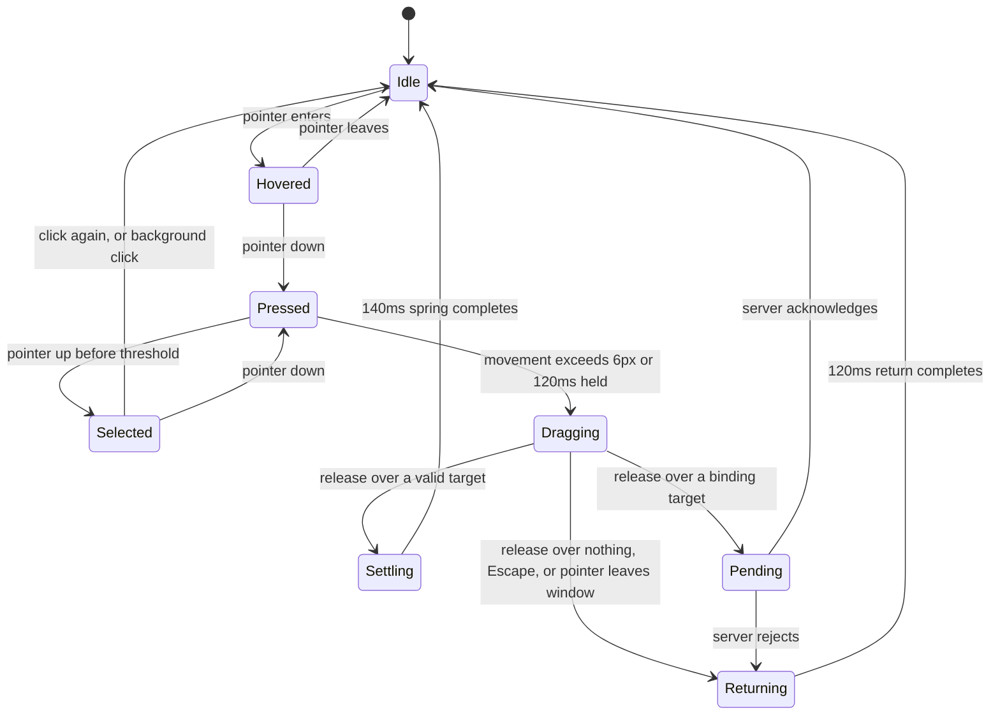

# 11 — Tile Interaction UX

| | |
|---|---|
| **Project** | American Mahjong Dealer |
| **Document** | 11_Tile_Interaction_UX.md |
| **Status** | Ratified v0.1 — approved by the project owner, 2026-09-02 |
| **Last Updated** | 2026-09-02 |
| **Role in SSOT** | Owns the Fidelity Contract in application, the free/binding act distinction, the pointer model, and the tile interaction state machine. Does **not** own the table layout (`32_UX/Table_Layout_and_Perspective.md`), tile visuals (`32_UX/Tile_Component_Spec.md`), keyboard and assistive-technology requirements in depth (`24`), or the commands themselves (`10`). |

---

## 1. Executive Summary

Tile interaction is the whole product's surface. Everything else in this documentation set — the
privacy model, the state machine, the protocol — exists so that a player can pick up a tile and put
it somewhere. If that gesture is imprecise or ambiguous, none of the rest matters.

The design has one organising distinction: **free acts versus binding acts**.

A free act affects only the acting player and nothing anyone else can see. Rearranging your rack,
selecting a tile, hovering. These must be instant, unblocked, and require no confirmation — a player
rearranging tiles while thinking should never wait for a network.

A binding act is public and, in a system with no referee, effectively irreversible. Discarding,
claiming, exposing, declaring. An accidental discard cannot be undone except by unanimous agreement
of four people (`05 §8`), which makes an accidental discard genuinely expensive. These require a
deliberate gesture — never a single click on a tile.

That asymmetry is unusual. Most interfaces make everything equally easy; this one deliberately makes
one class of action harder, because the cost of getting it wrong is carried by four people rather
than one.

---

## 2. Objectives

Serves `OBJ-03` (interaction fast, precise, and predictable enough that players stop thinking about
it) and `OBJ-04` (players retain complete agency — the interface never acts on its own).

---

## 3. The Fidelity Contract, applied

The seven principles from `02 §3.3`, in priority order, with what each rules out here:

| # | Principle | Applied |
|---|---|---|
| FC-1 | Physical familiarity | Tiles are dragged, not selected from menus. The rack is a row you rearrange by hand. |
| FC-2 | Player control | No timer ever acts. No default commits. Nothing happens the player did not cause. |
| FC-3 | Speed | Free acts are local and instant. No confirmation dialog on anything reversible. |
| FC-4 | Low cognitive overhead | No modes. No action whose meaning depends on invisible state. |
| FC-5 | No assistance | No highlights, hints, counts of anything meaningful, or suggestions. |
| FC-6 | No hidden automation | No sorting, no auto-arrange, no auto-anything (`NR-301`–`NR-306`). |
| FC-7 | Predictability | The same gesture always does the same thing. |

**`FC-3` yields to `FC-2`.** A binding act gets a deliberate gesture even though that is slower.

**`FC-1` yields to `FC-7`.** Where a physical gesture would be ambiguous on a screen — a vague push
toward the middle of the table — the unambiguous version wins: an explicit, labelled drop zone.

---

## 4. The three questions

A player must be able to answer these at every moment, without thinking. They are the acceptance
test for every interaction decision in this chapter.

| Question | Answered by |
|---|---|
| **What am I holding?** | The dragged tile follows the pointer, lifted and shadowed, at full opacity. Its origin shows a gap, not a copy. |
| **Where will it go?** | Exactly one drop target is highlighted at a time. In the rack, an insertion caret shows the position. Over nothing valid, the tile dims and the target list is empty. |
| **What happens if I act?** | Binding drop zones are labelled with the verb (`Discard`). Free positions are unlabelled, because nothing consequential happens. |

---

## 5. Free acts and binding acts

### 5.1 The classification

| Act | Class | Effect | Gesture |
|---|---|---|---|
| Hover a tile | Free | Visual only | Pointer over |
| Select / deselect | Free | Private | Click |
| Reorder within the rack | Free | Private | Drag within the rack |
| Scroll or pan the table | Free | Visual only | Wheel / drag on background |
| **Discard** | **Binding** | Public, irreversible | Drag to the labelled discard zone, or select + confirm |
| **Claim the current discard** | **Binding** | Public, moves the turn | Click the current discard, then confirm |
| **Draw from the wall** | **Binding** | Public, moves the turn | Click a wall end |
| **Expose tiles** | **Binding** | Public | Select, then drag to the exposure ledge |
| **Retract an exposure** | **Binding** | Public | Click the exposure, then confirm |
| **Swap with an exposed tile** | **Binding** | Public | Drag a held tile onto an exposed tile |
| **Commit a pass** | **Binding** | Enters the exchange | Select, then confirm |
| **Declare Mahjong** | **Binding** | Public, changes state | Dedicated control, then confirm |
| **Reveal hand** | **Binding** | Public, irreversible | Dedicated control, then confirm |
| **Propose / respond to a correction** | **Binding** | Public | Dedicated control |

### 5.2 Rules for each class

**Free acts.** Zero network round trips before the visual result (`NFR-002`). Applied optimistically
and immediately. No confirmation, ever. Never blocked by a pending binding act — a player waiting on
a discard acknowledgement can still rearrange their rack. The order is sent to the server
afterwards, unacknowledged in the interface.

**Binding acts.** Never triggered by a single click on a tile in the rack. Require either a drag
crossing into a labelled zone, or an explicit two-step selection and confirmation. Show a pending
state until acknowledged. Reconcile authoritatively: if rejected, the interface snaps back to server
state with a plain explanation.

### 5.3 Why draws and claims are binding

A wall draw and a claim both move the turn pointer, which changes the table for everyone. Neither
can be undone except by rewind. They are single-click rather than drag only because their targets —
a wall end, the current discard — are unambiguous, large, and outside the rack where accidental
clicks live. A confirmation step follows the click for the claim, since the discard sits near the
centre of the table where a stray click is plausible.

---

## 6. The rack

The player's own tiles, in a single row along the bottom of their view.

| Property | Decision |
|---|---|
| Order | Entirely the player's. Never changed by the system for any reason (`NR-301`–`NR-306`) |
| New tiles | Appended at the end — drawn, claimed, retracted, and received tiles all (`FR-097`) |
| Overflow | The rack scales tile width down to a floor, then scrolls horizontally. It never wraps |
| Gaps | The player may leave deliberate gaps as separators; gaps are private and persist |
| Persistence | Order and gaps survive reconnection and rewind (`FR-101`) |

### 6.1 On appending rather than inserting

Every tile that arrives goes to the end. This is uniform, predictable, and — most importantly — it
is the only choice that involves no judgment. Inserting a drawn tile "where it belongs" requires
knowing where it belongs, which is a rule (`NR-304`).

It also has a practical benefit players will recognize from a physical table: a newly drawn tile sits
apart from the arranged hand until the player decides what to do with it.

### 6.2 Gaps

A physical player pushes tiles apart to group them. The rack supports this: a player may leave empty
positions, which are theirs alone and mean nothing to the system. They are pure private annotation,
which is exactly what a physical gap is.

---

## 7. The pointer model

Pointer Events throughout — one code path for mouse, trackpad, pen, and touch. Mouse-specific events
are not used (`24 §5`).

### 7.1 Drag

| Stage | Behaviour |
|---|---|
| Press | Tile enters `pressed`: 1px depression, no other change. Pointer captured |
| Threshold | A drag begins after 6px of movement, or 120ms held with any movement |
| Lift | Tile scales to 1.06, gains a shadow, and follows the pointer anchored at the grab point |
| Origin | Shows a gap, not a copy — the tile is being moved, not duplicated |
| Over a target | Exactly one target highlights. In the rack, an insertion caret appears |
| Over nothing | The tile dims to 70%; no target is highlighted |
| Release on a target | Springs into place over 140ms |
| Release on nothing | Returns to origin over 120ms. **No action occurs** |
| Cancel | Escape, or the pointer leaving the window, returns the tile home |

The 6px threshold distinguishes a drag from a click. Below it the gesture is a click; above it, the
click is suppressed on release. This is what prevents a player who nudged the pointer while
selecting from accidentally starting a drag — and, more importantly, prevents a slightly-moved click
from being ambiguous.

### 7.2 Drop targets

| Target | Accepts | Highlight |
|---|---|---|
| Rack position | A tile from the rack | Insertion caret between tiles |
| Discard zone | A tile from the rack | Labelled outline, `Discard` |
| Own exposure ledge | One or more selected tiles | Labelled outline, `Expose` |
| An exposed tile (any seat) | A tile from the rack | The target tile outlines |

Targets highlight **only** while a compatible drag is active. A resting table shows no drop zones,
because there is nothing to drop.

### 7.3 Selection

Click toggles selection. Selected tiles rise 4px and gain a persistent outline. Shift-click extends
a range. Clicking the table background clears the selection.

Selection is private (`OWN`) and is used for exposing and for committing a pass. A selection is never
consumed implicitly — no action ever acts on a selection without an explicit command.

### 7.4 Hover

100% opacity and a 2px lift. Hover **never changes what an action will do** (`FC-7`), and never
reveals information — no tooltip names a tile, because a player looking at their own tiles can see
them and a player looking at anyone else's must not.

---

## 8. Tile interaction state machine

`Pending` applies only to binding acts. A free reorder goes `Settling → Idle` with no network wait.

---

## 9. Preventing accidental actions

The design's most consequential constraint, because there is no referee to undo a mistake.

| Guard | Mechanism |
|---|---|
| No single click discards | Binding acts require a drag into a labelled zone, or select-then-confirm |
| The discard zone is deliberate | Positioned away from the rack; accepts only a drag; requires the tile to be fully inside |
| Confirmation for clicked binding acts | Claim, retract, declare, and reveal use a two-step confirm |
| Escape always cancels | Cancels a drag, a selection, or a pending confirmation |
| Release outside a target does nothing | The default outcome of an uncertain gesture is no action |
| No action on hover | Hover never commits anything |
| No double-click shortcuts | A rapid second click cannot trigger a binding act |
| Rejected acts reconcile visibly | The interface returns to server state with a plain explanation |
| Reveal warns once | `Reveal hand` states plainly that all four seats will see every tile, and is irreversible |

### 9.1 On the absence of double-click

Double-click-to-discard is the conventional shortcut in tile games and is deliberately excluded. It
is indistinguishable from an impatient double-click on a tile a player was merely selecting, and the
consequence — a public, irreversible discard of the wrong tile — is exactly the failure the rest of
this section is built to prevent (`FC-7`, `FC-2`).

---

## 10. Latency and feedback

| Act | Feedback | Budget |
|---|---|---|
| Hover | Immediate | ≤ 16ms |
| Press | Immediate | ≤ 16ms |
| Drag | Follows the pointer | 60fps sustained (`NFR-001`) |
| Free reorder | Applied locally on drop | ≤ 50ms to settle |
| Binding act | `Pending` state on release | ≤ 50ms (`NFR-003`) |
| Binding acknowledgement | `Pending` clears | p95 ≤ 150ms (`NFR-004`) |
| Another seat's action | Animated into place | p95 ≤ 250ms (`NFR-005`) |

If an acknowledgement exceeds 1 second, the pending tile shows a subtle waiting indicator. If it
exceeds 5 seconds, a connection banner appears. The tile itself never disappears or moves
speculatively — a player must never see a discard that has not happened.

---

## 11. Keyboard

Full parity is required (`NFR-050`); this is the tile-interaction portion, with the rest in `24 §5`.

| Key | Action |
|---|---|
| `←` `→` | Move focus along the rack |
| `Home` / `End` | First / last tile |
| `Space` | Toggle selection of the focused tile |
| `Shift` + `←` `→` | Extend selection |
| `Alt` + `←` `→` | Move the focused tile within the rack (a free act) |
| `D` | Arm a discard of the focused tile; `Enter` confirms |
| `E` | Arm an exposure of the selection; `Enter` confirms |
| `W` | Arm a wall draw; `Enter` confirms; `H`/`T` choose the end |
| `C` | Arm a claim of the current discard; `Enter` confirms |
| `Escape` | Cancel any armed action, drag, or selection |
| `Tab` | Move between regions: rack, table, discard pile, controls |

Every binding act is **armed** and then confirmed, mirroring the pointer's two-step requirement. The
armed state is announced to assistive technology and shown visually.

---

## 12. What the interface never does

Restating the negative requirements at the level a designer will encounter them:

Never sorts or groups tiles (`NR-301`–`NR-303`). Never reorders after a draw, pass, claim, or rewind
(`NR-304`). Never offers "auto-arrange" (`NR-305`). Never highlights matching, related, or
"interesting" tiles (`NR-203`). Never counts anything meaningful — no "3 of these remain," no "you
are 2 tiles from…" (`NR-205`). Never disables an action because it looks unwise; the only unavailable
actions are those the server would genuinely refuse (`02 §8`). Never warns that a discard "may be a
mistake" (`NR-203`). Never acts on a timer (`NR-210`). Never shows another player's tiles under any
circumstance (`NR-501`).

---

## 13. Design Decisions

| ID | Decision | Rationale |
|---|---|---|
| D-11-01 | Free versus binding as the organising distinction | Interaction cost should match consequence. With no referee, a binding act is far more expensive than in a rules-enforcing game, and the interface should say so. |
| D-11-02 | Binding acts never triggered by a single click on a rack tile | The rack is where the pointer spends its time; a single click there must be safe. |
| D-11-03 | No double-click shortcut for discard | Indistinguishable from an impatient click on a tile being selected, with an irreversible consequence. |
| D-11-04 | 6px drag threshold with click suppression | Cleanly separates click from drag, so a nudged pointer never starts an unintended drag. |
| D-11-05 | Release over nothing does nothing | The default outcome of an uncertain gesture must be no action. |
| D-11-06 | New tiles append to the end of the rack | The only choice requiring no judgment about where a tile belongs (`NR-304`). |
| D-11-07 | Gaps in the rack are supported and private | Physical players push tiles apart; the gap is annotation, and annotation is theirs. |
| D-11-08 | Free acts never block on the network | A player thinking with their tiles must not wait on a round trip (`FC-3`). |
| D-11-09 | No optimistic application of binding acts | A player must never see a discard that has not happened. |
| D-11-10 | Hover never changes meaning and never reveals | Predictability (`FC-7`) and privacy — no tooltip names a tile. |
| D-11-11 | Drop targets highlight only during a compatible drag | A resting table shows no zones, reducing visual noise and ambiguity. |
| D-11-12 | Keyboard binding acts are armed then confirmed | Parity with the pointer's two-step requirement, not merely parity of capability. |
| D-11-13 | Pointer Events for all input | One code path for mouse, pen, and touch. |

---

## 14. Alternative Designs

| Alternative | Why rejected |
|---|---|
| Double-click to discard | `D-11-03`. |
| Click a tile then click the discard zone, with no drag | Supported as the keyboard and accessibility path, but drag is the primary gesture because it is the physical one (`FC-1`). |
| Optimistic discard, rolled back on rejection | Shows a public act that may not have happened. |
| Confirmation dialog on every discard | Punishes the common case to guard the rare one; the deliberate gesture already provides the guard (`FC-3`). |
| Auto-sort with a toggle | `NR-305`. A toggle does not make a forbidden capability permitted. |
| Insert drawn tiles into a sorted position | Requires knowing where they belong — a rule. |
| Canvas rendering | Reimplements focus, accessible names, and text for no benefit at this element count. |
| Tooltips naming tiles | Reveals information on hover and adds latency-dependent behaviour to a resting pointer. |

---

## 15. Trade-offs

**Binding acts are slower than they could be.** Accepted deliberately: the cost of an accidental
discard is borne by four people and requires unanimous agreement to undo.

**No sorting will frustrate some players.** Accepted. It is a negative requirement, and the rack
supports manual gaps precisely so players can organize by hand.

**Appending to the end means a drawn tile is never "in place."** Accepted, and it matches the
physical experience of a freshly drawn tile sitting apart from the arranged hand.

**Full keyboard parity constrains the interaction design.** Accepted, and it has improved the design:
requiring every action to have an unambiguous name and target forced the two-step arm-and-confirm
pattern, which turned out to be the right pointer design too.

---

## 16. Risks

| Risk | Mitigation |
|---|---|
| Accidental discards despite the guards | Deliberate gesture; labelled zones; Escape; release-over-nothing does nothing; correction as last resort |
| A convenience feature is added that constitutes assistance | `§12` enumerates the temptations; `NR-2xx`, `NR-3xx`; `TC-A09` |
| Drag behaviour differs across browsers | Pointer Events with explicit capture; cross-browser E2E coverage |
| Latency makes binding acts feel unresponsive | Immediate pending state; progressive indicators; `NFR-003`, `NFR-004` |
| Keyboard path diverges from pointer capability | `NFR-050`; keyboard-only traversal of every E2E scenario (`TC-X01`) |
| The rack becomes unusable at large hand sizes | Scales then scrolls, never wraps; tested at 40+ tiles since hand size is unbounded (`NR-009`) |

---

## 17. Future Considerations

Not committed: a player-configurable drag threshold for accessibility; multi-tile drag for exposing
several tiles in one gesture (selection plus drag already covers this); haptic feedback on touch
devices.

---

## 18. Cross References

| Document | Focus |
|---|---|
| `02_System_Scope.md §3.3` | The Fidelity Contract |
| `10_Player_Action_Model.md` | The commands these gestures issue |
| `23_Performance_Requirements.md` | The latency budgets |
| `24_Accessibility.md` | Keyboard, contrast, motion, assistive technology |
| `32_UX/Table_Layout_and_Perspective.md` | Where everything sits |
| `32_UX/Tile_Component_Spec.md` | How a tile is drawn |
| `32_UX/Interaction_Patterns.md` | Non-tile patterns |
| `SCOPE_BOUNDARIES.md §4.4` | `NR-301`–`NR-306` |

---

## 19. Revision History

| Version | Date | Author | Changes |
|---|---|---|---|
| 0.1 | 2026-09-02 | Design (architect role), owner-approved | Initial chapter |
