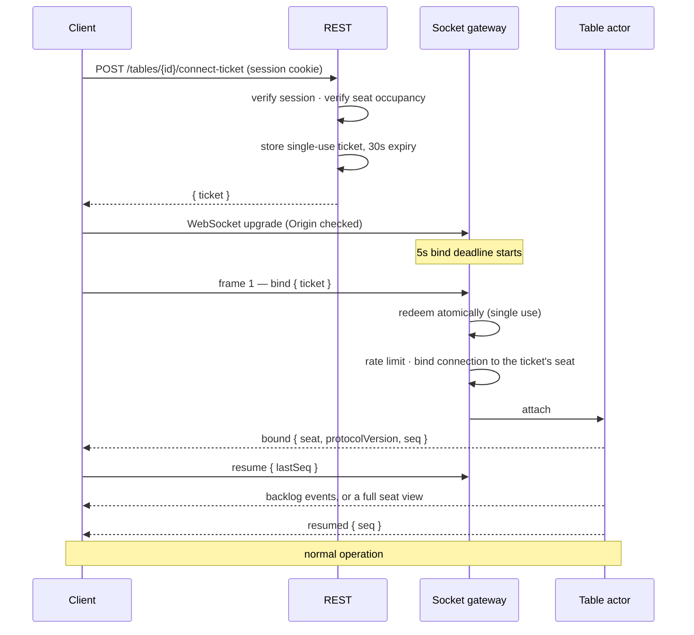
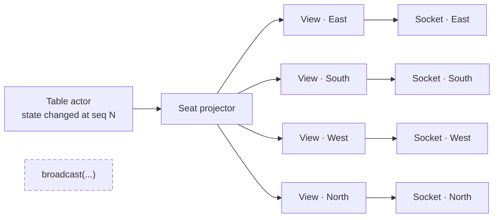
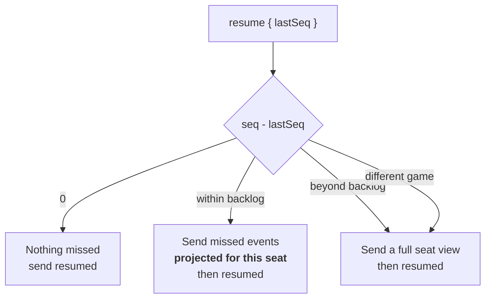

# 12 — Realtime WebSocket Architecture

| | |
|---|---|
| **Project** | American Mahjong Dealer |
| **Document** | 12_Realtime_WebSocket_Architecture.md |
| **Status** | Ratified v0.1 — approved by the project owner, 2026-09-02 |
| **Last Updated** | 2026-09-02 |
| **Role in SSOT** | Owns the connection lifecycle, envelope structure, delivery model, backpressure, heartbeats, and resumption. Does **not** own the message catalog (`19`), input integrity semantics (`13`), REST (`18`), or presence policy (`22`). |

---

## 1. Executive Summary

The socket layer carries the table. Its design follows from one property that distinguishes this
system from a typical realtime application: **there is no message that all four clients receive
unchanged.** Every event is projected four times, and four different payloads go out.

That single fact drives most of what follows. There is no broadcast primitive, because the correct
operation is never "send this to the room" (`ADR-0007`). The socket write interface accepts only the
output of the seat projector, so a code path that wanted to broadcast has nothing to call. And the
resumption protocol reuses the same projector, so catching up after a disconnection cannot leak
differently from live play.

Three further decisions shape the layer. A connection is bound to exactly one seat, server-side,
from a single-use ticket — so there is no seat parameter anywhere on the wire (`NR-601`). Frames
carry exactly one sequence number, the table's `seq`, because a protocol with two sequence numbers
eventually has two that disagree. And backpressure is measured in bytes handed to the socket rather
than the buffered amount the platform reports, because the latter stays at zero until the kernel
buffer fills, which is far too late.

---

## 2. Objectives

Serves `OBJ-05` (a game survives an ordinary network hiccup; a dropped player rejoins the seat they
left), `OBJ-06` (through per-seat projection with no broadcast path), and `OBJ-09` (through
sequencing and single delivery per seat).

---

## 3. Division of responsibility

| Concern | Transport | Why |
|---|---|---|
| Register, log in, log out, session | REST | Request/response; no ordering relationship to a table |
| Create table, join by code, list own tables | REST | Same |
| Mint a connect ticket | REST | Authenticated by session; produces the socket credential |
| Administration | REST | Same |
| Every table command and event | WebSocket | Part of one ordered stream per table |
| Presence, chat, signals | WebSocket | Table-scoped, transient |

The split is not stylistic. Everything on the REST side is independent; everything on the socket side
belongs to one totally-ordered stream. Mixing them would create two paths to the same state with no
defined ordering between them.

---

## 4. Connection lifecycle

### 4.1 The ticket

| Property | Value | Why |
|---|---|---|
| Issued by | REST, authenticated by session | The session is the durable identity |
| Contents (server-side) | account, session, table, seat | The client sees only an opaque value |
| Lifetime | 30 seconds | Long enough to open a socket, short enough to be useless if captured |
| Uses | Exactly one, redeemed atomically | A captured ticket cannot be replayed |
| Where it travels | **In the first frame, never in the URL** | Query strings land in proxy logs, access logs, browser history, and referrer headers |
| Storage | A PostgreSQL row with a unique constraint (`ADR-0014`) | Single-use is a constraint, not a check |

### 4.2 Binding

Binding establishes which seat the connection is. **The seat comes from the ticket's server-side
claims and from nowhere else.** There is no seat field in any client frame (`NR-601`), so the
classic cross-seat authorization bug is not defended against but absent.

| Rule | Behaviour |
|---|---|
| First frame must be `bind` | Anything else closes `4001` |
| Bind deadline | 5 seconds from upgrade, else `4001` |
| Invalid, expired, or used ticket | Closes `4002` |
| Rate limit | 10 binds per session per minute, after redemption |
| One connection per seat | A newer authenticated bind closes the older with `4003` |
| Origin | Checked at upgrade against an allow-list |

The one-connection rule prevents a player holding two sockets on one seat, which would complicate
delivery guarantees and give them nothing.

### 4.3 Session revocation

A revoked session must not keep a live socket. The gateway re-checks bound sessions on a short
interval and closes any that have become invalid with `4004`, within 5 seconds (`NFR-026`).

This is why sessions are opaque server-side tokens rather than self-contained bearer tokens: a
self-contained token cannot be revoked before it expires, and "log out everywhere" would not close
an open table connection (`15 §4`).

---

## 5. Envelope

### 5.1 Client to server

Exactly one shape.

| Field | Type | Purpose |
|---|---|---|
| `t` | `"cmd"` | Frame type; clients send only commands and protocol frames |
| `cmd` | string | Command name from `19` |
| `cmdId` | UUIDv7 | Idempotency (`13 §4`) |
| `cseq` | integer | Per-connection monotonic counter (`13 §5`) |
| `d` | object | Command parameters |

No seat. No table identifier — the binding determines both. No timestamp — a client's clock is not
evidence of anything.

### 5.2 Server to client

| `t` | Meaning | Carries |
|---|---|---|
| `bound` | Binding succeeded | seat, protocol version, current `seq` |
| `resumed` | Resumption complete | `seq`, and a full seat view if a snapshot was sent |
| `ack` | A command was applied | `cmdId`, resulting `seq` |
| `reject` | A command was refused | `cmdId`, code, and a human-readable reason |
| `event` | Something happened at the table | `seq`, the event, and this seat's view |
| `notice` | Out-of-band information | Kind and payload — connection warnings, rate-limit notices |
| `pong` | Heartbeat response | — |

### 5.3 One sequence number

The protocol has exactly one: `seq`, the table's authoritative counter, present on every `event` and
`ack`. `cseq` is a per-connection input counter, not a second sequence — it orders what the client
sent, never what the table did.

A protocol with two sequence numbers eventually has two that disagree, and reconciling them is a
class of bug worth designing out.

### 5.4 The view

Every `event` carries this seat's complete view, not a delta. The client replaces its view wholesale
and never merges (`C-06`).

Deltas were considered and rejected. The view is a few kilobytes; a table generates a few hundred
events per hour; and delta application is a second implementation of state transition living on the
untrusted side of the boundary — precisely where `03 §4.1` prevents game logic from existing.
Wholesale replacement means a client cannot drift, because it holds no derived state to drift.

---

## 6. Delivery

Four projections, four frames, four sockets. **There is no broadcast function.** The socket write
interface accepts only the projector's output type, so a code path wanting to send the same payload
to everyone has nothing to call (`NFR-062`).

A rejection is delivered **only to the originating seat**. A rejection reveals intent — that someone
tried to discard a tile they did not hold — and the other seats have no business learning it
(`05 §6.1`).

---

## 7. Heartbeats and disconnection detection

| Parameter | Value | Rationale |
|---|---|---|
| Server ping interval | 15 s | Frequent enough for prompt detection, light enough to be free |
| Missed pongs tolerated | 2 | One missed beat is a hiccup; two is a pattern |
| Detection worst case | ~35 s | Meets `NFR-020` |
| Client-initiated ping | Permitted | Lets a client detect a half-open connection itself |

On detection the gateway closes the socket and notifies the actor, which marks the seat absent and
pauses the table if a game is in progress (`22 §5`).

Detection is deliberately not faster. A 5-second timeout would mark seats absent during ordinary
mobile network transitions, and a table that pauses and resumes every few minutes is worse than one
that takes half a minute to notice a genuine departure.

---

## 8. Resumption

| Parameter | Value |
|---|---|
| Backlog depth | 200 events per table, in memory |
| Backlog lifetime | While the actor is live |
| Beyond backlog | Full seat view |
| After a server restart | Full seat view from the restored checkpoint |

**Backlog frames are produced by the same projector as live frames.** Resumption is not a separate
path with its own privacy properties — which is the property that makes it safe (`ADR-0011`).

Two hundred events covers a several-minute absence at typical pace. Beyond that a snapshot is
cheaper than the backlog anyway.

### 8.1 What resumption restores

The full seat view: public table state, this seat's concealed hand **in the player's own order**
(`FR-144`), selection state, and any open pass round or correction proposal. A returning player
finds the table as they left it plus whatever happened while they were gone.

---

## 9. Backpressure

A slow consumer must not be allowed to consume unbounded server memory.

| Parameter | Value |
|---|---|
| Measured as | Bytes handed to the socket and not yet written |
| Threshold | 1 MB |
| Action | Close `4010` |
| Command rate limit | 5 per second, burst 10, per connection |
| Consecutive throttles before close | 20, then `4009` |
| Maximum inbound frame | 16 KB |

### 9.1 Why not the platform's buffered-amount metric

The obvious metric reports what the platform has queued, and it stays at zero until the kernel's
send buffer fills — by which point a genuinely stalled consumer has already accumulated far more
than the threshold. Tracking bytes handed off and not yet confirmed written detects a stall while it
is still small.

Closing is the right response rather than dropping frames: a client that has missed frames has an
incoherent view, and resumption from a known sequence is cheap and correct (`§8`).

---

## 10. Close codes

| Code | Name | Meaning |
|---|---|---|
| 4001 | `BIND_REQUIRED` | First frame was not `bind`, or the deadline passed |
| 4002 | `TICKET_INVALID` | Ticket unknown, expired, or already used |
| 4003 | `REPLACED_BY_NEWER_BIND` | Another connection bound to this seat |
| 4004 | `SESSION_REVOKED` | The session became invalid |
| 4008 | `PROTOCOL_VIOLATION` | Malformed frame, `cseq` gap, or a frame in the wrong state |
| 4009 | `RATE_LIMITED` | Sustained throttling |
| 4010 | `SLOW_CONSUMER` | Backpressure threshold exceeded |
| 4011 | `SEAT_VACATED` | This connection's seat was vacated (`leaveSeat`, FR-025) |
| 1012 | `SERVICE_RESTART` | Planned restart; reconnect after a short delay |

Full catalog with client guidance in `33_API/Error_Code_Catalog.md`.

### 10.1 Client reconnection policy

| Code | Client should |
|---|---|
| 4001, 4008 | Report a defect; do not retry blindly |
| 4002 | Mint a fresh ticket and retry once |
| 4003 | Not reconnect — another tab or device took the seat; say so |
| 4004 | Return to login |
| 4009 | Back off, then reconnect |
| 4010, 1012, transport loss | Reconnect with exponential backoff and jitter: 1s, 2s, 4s, 8s, capped at 30s |
| 4011 | Not reconnect — this seat is no longer held; return to the lobby |

Jitter matters: a server restart disconnects four clients simultaneously, and without jitter they
reconnect in lockstep.

---

## 11. Design Decisions

| ID | Decision | Rationale |
|---|---|---|
| D-12-01 | No broadcast primitive; the write interface accepts only projector output | Every event is four different payloads. A broadcast helper is a four-seat leak waiting for a convenient moment. |
| D-12-02 | Ticket redeemed in the first frame, never in a URL | URLs are logged in more places than anyone remembers. |
| D-12-03 | No seat field in any client frame | Makes cross-seat access absent rather than defended (`NR-601`). |
| D-12-04 | Exactly one sequence number | Two eventually disagree. |
| D-12-05 | Full view per event, no deltas | Delta application is a second state machine on the untrusted side. The view is small. |
| D-12-06 | Backlog frames use the live projector | Resumption cannot leak differently from live play. |
| D-12-07 | Backpressure measured as bytes handed off | The platform's buffered-amount metric detects a stall far too late. |
| D-12-08 | `cseq` gap closes the socket | A client that has missed frames is incoherent; clean resumption is cheap. |
| D-12-09 | 15s heartbeat, 2 misses | Fast enough for `NFR-020`, slow enough to survive mobile network transitions. |
| D-12-10 | One connection per seat, newest wins | Simpler delivery guarantees, and a second connection gains nothing. |
| D-12-11 | Rejections go only to the originating seat | A rejection reveals intent. |
| D-12-12 | Opaque server-side sessions rather than self-contained tokens | Revocation must close a live socket within 5 seconds. |

---

## 12. Alternative Designs

| Alternative | Why rejected |
|---|---|
| A realtime library with rooms | Its central abstraction is the operation this design must never perform (`ADR-0007`). |
| Ticket in the connection URL | Credential in a log file. |
| Client-supplied seat with a server check | A check can be wrong; an absent parameter cannot. |
| Delta updates | A second state machine on the client, for a bandwidth saving that does not matter at these sizes. |
| Separate backlog serialization | A second privacy-relevant path; the whole point is that there is one. |
| Dropping frames under backpressure | Leaves the client incoherent with no signal; closing forces correct resumption. |
| Aggressive 5s heartbeats | Marks seats absent during ordinary mobile transitions. |
| Self-contained bearer tokens | Cannot be revoked before expiry, so "log out everywhere" would not close a table connection. |

---

## 13. Trade-offs

**Four projections per event costs four times the serialization.** Accepted: a view is a few
kilobytes and a table generates a few hundred events per hour.

**Full views use more bandwidth than deltas.** Accepted for the same reason, and it buys the
elimination of client-side state derivation.

**Closing on a `cseq` gap is severe.** Accepted: resumption is fast and the alternative is a client
acting on a partially-updated view.

**A 200-event backlog is memory per table.** Accepted: a few hundred kilobytes at most, and it turns
the common brief interruption into a non-event.

**No transport fallback for networks that block WebSocket.** Accepted: such networks are rare, and a
polling fallback would be a second delivery path with its own privacy properties.

---

## 14. Risks

| Risk | Mitigation |
|---|---|
| A broadcast helper is introduced | `D-12-01`; the write interface's type makes it uncallable; `TC-P07` |
| A seat parameter is added | `NR-601`; `TC-I01` interface audit |
| Resumption acquires its own serialization | `D-12-06`; frame inspection covers resumed frames (`TC-P01`) |
| Backlog memory grows unbounded | Fixed depth per table; actors retired when idle |
| Reconnection storms after a restart | Exponential backoff with jitter; `1012` signals a planned restart |
| Tickets leak through referrers or logs | Never in a URL; single-use; 30-second expiry |

---

## 15. Future Considerations

Not committed: binary frame encoding, should message size ever matter; a compression negotiation;
splitting the gateway from the HTTP process if their scaling profiles diverge (`27 §8`).

---

## 16. Cross References

| Document | Focus |
|---|---|
| `13_Input_Integrity.md` | `cmdId`, `cseq`, staleness, hostile input |
| `14_Player_Privacy.md` | The projector and visibility classes |
| `18_API_Design.md` | REST, including ticket issuance |
| `19_WebSocket_Event_Catalog.md` | The normative message catalog |
| `22_Disconnect_and_Reconnect.md` | Presence policy, grace, auto-pause |
| `33_API/Error_Code_Catalog.md` | Every rejection and close code |
| `ADR-0007`, `ADR-0011` | Transport and reconnection decisions |

---

## 17. Revision History

| Version | Date | Author | Changes |
|---|---|---|---|
| 0.1 | 2026-09-02 | Design (architect role), owner-approved | Initial chapter |
