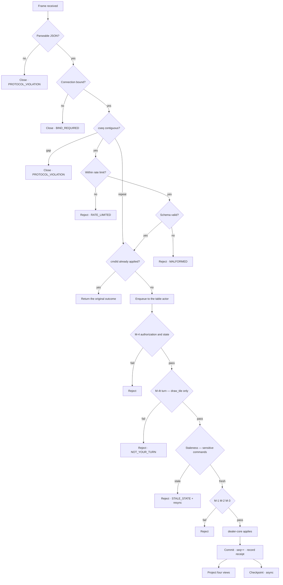

# 13 — Input Integrity

| | |
|---|---|
| **Project** | American Mahjong Dealer |
| **Document** | 13_Input_Integrity.md |
| **Status** | Ratified v0.1 — approved by the project owner, 2026-09-02 |
| **Last Updated** | 2026-09-02 |
| **Role in SSOT** | Owns the distinction between player intent and client-reported state, and the mechanisms that protect it: idempotency, sequencing, staleness, and hostile-input handling. Does **not** own the transport (`12`), the commands (`10`), or authentication (`15`). |

---

## 1. Executive Summary

Between a player's click and a change in the table lies a network, and networks retry, reorder,
duplicate, stall, and drop. The job of this chapter is to make sure that what the server applies is
what the player meant — once, in order, and only while it still makes sense.

The framing that governs the whole chapter is the distinction between **player intent** and
**client-reported state**. A player intends to discard one specific tile, once. The client's report
of that intent may arrive twice, arrive late, arrive after the tile has already moved, or be
fabricated entirely. The server's job is to honour the intent when it is still coherent, refuse it
when it is not, and never apply it twice.

Two things raise the stakes here above the usual. There is no rules engine, so an incorrectly
applied command cannot be caught by a legality check downstream — this layer is the only defence.
And a discard is public and effectively irreversible (`ADR-0016`), so a double-applied discard is not
a cosmetic glitch; it costs a tile and requires four people to agree to undo.

One thing this chapter does **not** claim: that client-side input can be trusted to originate from a
human hand. It cannot, and no web application can make that guarantee. What it guarantees instead is
stated precisely in `§3`.

---

## 2. Objectives

Serves `OBJ-09` — every action takes effect exactly once, in a defined order, and only when the
acting player is authorized to perform it.

---

## 3. What is and is not guaranteed

### 3.1 Not guaranteed

The system makes **no claim** to prevent manipulation of the client or its input. A synthetic pointer
event, a modified client, an automation tool, or a script driving the socket directly cannot be
excluded at the web-application layer. Any design asserting otherwise would be asserting something
untrue.

This matters for what the guarantees are worth. If a player runs a modified client, they can send
any command the protocol permits, at any rate the limits allow. What they **cannot** do is anything
the server would not have accepted from an honest client — which is the property that actually
matters.

### 3.2 Guaranteed

> The server never accepts an action merely because the client claims it happened.
>
> Every accepted action is **authenticated**, **authorized**, **structurally valid**, **correctly
> sequenced**, and **attributable** to the bound player session.

Concretely, a client cannot: act on a seat other than its own; assert the contents of any hand, the
wall, or the discard pile; choose which tile it draws; influence or observe the shuffle; cause an
action to apply twice; or apply an action against a target that has already moved.

A modified client can therefore play badly, quickly, or rudely. It cannot cheat, because there is
nothing in the protocol that would let it.

---

## 4. Idempotency — `cmdId`

Every command carries a client-generated UUIDv7.

| Aspect | Design |
|---|---|
| Generated by | The client, once per intent — **not** once per transmission |
| Retries | A retry of the same intent reuses the same `cmdId` |
| Server behaviour | If the `cmdId` has been seen, return the original outcome without re-applying |
| Retention | For the life of the game, in the actor and in the checkpoint |
| Scope | Per table |

### 4.1 Why per intent rather than per transmission

This is the detail that makes the mechanism work, and it is a client obligation the protocol cannot
enforce. A client that generates a fresh identifier on each retry has no idempotency at all — every
retry looks like a new intent. `33_API/Wire_Protocol_Contract.md` states the obligation explicitly,
and the reference client implements it by minting the identifier when the player acts and carrying it
through every retry of that action.

### 4.2 Replay of a duplicate is not an error

A repeated `cmdId` returns `DUPLICATE_COMMAND` **with the original outcome**, not a failure. The
client that retried because it was unsure whether the first attempt landed gets a definitive answer:
it landed, and here is what happened.

### 4.3 UUIDv7 rather than v4

Time-ordered identifiers make the receipt table's index locality good and make diagnostics readable
without carrying a timestamp field the server would not trust anyway.

---

## 5. Sequencing — `cseq`

Every command carries a per-connection monotonic counter, starting at 1 on each new connection.

| Situation | Response |
|---|---|
| Contiguous | Process normally |
| Exact repeat of the last value | Treat as a retry; `cmdId` decides the outcome |
| Gap — a value ahead of expected | **Close the socket** with `PROTOCOL_VIOLATION` (4008) |
| Regression below the last value, with an unseen `cmdId` | Close the socket |

### 5.1 Why a gap closes the connection

A gap means frames were lost between the client and the server. The client's view of what it has
sent, and therefore of what the table should look like, is now unreliable in ways neither side can
enumerate. Continuing would mean processing commands from a client acting on an unknown state.

Closing forces a clean resumption from a known sequence (`12 §8`), which costs a fraction of a
second and leaves no ambiguity. The severity is deliberate and cheap.

### 5.2 `cseq` is not a second sequence number

It orders what one connection sent. `seq` orders what the table did. They are different things with
different lifetimes — `cseq` resets on every connection, `seq` never resets — and the protocol has
exactly one sequence number in the sense that matters (`12 §5.3`).

---

## 6. Staleness — `seq`

A client that has not yet processed recent events may act on a view that is out of date.

### 6.1 Order-sensitive commands

Only commands whose target could have moved are staleness-checked:

| Command | Sensitive? | Why |
|---|---|---|
| `claim_discard` | **Yes** | The current discard may have been claimed or superseded |
| `swap_exposed_tile` | **Yes** | The exposed tile may have been swapped or retracted |
| `respond_correction`, `respond_declaration`, `respond_end_game` | **Yes** | The proposal may have resolved |
| `discard_tile`, `expose_tiles` | No | The target is the actor's own tile; `M-2` covers it |
| `draw_tile` | No | The target is "next from the wall," which cannot be stale |
| `arrange_hand` | No | Carries a full permutation; a late arrival is self-correcting |
| Chat, signals, pause | No | No target |

### 6.2 Two overlapping defences

For the sharpest case, `claim_discard`, staleness is caught twice:

1. **The tile handle.** The command names the tile being claimed (`D-10-04`). If the current discard
   is a different tile, `M-3` fails with `TILE_NOT_AVAILABLE`. This alone prevents a stale click from
   claiming a tile the player never saw — the most consequential staleness failure available.
2. **The sequence check.** A command carrying a `seq` older than the last state-changing event on a
   sensitive target is refused with `STALE_STATE` and a resynchronization frame.

Two defences because the consequence is a player acquiring a tile they did not intend to claim, in a
system where the remedy costs four people's agreement.

### 6.3 Resynchronization

A `STALE_STATE` rejection is accompanied by the seat's current view. The client replaces its view and
may act again. The player sees their action refused with a plain explanation — "that tile was already
claimed" — and the table state visibly updated.

---

## 7. Authorization on every command

Restating what `12 §4.2` establishes structurally, because it is the most important integrity
property in the system.

**The seat is derived from the socket binding. There is no seat field on the wire** (`NR-601`).

This means the classic multiplayer attack — changing an identifier in a request to act as another
player — has no vector. There is no parameter to change. An attacker's only lever is their own
binding, which was established server-side from their own session at a table where they already hold
a seat.

Ownership is checked independently on top of this (`M-2`): even acting on their own seat, a player
cannot reference a tile they do not hold. And handles are opaque and per-game (`07 §5.3`), so a
guessed handle fails ownership anyway.

---

## 8. Hostile and malformed input

| Category | Handling |
|---|---|
| Malformed JSON | Close `PROTOCOL_VIOLATION` |
| Schema violation | Reject `MALFORMED`; state unchanged; connection stays open |
| Unknown command name | Reject `MALFORMED` |
| Command in the wrong state | Reject `NOT_IN_PHASE` or the relevant flag code |
| Oversized frame | Close; the platform enforces a 16 KB maximum |
| Unknown handle | Reject `NOT_YOUR_TILE` — deliberately identical to a handle owned by someone else |
| Excessive rate | Throttle, then close `RATE_LIMITED` after 20 consecutive throttles |
| Injection attempts in text | Text is opaque; rendered as plain text, never as markup; parameterized queries throughout |
| Duplicate response to a proposal | Reject; a seat responds once |

### 8.1 Uniform rejection for unknown and unowned handles

Both produce `NOT_YOUR_TILE`. Distinguishing them would let a client probe which handles exist,
which is a small oracle but a free one to close.

### 8.2 Schema validation is structural only

Validation checks shape: field presence, types, lengths, enumerated values, array bounds. It never
checks meaning. A discard of a tile the player does not hold is structurally valid and fails at
`M-2`; a pass of seven tiles is structurally valid and fails nowhere, because it is permitted
(`NR-008`).

The boundary matters: a validator that "helpfully" rejected an unusual-looking command would be a
rules engine in the least visible possible location.

---

## 9. The command pipeline

Two properties of this pipeline are load-bearing. Cheap checks precede expensive ones, so a hostile
client is refused before reaching the actor's queue. And **no stage can be skipped**: there is one
entry point into the actor, and it runs the whole pipeline.

---

## 10. Rate limits

| Scope | Limit | Response |
|---|---|---|
| Commands per connection | 5/s, burst 10 | Throttle; close after 20 consecutive |
| Chat messages per seat | 10 per 10 s | Throttle |
| Signals per seat | 5 per 10 s | Throttle |
| Correction proposals per seat | 3 per minute | Reject |
| Binds per session | 10 per minute | Reject |

Limits sit above any plausible human rate. A fast player performs a few actions per second at most;
five per second with a burst of ten accommodates rapid rearrangement without being generous to a
script.

Per-connection limits live in process memory (`ADR-0014`). The security-critical limit — the login
lockout curve — lives in PostgreSQL, because a control that vanishes on restart is one an attacker
waits out (`15 §7`).

---

## 11. Design Decisions

| ID | Decision | Rationale |
|---|---|---|
| D-13-01 | State the guarantee as server acceptance, not input authenticity | Client input cannot be authenticated by a web application. Claiming otherwise would be false; the real guarantee is stronger and defensible. |
| D-13-02 | `cmdId` per intent, not per transmission | The whole mechanism depends on it; stated as an explicit client obligation. |
| D-13-03 | Duplicate returns the original outcome | The retrying client's actual question is "did it land?", and this answers it. |
| D-13-04 | A `cseq` gap closes the socket | A client that lost frames has an unenumerable view; clean resumption is cheap and unambiguous. |
| D-13-05 | Staleness checked only on order-sensitive commands | Checking everything adds friction where the target cannot move. |
| D-13-06 | `claim_discard` names the tile handle **and** is staleness-checked | The consequence — acquiring an unintended tile — justifies two defences. |
| D-13-07 | `arrange_hand` carries a full permutation | Idempotent and self-correcting; removes it from staleness entirely. |
| D-13-08 | Unknown and unowned handles reject identically | Closes a free probing oracle. |
| D-13-09 | Schema validation is structural only | A validator rejecting "unusual" commands would be a rules engine in the least visible place. |
| D-13-10 | Cheap checks before expensive ones, one entry point | A hostile client is refused before reaching the actor; no stage can be bypassed. |
| D-13-11 | Rate limits above any human rate | Limits should stop scripts, not fast players. |

---

## 12. Alternative Designs

| Alternative | Why rejected |
|---|---|
| Server-generated command identifiers | The server cannot recognize a retry as the same intent; the identifier must originate with the intent. |
| Timestamps for ordering | A client's clock is not evidence; clock skew and manipulation both break it. |
| Applying commands out of order with reconciliation | Requires the client to hold derived state, which `C-06` forbids. |
| Rejecting rather than closing on a `cseq` gap | Leaves a client acting on an unknown view. |
| Staleness checks on every command | Friction where the target cannot move; `arrange_hand` in particular would become order-dependent for no reason. |
| Distinguishing unknown from unowned handles | A free probing oracle. |
| Client-side input attestation | Not achievable in a browser, and would create a false sense of assurance. |
| Semantic validation at the schema layer | A rules engine in the least visible possible location (`NR-004`). |

---

## 13. Trade-offs

**Idempotency depends on client cooperation.** Accepted: a client that regenerates identifiers harms
only itself, since the server still applies each command it receives exactly once per identifier and
every command remains individually authorized.

**Closing on a gap costs a reconnection.** Accepted: sub-second, and the alternative is worse.

**Receipts are retained for the life of a game.** Accepted: a few hundred small rows.

**Rate limits could inconvenience an unusually fast player.** Accepted: the burst allowance covers
rapid rearrangement, which is the only genuinely fast interaction.

---

## 14. Risks

| Risk | Mitigation |
|---|---|
| A retry is treated as a new intent | `D-13-02`; stated as a client obligation; `TC-I04` tests deliberate replays |
| A stale claim takes an unintended tile | Handle parameter plus staleness check (`D-13-06`) |
| A validator acquires semantic checks | `D-13-09`; `TC-A03` command-path audit |
| A command path bypasses the pipeline | One entry point to the actor; `TC-I03` |
| Rate limits vanish on restart, enabling a wait-out attack | Security-critical limits are durable in PostgreSQL (`15 §7`) |
| A seat parameter is added | `NR-601`; `TC-I01` |

---

## 15. Future Considerations

Not committed: per-account adaptive rate limits informed by observed behaviour; a client-side retry
budget surfaced in the interface so a player can see that a command is being retried.

---

## 16. Cross References

| Document | Focus |
|---|---|
| `12_Realtime_WebSocket_Architecture.md` | Transport, envelope, close codes |
| `10_Player_Action_Model.md` | Per-command validations and rejection codes |
| `15_Security_Architecture.md` | Authentication, sessions, durable rate limits |
| `21_Error_Handling_and_Recovery.md` | Error taxonomy and client contract |
| `33_API/Wire_Protocol_Contract.md` | Client obligations, including `cmdId` |
| `34_Testing/Integrity_and_Randomization_Suites.md` | `TC-I*` |
| `ADR-0009` | The decision this chapter elaborates |

---

## 17. Revision History

| Version | Date | Author | Changes |
|---|---|---|---|
| 0.1 | 2026-09-02 | Design (architect role), owner-approved | Initial chapter |
