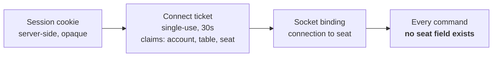

# 15 — Security Architecture

| | |
|---|---|
| **Project** | American Mahjong Dealer |
| **Document** | 15_Security_Architecture.md |
| **Status** | Ratified v0.2 — approved by the project owner, 2026-09-03 |
| **Last Updated** | 2026-09-03 |
| **Role in SSOT** | Owns authentication, session management, isolation boundaries, rate limiting, transport security, and administrative security. Does **not** own the privacy model (`14`), input integrity semantics (`13`), the threat models (`THREAT_MODEL.md`, `PRIVACY_THREAT_MODEL.md`), or the requirement matrix (`SECURITY_REQUIREMENTS_MATRIX.md`). |

---

## 1. Executive Summary

Security here has an unusual shape, because the asset inventory is unusual.

There is no money (`ADR-0003`), nothing to steal that can be sold, and nothing of value at stake in a
game. What the system holds that matters is: **account credentials**, and **the contents of concealed
hands while a game is live**. Those two assets, and essentially nothing else.

That inventory simplifies the architecture considerably and sharpens where the effort goes. There is
no fraud detection, no transaction monitoring, no financial audit trail, and no regulatory
compliance surface. What there is instead is an unusually strong emphasis on **isolation** — keeping
each player's session bound to exactly one seat, and keeping every principal away from data they are
not entitled to.

The most important security property in the system is not a control at all. It is the absence of a
parameter: **no client frame or request carries a seat or player identifier**, so the classic
cross-player attack has no vector to exploit (`NR-601`). Several other properties have the same
shape — no spectator role to abuse, no administrative path to a hand, no replay artifact to exfiltrate.
Security by absence is more durable than security by check, because a check can be wrong.

---

## 2. Objectives

Serves `OBJ-06` (concealed hands reach only their owner) and `OBJ-09` (actions authorized and
attributable), and supports `OBJ-07` by keeping the shuffle beyond any client's reach.

---

## 3. Assets and adversaries

| Asset | Value to an adversary | Primary protection |
|---|---|---|
| Account credentials | Access to a person's account; credential reuse elsewhere | Memory-hard hashing with a server-side pepper; durable lockout |
| Concealed hands, live | Advantage in an ongoing game | The privacy model (`14`) |
| Wall order | Complete knowledge of the game's future | `SRV` classification; never leaves the server |
| Session tokens | Impersonation | Opaque, hashed at rest, revocable within 5 seconds |
| Join codes | Entry to a private table | Stored irreversibly; rate limited; uniform failures |
| Display names | Minimal | — |

| Adversary | Capability | Motivation |
|---|---|---|
| A player at the table | A valid session and seat; can modify their client | See another hand; act as another seat |
| A player elsewhere | A valid session, no seat at this table | Reach a table they were not invited to |
| An unauthenticated attacker | Network access | Credential attacks; table enumeration |
| A curious operator | Infrastructure access | Look at a game |
| A passive network observer | Traffic observation | Any of the above |

The first row is the distinctive one. In most applications the user at the keyboard is not the
adversary; here, a player who wants to see another player's hand is the most likely attacker and has
the most access.

---

## 4. Authentication and sessions

### 4.1 Credentials

| Control | Design |
|---|---|
| Hashing | Argon2id with parameters reviewed annually against current guidance |
| Pepper | A server-side secret combined with the password before hashing, stored in the secret manager and never in the database |
| Storage | Hash and salt only; the password is never stored, logged, or transmitted beyond the login request |
| Minimum length | 12 characters, with no composition rules |
| Breach check | Rejected if present in a known-compromised password list |
| Failure response | Identical for a wrong password and a nonexistent account, after equivalent work |

No composition rules: they push users toward predictable patterns and add nothing over length plus a
breach check.

The **pepper** matters more than it appears. A database compromise alone yields hashes that cannot be
attacked without the application secret, which lives in a different system.

### 4.2 Sessions

| Property | Value | Rationale |
|---|---|---|
| Token | 256 bits from a cryptographic source | |
| Storage | SHA-256 of the token; the token itself is never stored | A database read does not yield usable sessions |
| Transport | `Secure`, `HttpOnly`, `SameSite=Lax`, host-prefixed cookie | Not reachable by script; not sent cross-site by default |
| Player lifetime | 30 days absolute, 7 days idle, sliding | A table game is a leisure activity; frequent re-login is friction without benefit |
| Administrator lifetime | 8 hours absolute, 30 minutes idle | Higher-privilege sessions should be short |
| Revocation | Effective within 5 seconds, including live sockets (`NFR-026`) | |
| Anti-forgery | Double-submit: a per-session secret sent as both a cookie and a header, checked on every non-safe method | |

### 4.3 Why opaque tokens rather than self-contained ones

A self-contained bearer token cannot be revoked before it expires. In this system, revocation must
close an **open socket at a live table** within five seconds — a logged-out or compromised session
that keeps receiving a seat's hand for another fifteen minutes is exactly the failure the privacy
model exists to prevent.

The cost is a database lookup per request and a periodic re-check on bound sockets (`12 §4.3`). At
this scale that is negligible.

---

## 5. Isolation

The most important section in this chapter.

### 5.1 Seat isolation — by absence

**No client frame or request carries a seat identifier.** The seat is derived from the socket binding,
which is derived from a single-use ticket, which is derived from a server-side session
(`12 §4`, `NR-601`).

There is no parameter to tamper with. This is a stronger property than any check, because a check
can be wrong and an absent parameter cannot be.

### 5.2 Table isolation

A ticket is issued only for a table where the requesting account currently occupies a seat. A player
cannot bind to a table they are not seated at, and a departed player's subsequent attempt is refused
exactly as a stranger's would be.

Where existence is itself sensitive — a table identifier, a join code — the failure is `404`, so
probing cannot distinguish "exists but forbidden" from "does not exist".

### 5.3 Data isolation

Every table-scoped query is constrained by the binding's table and seat. There is no query in the
system that fetches "a hand" without also constraining which seat is asking, because the projector is
the only reader of hands and it takes a seat (`14 §5`).

### 5.4 Isolation by absence, summarized

| Attack | Why it has no vector |
|---|---|
| Change a seat parameter to act as another player | No seat parameter exists |
| Subscribe as a spectator | No spectator role exists (`NR-401`) |
| Use an administrative endpoint to view a hand | No such endpoint exists (`NR-406`) |
| Exfiltrate a replay artifact | No replay exists (`ADR-0012`) |
| Reconstruct a hand from a revealed shuffle | The salt is never revealed (`ADR-0008`) |
| Read a concealed hand from a backup | Purged at game close; encrypted before that (`NFR-013`) |

---

## 6. Transport and browser security

| Control | Setting |
|---|---|
| TLS | Required everywhere; modern ciphers only; HSTS with a long max-age |
| Content Security Policy | Strict: no inline script, no `eval`, explicit source allow-lists |
| Frame protection | `frame-ancestors 'none'` |
| MIME sniffing | `X-Content-Type-Options: nosniff` |
| Referrer | `no-referrer` |
| Permissions | Restrictive policy; no camera, microphone, geolocation, or payment |
| CORS | Explicit allow-list; credentials permitted only for known origins |
| WebSocket upgrade | Origin checked against the same allow-list |
| Source maps | Not served in production |

Chat text is rendered as **plain text, never as markup** (`FR-134`), which removes stored and
reflected script injection from the only user-generated content in the system.

---

## 7. Rate limiting

### 7.1 The limits

| Operation | Limit | Storage |
|---|---|---|
| Login, per account | 5/minute, then progressive lockout | **PostgreSQL — durable** |
| Login, per address | 20/minute | Process memory |
| Registration, per address | 3/hour | Process memory |
| Password reset, per account | 3/hour | PostgreSQL |
| Join by code, per account | 10/minute | Process memory |
| Join by code, per address | 30/minute | Process memory |
| Socket bind, per session | 10/minute | Process memory |
| Commands, per connection | 5/s, burst 10 | Process memory |
| Chat, per seat | 10 per 10 s | Process memory |
| Administrative mutations | 30/minute | PostgreSQL |
| Administrator MFA verification, per account | 5/minute, then progressive lockout | **PostgreSQL — durable** |

**The security-critical limits are durable.** A lockout that vanishes on restart is one an attacker
waits out, so the login lockout curve and the reset limit live in PostgreSQL regardless of what
else is in memory. Convenience throttles may be ephemeral; controls may not (`ADR-0014`).

### 7.2 Why a six-character join code is sufficient

The code uses a 32-character alphabet excluding visually confusable glyphs, over six positions:
roughly 1.07 × 10⁹ combinations.

At the per-account limit of 10 per minute, an attacker managing 100 accounts achieves 1000 attempts
per minute. Reaching a 1-in-1000 chance of hitting **one particular** live table would take on the
order of two years of continuous effort, and the target table will have closed within hours.

Two properties do the real work. Codes are only valid while a table is live — typically a few hours —
so there is no persistent target. And failures are uniform (`§5.2`), so an attacker cannot even
distinguish a wrong code from a nonexistent table.

The analysis is recorded because "six characters" invites the objection, and the answer is not the
length alone but the length together with rate limiting and short validity.

---

## 8. Administrative security

The administrative surface is deliberately small (`04 §3.3`), which is itself the principal control:
an administrator who cannot reach a hand cannot leak one.

| Control | Design |
|---|---|
| Account creation | Out of band only; never by self-registration |
| Second factor | Required, TOTP (`§8.1`) — a hardware authenticator is future work, `§15` |
| Session | 8 hours absolute, 30 minutes idle |
| Network | Restricted to known addresses where the deployment permits |
| Audit | Every action recorded with actor, target, time, and a mandatory reason |
| Capabilities | Accounts, tables, health, audit log — nothing else |
| Reach into a game | **None.** No path exists (`NR-406`, `NR-407`) |

There is no break-glass path to game content, and none should be added. A break-glass mechanism
would require the capability to exist, which is precisely what `04 §3.3` avoids: an absent path has
no failure mode, and a guarded one fails when the guard does.

### 8.1 TOTP step-up (`ADR-0017`, `SEC-007`)

`POST /sessions` still authenticates an administrator by password alone and issues a session — the
second factor is not folded into that request, because the session is already the durable unit of
authorization this system revokes and expires (`§4.2`, `§4.3`), and step-up is cheaper to express as
"verify this session further" than as a second, parallel authentication path.

| Aspect | Design |
|---|---|
| Algorithm | RFC 6238 TOTP, HMAC-SHA1, 6 digits, 30-second period |
| Drift tolerance | ±1 step (accepts the previous, current, or next 30-second window) |
| Replay prevention | The account's last-accepted time step is recorded; a step at or before it is rejected even if otherwise valid |
| Secret storage | `accounts.totp_secret`, application-layer AES-256-GCM (`17 §7.1`), a key distinct from the checkpoint encryption key |
| Verification endpoint | `POST /sessions/mfa` — `{ code }` → `204`, sets `sessions.mfa_verified_at` on the calling session only |
| Gate | Every `/admin/*` endpoint (`requireAdmin`) additionally requires `mfa_verified_at` **on the session that is asking** — `401 MFA_REQUIRED` otherwise |
| Rate limit | 5/minute per account, then progressive lockout — the same durable curve as login (`§7.1`, `lockout.ts`'s curve), tracked separately from password-lockout state |
| Scope | One verification per session, for that session's life (`§4.2`'s existing absolute/idle timers) — no separate step-up timer |

A session that never completes step-up is not useless: `requireSession` still accepts it (the player
half of the account model has no concept of "half-authenticated"), but `requireAdmin` never does.
This mirrors `requireCsrf`'s existing shape — one check layered onto session validity, not a second
authentication system.

### 8.2 Enrollment and recovery are operational, not endpoints

Enrollment happens once, out of band, in the same act that provisions the account (`28 §3`): the
provisioning procedure generates the account and its TOTP secret together and displays the secret
once. There is no enrollment endpoint and no in-app setup screen — the same reasoning `04 §3.3`
already applies to account creation itself (never self-registration) extends to the secret that
protects it.

A lost device is recovered the same way a compromised account is handled today: disable
(`PATCH /admin/accounts/{id}`) and re-provision. There are no recovery codes and no self-service
reset. `ADR-0017` records why this, and not a WebAuthn build or a recovery-code subsystem, is the
right size for an administrative surface this small.

---

## 9. Secrets

| Secret | Handling |
|---|---|
| Password pepper | Secret manager; never in the database or in configuration files |
| Checkpoint encryption key | Secret manager; envelope encryption where the platform supports it |
| TOTP secret encryption key | Secret manager; distinct from the checkpoint key so rotating one never touches the other (`§8.1`, `17 §7.1`) |
| Session signing material | Secret manager |
| Database credentials | Secret manager; rotated on a schedule |

A production build **refuses to start** if any required secret is missing or set to a development
default (`NFR-044`). Starting with a placeholder is worse than not starting, because it starts.

---

## 10. Dependencies and supply chain

| Control | Design |
|---|---|
| Lockfile | Committed; installs are reproducible |
| Vulnerability scanning | Every build; the build fails on a known high-severity advisory in a runtime dependency |
| Install-time scripts | Denied by default; each exception is reviewed |
| Client dependencies | Minimized deliberately — every client dependency runs in the context that holds a seat's hand |
| Updates | Reviewed rather than automatic for runtime dependencies |

---

## 11. Design Decisions

| ID | Decision | Rationale |
|---|---|---|
| D-15-01 | Prefer security by absence over security by check | An absent parameter, role, or endpoint has no failure mode. Most of this chapter's strongest properties are absences. |
| D-15-02 | Opaque server-side sessions rather than self-contained tokens | Revocation must close a live socket within 5 seconds; a self-contained token cannot be revoked before expiry. |
| D-15-03 | Security-critical rate limits in durable storage | A control that vanishes on restart is one an attacker waits out. |
| D-15-04 | A server-side pepper in addition to per-password salts | A database compromise alone yields hashes that cannot be attacked. |
| D-15-05 | Uniform failure responses on authentication and table access | Prevents account and table enumeration. |
| D-15-06 | Long player sessions, short administrator sessions | Matches the risk of each; a leisure activity should not demand frequent re-login. |
| D-15-07 | No break-glass path to game content | Would require the capability to exist. `04 §3.3`. |
| D-15-08 | Record the join-code analysis explicitly | The length invites objection, and the answer depends on limits and validity as much as on entropy. |
| D-15-09 | Refuse to start without required secrets | A service running on placeholder secrets looks healthy and is not. |
| D-15-10 | Chat rendered as plain text, never as markup | Removes injection from the only user-generated content. |
| D-15-11 | TOTP step-up verifies the session, not a second authentication path | The session is already the durable, revocable unit of authorization (`D-15-02`); step-up adds one fact to it rather than duplicating login. `ADR-0017`. |
| D-15-12 | Administrator MFA enrollment and recovery are out-of-band operational procedures, not endpoints | Matches account creation itself (`D-15-07`'s neighbor, `04 §3.3`): an absent enrollment/recovery capability has no failure mode. `ADR-0017`. |

---

## 12. Alternative Designs

| Alternative | Why rejected |
|---|---|
| Self-contained bearer tokens | Cannot be revoked in time to close a live table connection. |
| Seat identifier in requests, with an authorization check | A check can be wrong; an absent parameter cannot. |
| All rate limits in memory | Security-critical limits must survive a restart. |
| Longer join codes | Entropy is not the binding constraint; limits and short validity are. |
| A public table directory with access control | Adds an enumeration surface for a feature the product does not need. |
| An audited administrative view of live tables | The audit records the access; it does not undo it. |
| Composition rules for passwords | Push users toward predictable patterns; length plus a breach check is stronger. |
| Automatic dependency updates | An unreviewed update runs in the process that holds every concealed hand. |
| WebAuthn/hardware-authenticator support in v1 | Materially larger surface — attestation, credential storage, a browser ceremony — for five endpoints and a hand-provisioned account population. `ADR-0017`. |
| Self-service TOTP enrollment (a first-login "scan this QR" screen) | Leaves the account unprotected between creation and first login, exactly the window out-of-band account creation already closes. `ADR-0017`. |
| Self-service recovery codes for a lost TOTP device | Its own hashed, single-use storage and UI for a population this small; re-provisioning already exists as a procedure. `ADR-0017`. |

---

## 13. Trade-offs

**Session lookups on every request cost a database round trip.** Accepted: negligible at this scale,
and it buys prompt revocation.

**No administrative visibility makes some support questions unanswerable.** Accepted deliberately —
"what tiles did I have?" cannot be answered by anyone, which is the guarantee working.

**Progressive lockout can be used to deny service to a known account.** Accepted, and mitigated:
lockout is progressive rather than absolute, expires, and can be cleared by the account owner through
verified email.

**Minimizing client dependencies costs development convenience.** Accepted: every client dependency
runs in the context that holds a seat's concealed hand.

---

## 14. Risks

| Risk | Mitigation |
|---|---|
| Credential stuffing | Durable per-account lockout; per-address limits; breach-list rejection |
| Session theft via script | `HttpOnly`, strict CSP, no inline script |
| Cross-seat access | No seat parameter exists (`§5.1`) |
| Join-code brute force | Rate limits, short validity, uniform failures (`§7.2`) |
| Operator curiosity | No administrative path; encryption at rest; purge at game close |
| A compromised dependency reads hands | Minimized client dependencies; scanning; denied install scripts |
| Secrets in configuration or logs | Secret manager; startup refusal; log scanner |
| A TOTP code brute-forced | Durable, progressive per-account lockout (`§7.1`, `§8.1`) — 1-in-10⁶ per guess, throttled to 5/minute |
| A stolen encrypted TOTP secret is decrypted offline | Application-layer AES-256-GCM with a key held only in the secret manager, distinct from the checkpoint key (`§9`) |
| An administrator's device clock drifts, locking them out | ±1 step tolerance (`§8.1`) absorbs ordinary drift; a device far enough out of sync to exceed it is itself worth investigating |

---

## 15. Future Considerations

Not committed: optional second factor for players; passkeys as a login method; per-game encryption
keys so that destroying a key is itself a purge (`14 §14`); a published vulnerability disclosure
policy; WebAuthn/hardware-authenticator support for administrators, alongside TOTP, behind the same
step-up endpoint (`ADR-0017`); self-service recovery codes, if the administrator population ever
grows enough that out-of-band re-provisioning becomes the bottleneck it isn't today.

---

## 16. Cross References

| Document | Focus |
|---|---|
| `04_User_Roles_and_Access.md` | Roles and the permission matrix |
| `13_Input_Integrity.md` | Command authorization and hostile input |
| `14_Player_Privacy.md` | The privacy model this chapter protects |
| `THREAT_MODEL.md` | `T-##` STRIDE analysis |
| `PRIVACY_THREAT_MODEL.md` | `PT-##` concealed-tile threats |
| `SECURITY_REQUIREMENTS_MATRIX.md` | `SEC-###` controls and verification |
| `27_Deployment_Architecture.md` | Secrets, TLS, network posture |

---

## 17. Revision History

| Version | Date | Author | Changes |
|---|---|---|---|
| 0.1 | 2026-09-02 | Design (architect role), owner-approved | Initial chapter |
| 0.2 | 2026-09-03 | Design (architect role), owner-approved | `§8.1`/`§8.2`: TOTP step-up protocol for administrators (`ADR-0017`, closes `SEC-007`); `D-15-11`, `D-15-12` |
