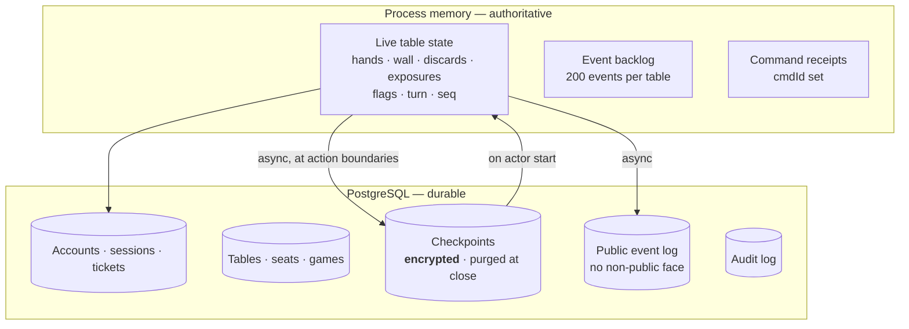
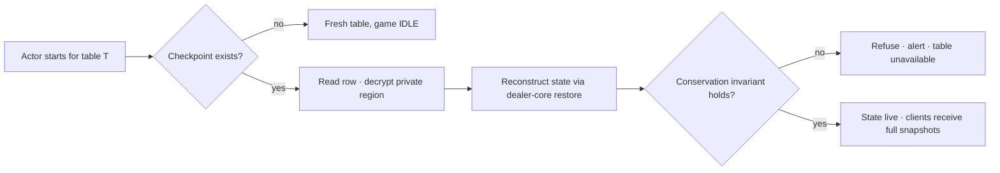
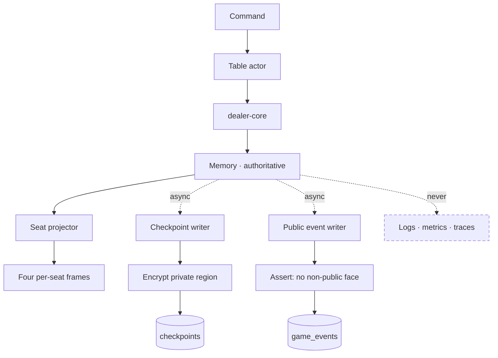

# 16 — Data Architecture

| | |
|---|---|
| **Project** | American Mahjong Dealer |
| **Document** | 16_Data_Architecture.md |
| **Status** | Ratified v0.1 — approved by the project owner, 2026-09-02 |
| **Last Updated** | 2026-09-02 |
| **Role in SSOT** | Owns where authority lives, what is stored, checkpoint design, the public event log, and retention. Does **not** own the physical schema (`17`), the privacy classification (`14`), or backup and restore procedures (`29`). |

---

## 1. Executive Summary

Data architecture here is shaped by one uncomfortable fact: **any durable record complete enough to
restore a game in progress necessarily contains concealed hands and the wall order.** There is no
crash-recovery design that avoids this. A game that can be resumed is a game that was written down.

So the question is never whether to store concealed material. It is how long it exists, who can
read it, and what happens to it afterwards — which makes the shape of the persistence model a
privacy decision at least as much as an availability one (`ADR-0010`).

The answer has three tiers. **Authority lives in memory**, so acknowledgement latency is independent
of disk. **Checkpoints** — complete, encrypted, short-lived — exist for crash recovery and are
purged when the game closes. And a **public-only event log** is retained indefinitely, because it
contains no tile face that was not already public and is therefore safe to keep, back up, and read
during an incident.

The tiers are chosen so that the long-lived data is harmless and the sensitive data is short-lived.
That inversion — the opposite of a conventional event-sourced design, where the complete history is
the permanent artifact — is the central decision.

---

## 2. Objectives

Serves `OBJ-05` (a crash must not destroy an in-progress game), `OBJ-06` (concealed material has a
short, defined life), and `OBJ-11` (one stateful dependency).

---

## 3. Where authority lives

| Datum | Authority | Durable? |
|---|---|---|
| Live table state | Memory | Via checkpoints |
| Turn pointer, flags, `seq` | Memory | Via checkpoints |
| Wall order and salt | Memory | Via checkpoints, encrypted |
| Event backlog | Memory | No — rebuilt as a snapshot after restart |
| Command receipts | Memory | Via checkpoints |
| Accounts, sessions, tickets | PostgreSQL | Yes |
| Tables, seats, game metadata | PostgreSQL | Yes |
| Public events | PostgreSQL | Yes |
| Audit records | PostgreSQL | Yes |
| Table chat | Nowhere | **Never stored** (`FR-131`) |

The chat row is the point of the table: it is the one datum with no storage tier at all.

---

## 4. Data classification

| Class | Examples | Handling |
|---|---|---|
| **Secret** | Password hashes, session hashes, encryption keys, pepper | Hashed or in a secret manager; never logged |
| **Concealed** | Hands, wall order, salt, rack order, selections | Memory, or encrypted checkpoints; purged at game close; never logged (`14`) |
| **Table-public** | Discards, exposures, hand sizes, declarations, corrections | Readable by the four seats; safe to persist and log |
| **Account** | Email, display name | Standard personal data; email never shown to other players |
| **Operational** | Sequence numbers, timings, counts, error codes | Freely logged |

Every column in `17` carries one of these classes, and the class determines its encryption,
retention, and logging treatment.

---

## 5. Checkpoints

### 5.1 Purpose

Two consumers, and the ordering matters:

1. **Crash recovery.** A restart must not destroy four people's game. This is the primary purpose
   and exists independently of anything else (`ADR-0010`).
2. **Correction.** A bounded, unanimous rewind restores an earlier checkpoint (`ADR-0016`).

Naming the order matters because a reviewer might reasonably suppose that removing the correction
feature would remove checkpoints. It would not: crash recovery requires them regardless, and any
recovery artifact necessarily contains concealed material. Encryption is therefore the floor, not
gold-plating.

### 5.2 Contents

A checkpoint is a complete, self-sufficient state.

| Region | Contents | Class |
|---|---|---|
| Public region | Table and game state, flags, turn, `seq`, discards, exposures, hand sizes, commitment | Table-public |
| **Private region** | Every seat's concealed hand with faces, rack order and gaps, selections, in-flight pass commitments, **wall order**, **salt** | **Concealed — encrypted** |
| Receipts | Applied `cmdId` values | Operational |

The private region is a single encrypted blob. Splitting it per seat was considered and rejected: it
would create four decryption paths where one suffices, and no consumer ever needs one seat's private
data without the others — recovery needs all of it, and nothing else reads it at all.

### 5.3 Timing and cadence

| Aspect | Design |
|---|---|
| When | After every accepted command that changes public state |
| How | **Asynchronously**, off the acknowledgement path (`NFR-032`) |
| Never during | `DEALING`, which is atomic (`09 §4.2`) |
| Latest | One row per table, overwritten in place |
| Correction window | The last 10 public action boundaries, retained separately |
| Worst-case loss | One public action (`NFR-031`) |

The asynchronous write is load-bearing. Putting a disk flush in the acknowledgement path would make
every tile movement wait on it — precisely the latency that makes an interface feel remote (`FC-3`).
The cost is stated plainly in `NFR-031` rather than implied away: an unclean crash can lose one
action, and in practice a player repeats a discard.

### 5.4 Restore

The invariant check is not optional (`07 §7.1`). A checkpoint that fails it describes a table where
tiles have been duplicated or lost, and serving it would let a player hold a tile that does not
exist. Refusing is recoverable; proceeding is not.

The event backlog is **not** restored. A client reconnecting after a restart receives a full snapshot
(`12 §8`), which is simpler than persisting a backlog whose only purpose is to avoid sending one.

### 5.5 Purge

At `CONCLUDED`, or when a table closes or is abandoned:

| Step | Timing |
|---|---|
| Delete the latest checkpoint | Immediately |
| Delete every correction-window checkpoint | Immediately |
| Zero in-memory private state | Immediately |
| Confirm no private region remains for the game | Within 60 s (`NFR-013`) |

Purge is a **hard delete**, not a soft flag. A soft-deleted concealed hand is a retained concealed
hand.

The purge runs before the next backup window, which is why routine backups usually contain no hands
at all (`§7`).

---

## 6. The public event log

An append-only record of what happened, retained indefinitely.

### 6.1 The invariant

> **No event in the public log contains a tile face that was not already public at the moment the
> event occurred.**

This single rule is what makes the log safe to keep, back up, replicate, and read during an incident.
It is checked at review time for every new event and asserted by `TC-P04`.

| Event | Public content | Withheld |
|---|---|---|
| `TilesDealt` | Hand sizes, turn | Every tile face |
| `TileDrawn` | Seat, end, wall remaining, hand size | The drawn face |
| `TileDiscarded` | Seat, **face**, index | — the face is public by definition |
| `DiscardClaimed` | Seat, **face** | — |
| `TilesExposed` | Seat, **faces** | — |
| `ExposureRetracted` | Seat, **faces** | — the faces were seen |
| `PassCommitted` | Seat, **count** | The committed faces |
| `PassRoundExecuted` | Routing, counts | Every moved face |
| `HandRevealed` | Seat, **faces** | — voluntarily revealed |
| `CorrectionApplied` | Target `seq`, whether a reshuffle occurred | Restored contents |
| `TableMessage` | **Not logged at all** | Everything (`FR-131`) |

The pattern: an event records a face only when that face was visible to all four seats at the time.

### 6.2 What the log is for

Operational diagnosis — the sequence of actions leading to a fault; audit — that a table existed and
who sat at it; and capacity analysis.

**What it is not for:** replay (`ADR-0012`), dispute resolution (the players were there), or
reconstructing a hand. Note that the log deliberately cannot do the last one: without the wall order
and without the private faces, the reconstruction argument of `08 §5.3` does not run.

### 6.3 Retention

| Data | Retention |
|---|---|
| Public event log | 90 days, then aggregate counts only |
| Game metadata | Indefinite |
| Audit log | 2 years |
| Checkpoint private regions | Life of the game, then purged |
| Sessions | Until expiry, then 30 days for security review |
| Connect tickets | 30 seconds, then deleted |

---

## 7. Backups

| Property | Design |
|---|---|
| Method | Continuous archiving with point-in-time recovery |
| Encryption | At rest, by the platform, plus application-layer encryption for private regions |
| Concealed material | **Usually absent**, because purge precedes the backup window |
| Worst case | A backup taken mid-game contains that game's encrypted private region |
| Restore testing | Quarterly, verified by a successful actor start (`29 §6`) |

The "usually absent" property is worth understanding: it is a consequence of purge timing rather
than a guarantee. A backup captured while a game is live does contain that game's private region,
encrypted. The design does not overstate this — it reduces exposure to the duration of a live game
rather than eliminating it.

---

## 8. Data flow

The dashed forbidden edge is enforced by types, not by convention (`14 §6`).

---

## 9. Design Decisions

| ID | Decision | Rationale |
|---|---|---|
| D-16-01 | Memory authoritative; durability by checkpoint | Latency independent of disk; recovery bounded to one action. |
| D-16-02 | Long-lived data is harmless; sensitive data is short-lived | The inversion of a conventional event-sourced design, and the central decision of this chapter. |
| D-16-03 | The private region is one encrypted blob, not four | One decryption path; no consumer needs one seat's data alone. |
| D-16-04 | Checkpoints asynchronous | A disk flush in the acknowledgement path is felt on every tile movement. |
| D-16-05 | Conservation verified on every restore, refusing on failure | Serving a state that miscounts tiles is worse than being unavailable. |
| D-16-06 | The backlog is not persisted | A snapshot after restart is simpler than persisting a backlog whose purpose is to avoid one. |
| D-16-07 | Purge is a hard delete | A soft-deleted hand is a retained hand. |
| D-16-08 | The public log has an invariant, checked per event | One rule makes the log safe to keep, back up, and read. |
| D-16-09 | Chat has no storage tier at all | Removes retention, export, backup, and moderation surfaces in one decision. |
| D-16-10 | State the backup exposure accurately | Purge reduces exposure to the life of a game; it does not eliminate it, and the documentation should not claim otherwise. |

---

## 10. Alternative Designs

| Alternative | Why rejected |
|---|---|
| Full event sourcing | A permanent complete record is a permanent record of every hand, buying auditability with no application here (`ADR-0010`). |
| Ephemeral only | A routine deploy destroys games in progress. |
| Database as authority | Disk latency in the acknowledgement path; reintroduces the concurrency problems the actor removes. |
| Synchronous checkpoints | Felt on every action for a one-action durability gain. |
| Per-seat encrypted regions | Four decryption paths, no consumer. |
| Soft-deleting concealed material | Not a purge. |
| Persisting the event backlog | Complexity to avoid a snapshot that is already implemented. |
| Logging private events to a separate secured store | A second concealed-material store with its own access control and retention — the thing this design exists to avoid. |

---

## 11. Trade-offs

**One action can be lost to an unclean crash.** Accepted and stated (`NFR-031`). A player repeats a
discard.

**No permanent gameplay history means a defect cannot be diagnosed by replaying a real game.**
Accepted: the mechanics are deterministic and exhaustively testable without one, and the public log
records the sequence.

**A backup taken mid-game contains that game's encrypted private region.** Accepted, stated
honestly, and bounded to the life of a game.

**Restoring a checkpoint that fails the invariant makes a table unavailable.** Accepted: the
alternative is a table playing with impossible tiles.

---

## 12. Risks

| Risk | Mitigation |
|---|---|
| A public event acquires a private field | `§6.1` invariant; review as part of the definition of done; `TC-P04` |
| Purge fails silently, retaining hands | Verified within 60 s; `TC-P04`; a failed purge alerts |
| Checkpoint encryption key is lost | Secret manager with versioned keys; loss affects only in-progress games |
| Checkpoint and memory diverge | Both produced by the same core function; conservation verified on restore |
| Backup retention outlives the purge policy | Backup retention is aligned with the log retention window; documented in `29` |
| A second concealed-material store is introduced | `§10`; any new store touching concealed data requires an ADR |

---

## 13. Future Considerations

Not committed: per-game encryption keys, so destroying a key is itself a purge; a longer correction
window if operational experience shows ten actions is too shallow; compressing checkpoints if their
size ever matters.

---

## 14. Cross References

| Document | Focus |
|---|---|
| `14_Player_Privacy.md` | Visibility classes and the policy matrix |
| `17_Database_Design.md` | The physical schema |
| `05_Game_Table_Architecture.md §8` | The correction mechanism |
| `09_Game_State_Machine.md §8` | Checkpoints and the machine |
| `29_Disaster_Recovery.md` | Backup, restore, RPO and RTO |
| `ADR-0010`, `ADR-0012`, `ADR-0016` | Persistence, replay, correction |

---

## 15. Revision History

| Version | Date | Author | Changes |
|---|---|---|---|
| 0.1 | 2026-09-02 | Design (architect role), owner-approved | Initial chapter |
