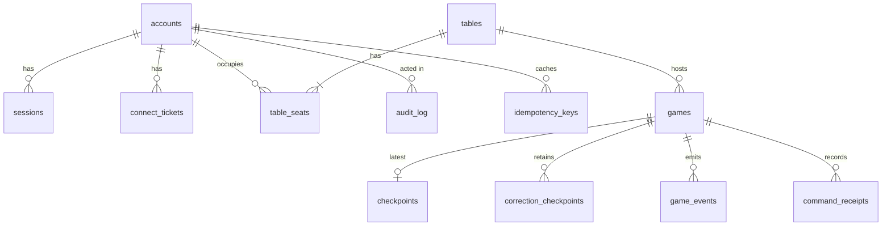

# 17 — Database Design

| | |
|---|---|
| **Project** | American Mahjong Dealer |
| **Document** | 17_Database_Design.md |
| **Status** | Ratified v0.7 — approved by the project owner, 2026-09-03 |
| **Last Updated** | 2026-09-03 |
| **Role in SSOT** | Owns the physical schema: tables, columns, constraints, indexes, encryption, and privileges. Does **not** own what data exists or why (`16`), the privacy classification (`14`), or migration operations (`27`). |

---

## 1. Executive Summary

The schema is small — twelve tables — and its smallness is the most informative thing about it. There
are no accounts, balances, ledgers, postings, prices, purchases, or transactions, because there is no
economy (`ADR-0003`). There are no rule versions, rule configurations, or validation runs, because
there are no rules (`ADR-0002`). There is no event stream containing concealed actions, because
authority lives in memory and the durable record is public-only (`ADR-0010`).

Two design habits run through it.

**Invariants are pushed into the database.** Where a rule about the data can be expressed as a
constraint, it is — one occupant per seat, one seat per account, at most one live game per table.
Application logic that checks these would race; a constraint does not.

**Privilege is structural.** The application role has no `SELECT` grant on the encrypted private
region of checkpoints. Even a compromised query cannot read it, and even a mistaken one cannot log
it. That is a different kind of protection from remembering not to select it.

---

## 2. Objectives

Serves `OBJ-06` (encryption and privilege on concealed material), `OBJ-08` and `OBJ-09` (constraints
that make impossible states impossible), and `OBJ-11` (the smallest adequate schema).

---

## 3. Conventions

| Convention | Rule |
|---|---|
| Primary keys | Application-generated UUIDv7 — time-ordered for index locality |
| Timestamps | `timestamptz`, always UTC |
| Naming | `snake_case`; tables plural, columns singular |
| Case-insensitive text | `citext` for email and display name |
| Deletes | Hard, for concealed material. Soft nowhere |
| Migrations | Forward-only; an applied migration is immutable; corrections are new migrations |
| Enumerations | Native types, so an invalid value cannot be stored |

---

## 4. Entity relationships

Twelve tables. `tables ||--|{ table_seats` is a non-optional four: a table always has exactly four
seat rows, occupied or not.

---

## 5. Tables

### 5.1 `accounts`

| Column | Type | Notes | Class |
|---|---|---|---|
| `id` | uuid PK | | |
| `email` | citext | **unique** | Account |
| `email_verified_at` | timestamptz null | | |
| `password_hash` | text | Argon2id; peppered before hashing (`15 §4.1`) | **Secret** |
| `display_name` | citext | Shown to the other three seats | Table-public |
| `role` | `account_role` | `player` \| `administrator` | |
| `status` | `account_status` | `active` \| `disabled` | |
| `failed_logins` | integer | Durable lockout counter (`15 §7`) | |
| `locked_until` | timestamptz null | Durable lockout expiry | |
| `password_change_count` | integer | Durable rate-limit counter for `POST /accounts/me/password` (`15 §7.1`, `18 §6`: "3/hour") | |
| `password_change_window_started_at` | timestamptz null | Start of the current rate-limit window | |
| `totp_secret` | bytea null | AES-256-GCM ciphertext; administrators only (`15 §8.1`, `ADR-0017`) | **Secret** |
| `totp_secret_key_version` | integer null | Same rotation-without-rewrite purpose as `checkpoints.key_version` (`D-17-05`), a distinct key (`15 §9`) | |
| `totp_enrolled_at` | timestamptz null | Set once, out of band, at provisioning (`15 §8.2`) | |
| `totp_last_used_step` | bigint null | Durable replay guard: a step at or before this is rejected even if otherwise valid (`15 §8.1`) | |
| `mfa_failed_attempts` | integer | Durable lockout counter for `POST /sessions/mfa`, tracked separately from `failed_logins` (`15 §7.1`) | |
| `mfa_locked_until` | timestamptz null | Durable lockout expiry for the same | |
| `created_at`, `updated_at` | timestamptz | | |

The lockout and password-change rate-limit columns are in the database rather than a cache
deliberately: a control that vanishes on restart is one an attacker waits out (`D-15-03`). The
password-change columns hold a flat fixed window (`D-17-14`), not the lockout columns' progressive
curve — the endpoint's own limit (`18 §6`) is flat. The `mfa_*` columns reuse `failed_logins`'
progressive curve exactly (`D-17-16`), but as their own counter: a wrong TOTP code is a different
failure from a wrong password, and conflating them would either lock a correctly-authenticated
administrator out of *retrying* step-up, or reset inappropriately.

`totp_secret` is **not** column-denied from the general `app` role the way `private_state` is
(`§7.2`): unlike a checkpoint's concealed material, which the application reads through one narrow
path at actor start, the TOTP secret must be decrypted and checked on every `POST /sessions/mfa`
call — the normal application flow, not a special one. The protection here is the encryption itself,
plus `app_readonly` never seeing the column at all (`§7.2`), the same posture `password_hash` and
`token_hash` already have.

### 5.2 `sessions`

| Column | Type | Notes | Class |
|---|---|---|---|
| `id` | uuid PK | | |
| `account_id` | uuid FK | cascade delete | |
| `token_hash` | bytea | **SHA-256 of the token; the token is never stored** | **Secret** |
| `csrf_secret` | text | Double-submit secret (`15 §4.2`) | **Secret** |
| `issued_at`, `last_seen_at`, `absolute_expires_at` | timestamptz | | |
| `revoked_at` | timestamptz null | Non-null closes bound sockets within 5 s | |
| `mfa_verified_at` | timestamptz null | Set by `POST /sessions/mfa`; gates `/admin/*` for **this session only** (`15 §8.1`, `ADR-0017`) | |
| `ip`, `user_agent` | text null | Security review only | Operational |

Unique index on `token_hash`. Partial index on `(account_id)` where `revoked_at is null`.

`mfa_verified_at` is per-session, not per-account, deliberately: a second login is a second session
and starts unverified again, the same way `revoked_at` doesn't carry across sessions either.

### 5.3 `connect_tickets`

| Column | Type | Notes |
|---|---|---|
| `id` | uuid PK | |
| `ticket_hash` | bytea | **unique** — single use is a constraint, not a check |
| `account_id`, `session_id`, `table_id` | uuid FK | |
| `seat` | `seat_position` | The seat the socket will bind to |
| `expires_at` | timestamptz | 30 seconds from issue |
| `redeemed_at` | timestamptz null | Set atomically on redemption |

Redemption is a single conditional update — set `redeemed_at` where it is null and not expired — so a
replayed ticket cannot succeed even under concurrency (`12 §4.1`). Rows are deleted shortly after
expiry.

### 5.4 `tables`

| Column | Type | Notes |
|---|---|---|
| `id` | uuid PK | |
| `join_code_hash` | bytea | **Irreversible.** A database read yields no usable codes |
| `host_account_id` | uuid FK null | Transfers if the host leaves (`05 §5.2`) |
| `status` | `table_status` | `open` \| `seated` \| `abandoned` \| `closed` |
| `owner_node` | text | The process that owns this table. Constant in v1 (`D-03-08`) |
| `deal_count_default`, `deal_count_dealer` | smallint | 13 and 14 — the whole configuration surface (`05 §7`) |
| `created_at`, `closed_at` | timestamptz | |

Partial unique index on `join_code_hash` where `status <> 'closed'`, so a code is unique among live
tables and may be reused after closure.

`owner_node` is unused logic in v1 and exists so the multi-node seam is a change of code rather than
a migration on live data (`ADR-0014`).

### 5.5 `table_seats`

| Column | Type | Notes |
|---|---|---|
| `id` | uuid PK | |
| `table_id` | uuid FK | cascade delete |
| `seat` | `seat_position` | `east` \| `south` \| `west` \| `north` |
| `account_id` | uuid FK null | Null when empty |
| `is_ready` | boolean | |
| `occupied_at` | timestamptz null | Host transfer uses this ordering |

Two constraints carry real weight:

| Constraint | Enforces |
|---|---|
| `unique (table_id, seat)` | Exactly one row per seat per table |
| `unique (account_id) where account_id is not null` | **One seat per account, platform-wide** (`FR-024`) |

The second prevents one person occupying two seats at a table and thereby seeing two hands — which
would make the four-player guarantee false. Expressed as a partial unique index because application
logic would race.

### 5.6 `games`

| Column | Type | Notes |
|---|---|---|
| `id` | uuid PK | |
| `table_id` | uuid FK | |
| `state` | `game_state` | `idle` \| `dealing` \| `in_play` \| `concluding` \| `concluded` |
| `seq` | bigint | Last durable authoritative sequence |
| `commitment` | bytea | Current wall commitment — public (`08 §5`) |
| `outcome` | `game_outcome` null | `declaration_accepted` \| `ended_by_agreement` \| `abandoned` |
| `outcome_seat` | `seat_position` null | The declaring seat, where applicable |
| `started_at`, `concluded_at`, `purged_at` | timestamptz | |

`outcome` is the entire record of how a game ended. There is **no score, value, rule justification,
or per-seat delta column** — and there is nowhere for one to live (`NR-013`, `NR-101`).

Partial unique index on `(table_id)` where `state <> 'concluded'`, so a table cannot have two live
games.

### 5.7 `checkpoints`

| Column | Type | Notes | Class |
|---|---|---|---|
| `game_id` | uuid PK FK | One row per game, overwritten in place | |
| `seq` | bigint | The sequence this state represents | |
| `public_state` | jsonb | Table and game state, flags, turn, discards, exposures, hand sizes | Table-public |
| `private_state` | bytea | **AES-256-GCM.** Hands, rack orders, selections, in-flight, wall order, salt | **Concealed** |
| `receipts` | jsonb | Applied `cmdId` values | Operational |
| `key_version` | smallint | Supports key rotation | |
| `written_at` | timestamptz | |

`private_state` is a single encrypted blob (`D-16-03`). Its plaintext never touches the database, so
even a full dump yields ciphertext.

`receipts` (`D-17-20`) is a plaintext operational projection of the same `cmdId`s durably tracked
inside `private_state`'s encrypted envelope (`13 §4`, `ADR-0009`) — cmdId only, no `seq`, mirroring
`public_state`'s own "informational, restore never reads it" role. The restore-critical copy (cmdId
*and* the `seq` each one produced) lives inside `private_state`; this column exists only for
`app_readonly`'s operational visibility.

### 5.8 `correction_checkpoints`

Identical shape, retained for the correction window rather than overwritten.

| Column | Type | Notes |
|---|---|---|
| `id` | uuid PK | |
| `game_id` | uuid FK | cascade delete |
| `seq` | bigint | unique with `game_id` |
| `public_state`, `private_state`, `key_version` | as above | |
| `written_at` | timestamptz | |

Rows beyond the last ten public actions are deleted as new ones are written, so the window is bounded
by construction rather than by a scheduled job (`05 §8.3`).

Durable (`D-17-19`): written asynchronously off the acknowledgement path, same as `checkpoints`
(`§5.7`), and restored into a process-restart actor's in-memory window via the same dedicated
decryption path (`app_checkpoint_reader`, `§7.2`).

### 5.9 `game_events`

| Column | Type | Notes |
|---|---|---|
| `id` | uuid PK | |
| `game_id` | uuid FK | |
| `seq` | bigint | unique with `game_id` |
| `type` | text | Event name from `19` |
| `seat` | `seat_position` null | The acting seat, where applicable |
| `payload` | jsonb | **Public content only** |
| `occurred_at` | timestamptz | |

Append-only, enforced by a trigger rejecting `UPDATE` and `DELETE` — an audit record that can be
edited is not an audit record.

`payload` is governed by the invariant in `16 §6.1`: **no tile face that was not already public.**
Checked at review for every new event type and asserted by `TC-P04`.

`TableMessage` is **not** an event type. Chat has no storage tier (`FR-131`).

### 5.10 `command_receipts`

| Column | Type | Notes |
|---|---|---|
| `game_id` | uuid FK | |
| `cmd_id` | uuid | Primary key with `game_id` |
| `seq` | bigint | The sequence the command produced |
| `applied_at` | timestamptz | |

Idempotency receipts (`13 §4`). Cascade-deleted with the game.

**Superseded, `D-17-20`**: this table has existed since the first migration but is never read or
written by any code — `16 §3`'s own "Where authority lives" diagram places command receipts in
memory, durable "via checkpoints" only, with no separate table on its Postgres side at all. The
mechanism actually built is `checkpoints.receipts` (`§5.7`), matching that diagram. This table is
left physically in place (dropping it is a more invasive migration than leaving an unused one) but
should not be treated as live schema.

### 5.11 `audit_log`

| Column | Type | Notes |
|---|---|---|
| `id` | uuid PK | |
| `actor_account_id` | uuid FK null | Null for system actions |
| `action` | text | |
| `target_type`, `target_id` | text, uuid null | |
| `reason` | text null | **Mandatory** for administrative actions (`FR-166`) |
| `ip` | text null | |
| `occurred_at` | timestamptz | |

Append-only by trigger. Authentication and administrative events only. **No game content, ever** — an
audit log that recorded gameplay would be a permanent concealed-material store (`16 §10`).

### 5.12 `idempotency_keys`

| Column | Type | Notes | Class |
|---|---|---|---|
| `account_id` | uuid FK | cascade delete | |
| `endpoint` | text | e.g. `"POST /tables"` — scopes a key to the request it replays | |
| `key` | text | The client-supplied `Idempotency-Key` header value | |
| `response_status` | smallint | | |
| `response_body` | jsonb | The original response, verbatim | **Secret** |
| `created_at`, `expires_at` | timestamptz | 10 minutes from creation | |

`PRIMARY KEY (account_id, endpoint, key)`. The replay cache behind `Idempotency-Key`
(`18 §3`, `D-18-10`) — currently written only by `POST /tables`.

`response_body` is classified **Secret** despite holding nothing more sensitive than what the client
already received once, because for `POST /tables` it includes the plaintext `join_code` — a
deliberate, narrow exception to `D-18-05`/`D-17-07`'s "stored irreversibly." Without it, a client that
created a table but never received the response (a dropped connection, a client crash before the body
was read) has no path to recover a code it already earned; retrying without `Idempotency-Key` only
gets `409 ALREADY_SEATED`, since the account already holds the seat. The exception is bounded by
`expires_at`, not by convention: an expired row is invisible to every lookup, and no endpoint or
administrative surface reads this table back to a human — it exists solely to answer "have I seen
this key" for the ten minutes that matters. No `app_readonly` grant, the same posture `connect_tickets`
takes for its own single-use secret. Rows are not swept by a scheduled job; lookups simply treat an
expired row as absent, the same lazy-expiry discipline `connect_tickets` already uses.

---

## 6. Constraints that carry design weight

Collected, because these are the places where the database enforces something the application
otherwise would.

| Constraint | Table | Enforces |
|---|---|---|
| `unique (account_id) where not null` | `table_seats` | One seat per account, platform-wide |
| `unique (table_id, seat)` | `table_seats` | Exactly four seats, one occupant each |
| `unique (table_id) where state <> 'concluded'` | `games` | At most one live game per table |
| `unique (join_code_hash) where status <> 'closed'` | `tables` | Codes unique among live tables, reusable after |
| `unique (ticket_hash)` | `connect_tickets` | Single-use tickets |
| `unique (game_id, seq)` | `game_events` | No duplicate sequence in the log |
| `primary key (game_id, cmd_id)` | `command_receipts` | Exactly-once command application — superseded, see `§5.10` |
| `primary key (account_id, endpoint, key)` | `idempotency_keys` | One cached response per account, per endpoint, per key |
| Append-only triggers | `game_events`, `audit_log` | Records cannot be rewritten |

Each replaces application logic that would be subject to a race.

---

## 7. Encryption and privilege

### 7.1 Encryption at rest

| Layer | Covers |
|---|---|
| Platform disk encryption | Everything |
| **Application-layer AES-256-GCM** | `checkpoints.private_state`, `correction_checkpoints.private_state`, `accounts.totp_secret` |

The application layer matters because platform encryption protects against a stolen disk, not against
a query. A `SELECT *` on a checkpoint — or on `accounts.totp_secret` — yields ciphertext.

Keys live in the secret manager, versioned (`key_version` / `totp_secret_key_version`) so rotation
does not require rewriting existing rows. A production start fails if a required key is absent or a
development default (`NFR-044`). `totp_secret`'s key is its own secret-manager entry, distinct from
the checkpoint key (`15 §9`), so rotating one never touches rows encrypted under the other.

### 7.2 Roles and grants

| Role | Grants |
|---|---|
| `app` | `SELECT`, `INSERT`, `UPDATE`, `DELETE` on all tables **except no `SELECT` on either `private_state` column** — obtained through a dedicated decryption path — **and `idempotency_keys`, `SELECT`/`INSERT` only**: a row is never updated and is never explicitly deleted, only aged out (`§5.12`) |
| `app_checkpoint_reader` | The dedicated decryption path referenced above: `SELECT (game_id, private_state, key_version)` on `checkpoints` (migration `0006`, `D-17-18`) and `SELECT (game_id, seq, private_state, key_version)` on `correction_checkpoints` (migration `0007`, `D-17-19`) — the same role reading a second table, not a second role, since both columns are the same data class under the same key. No write grant anywhere, and no grant on any other table. A distinct connection string/credential from `app`'s, so the two roles' access can never be exercised through one compromised connection. |
| `app_readonly` | `SELECT` on public tables only; **no grant on `private_state`, `password_hash`, `token_hash`, `csrf_secret`, `totp_secret`, `totp_secret_key_version`, `totp_last_used_step`** |
| `migrator` | DDL; used only by migrations |

The column-level denial on `private_state` for the general application role is the second barrier
behind encryption. A query written by mistake, or by an injection that reached the general role,
cannot return the column at all. Reading it requires the narrow, audited path that also holds the
key — `app_checkpoint_reader`, exercised by exactly two code paths
(`CheckpointRepository.readForRestore` and `CorrectionCheckpointRepository.readForRestore`, both
`server`), never the general application role.

`app_readonly` exists for operational inspection during an incident and can reach nothing sensitive.

### 7.3 Purge

At game conclusion, close, or abandonment: delete the `checkpoints` row, delete all
`correction_checkpoints` rows for the game, set `games.purged_at`. Hard deletes; verified within 60
seconds (`NFR-013`, `TC-P04`).

---

## 8. What is deliberately absent

The absences are as normative as the tables, and each is enforced by a negative requirement.

| Absent | Why | `NR` |
|---|---|---|
| Accounts, balances, wallets | No economy | `NR-101`, `NR-102` |
| Ledger transactions, postings | No economy | `NR-103` |
| Prices, purchases, payment records | No economy | `NR-105`, `NR-106` |
| Penalties, fees, stakes | No economy | `NR-107` |
| Score, value, or per-seat delta columns | No scoring | `NR-013` |
| Rule versions, rule configuration, validation runs | No rules | `NR-001`, `NR-010`, `NR-011` |
| Hand-pattern or card data | No rules | `NR-010` |
| Replay artifacts | Reconstructs hands | `NR-508` |
| Chat message storage | Ephemeral by design | `FR-131` |
| Spectator or observer records | No such role | `NR-401` |
| An event stream containing concealed actions | Permanent concealed-material store | `NR-506` |

`TC-A06` scans the schema for economic vocabulary; `TC-A01` scans for rule vocabulary.

---

## 9. Design Decisions

| ID | Decision | Rationale |
|---|---|---|
| D-17-01 | Push invariants into constraints | Application checks race; constraints do not. Each constraint in `§6` replaces logic that would be subject to a race. |
| D-17-02 | One seat per account as a partial unique index | Prevents one person seeing two hands, which would falsify the four-player guarantee. |
| D-17-03 | No `SELECT` grant on `private_state` for the general role | A second barrier behind encryption; a mistaken or injected query cannot return the column. |
| D-17-04 | Application-layer encryption in addition to platform encryption | Platform encryption protects against a stolen disk, not against a query. |
| D-17-05 | `key_version` on encrypted rows | Rotation without rewriting existing rows. |
| D-17-06 | Append-only triggers on the event and audit logs | A record that can be rewritten is not a record. |
| D-17-07 | Join codes stored irreversibly | A database read yields no usable codes. |
| D-17-08 | `owner_node` from the first migration | Makes the multi-node seam a code change rather than a migration on live data. |
| D-17-09 | Hard deletes for concealed material | A soft-deleted hand is a retained hand. |
| D-17-10 | `game_outcome` as an enumeration with no value column | There is nowhere for a score to live, which is stronger than not writing one. |
| D-17-11 | Correction checkpoints bounded by deletion on write | The window is bounded by construction, not by a scheduled job that could fail. |
| D-17-12 | UUIDv7 primary keys | Time-ordered index locality without exposing sequential identifiers. |
| D-17-13 | `idempotency_keys` caches a full response, not just a fact-of-completion flag | A client retrying `POST /tables` after a lost response needs the identical body back, `join_code` included (`18 §7`, `D-18-11`) — a completion flag alone would tell it the create succeeded but not what it needs to act on it. |
| D-17-14 | `POST /accounts/me/password`'s durable rate limit is a flat fixed window, not `failed_logins`' progressive curve | `18 §6` specifies a flat 3/hour, not an escalating one; reusing the lockout shape would invent a policy the spec doesn't call for. |
| D-17-15 | `totp_secret` is encrypted but not column-denied from the general `app` role | Unlike `private_state`, read once at actor start through a narrow path, the TOTP secret is decrypted on every `POST /sessions/mfa` call — the normal application flow. `ADR-0017`. |
| D-17-16 | MFA lockout (`mfa_failed_attempts`/`mfa_locked_until`) reuses the login lockout curve, as its own separate counter | A wrong TOTP code is a different failure than a wrong password; sharing `failed_logins` would let one lock out the other. `ADR-0017`. |
| D-17-17 | `mfa_verified_at` lives on `sessions`, not `accounts` | Step-up verifies *this session*, not the account generally — a new login is a new session and starts unverified again, the same way `revoked_at` doesn't carry across sessions. `D-15-11`, `ADR-0017`. |
| D-17-18 | `private_state` restore goes through a second DB role (`app_checkpoint_reader`), not a grant widening `app` | `§7.2`'s existing denial on `app` was written before any legitimate consumer of `private_state` existed; crash-recovery restore (`docs/29`) is now that consumer. A second, SELECT-only, single-column, single-table role keeps the original defense-in-depth property literally true (`app`'s own credentials still can't read the column at all) rather than trading it for one fewer connection to manage. |
| D-17-19 | `correction_checkpoints` durability closes via the same `app_checkpoint_reader` role and `CheckpointWriter` injection point as `checkpoints`, not a second reader role | A new migration (`0007`) widens that role's existing grant to a second table rather than creating another one — the isolation property `D-17-18` protects (`app`'s own credentials still can't read either `private_state` column) is unaffected by one role reading two tables of the same data class instead of one. `docs/29`, `ADR-0016`. |
| D-17-20 | `command_receipts` (`§5.10`) is superseded by `checkpoints.receipts` (`§5.7`), not built out as a second mechanism | `16 §3`'s own "Where authority lives" diagram places command receipts in memory, durable "via checkpoints" only — no separate table on its Postgres side. `command_receipts` predates that diagram (or was never reconciled with it) and has no code reading or writing it. Left in place rather than dropped — a schema deletion is a more invasive migration than marking a table unused. `13 §4`, `ADR-0009`. |

---

## 10. Alternative Designs

| Alternative | Why rejected |
|---|---|
| Application-enforced seat uniqueness | Races under concurrent joins. |
| Storing concealed state in normalized columns | Every column becomes individually leakable; a single encrypted blob has one access path. |
| Platform encryption only | Does not protect against a query. |
| Row-level security instead of column denial | More machinery for a single-tenant application with one application role; column denial is exact. |
| An event stream containing private payloads | A permanent concealed-material store (`ADR-0010`). |
| Soft deletes throughout | Concealed material must actually be deleted. |
| Storing join codes reversibly | A database read would yield working codes for live tables. |
| Sequential integer keys | Expose creation order and enable enumeration. |
| A separate schema per table (multi-tenancy) | Enormous complexity for four-player private tables. |
| A fact-of-completion flag instead of a cached response for `Idempotency-Key` | Doesn't solve the problem: a client with a lost response still can't recover its `join_code` (`D-17-13`). |
| No TTL — rely on the caller to delete its own key | A client that never retries leaves the row forever; an unconditional short TTL needs no cooperation. |
| Progressive lockout for password-change attempts, mirroring login | `18 §6` specifies a flat 3/hour, not an escalating curve (`D-17-14`). |
| An in-memory counter for the password-change limit | The same reasoning as the login lockout: it vanishes on restart, which an attacker can wait out (`D-15-03`). |
| Column-denying `totp_secret` from `app` the way `private_state` is denied | The application needs to decrypt and check it on every step-up call, not through a narrow, occasional path (`D-17-15`). |
| Sharing `failed_logins`/`locked_until` for MFA failures too | A wrong TOTP code and a wrong password are different failure modes; one counter would let either lock out the other (`D-17-16`). |
| `mfa_verified_at` on `accounts`, verified once per account rather than per session | Would let a stolen session cookie inherit a step-up an entirely different login performed; sessions are already the system's unit of revocation (`D-17-17`). |

---

## 11. Trade-offs

**Column-level denial means the decryption path is slightly awkward** — it needs a distinct
connection or role. Accepted: that awkwardness is the control.

**Twelve tables is fewer than a reviewer might expect.** Accepted, and `§8` exists so the absences
read as decisions rather than as omissions.

**`idempotency_keys.response_body` is a deliberate, narrow hole in `D-17-07`.** Accepted, bounded by
a 10-minute `expires_at` rather than by convention — see `§5.12`.

**Application-layer encryption means the database cannot index or query private state.** Accepted:
nothing queries it. It is read whole, by one path, at actor start.

**`owner_node` is unused in v1.** Accepted: one column against a future migration on live data.

---

## 12. Risks

| Risk | Mitigation |
|---|---|
| A private field is added to an event payload | `16 §6.1` invariant; review; `TC-P04` |
| A score or value column is added | `NR-013`; `TC-A06` schema scan |
| Purge fails, retaining hands | Verified within 60 s; failures alert; `TC-P04` |
| The encryption key is lost | Versioned keys in the secret manager; loss affects only live games |
| A migration weakens a constraint | Migrations are reviewed against `§6`; the constraint list is part of the definition of done |
| `app_readonly` is granted more than intended | Grants asserted in a schema test |
| A cached join code in `idempotency_keys` outlives its purpose | 10-minute `expires_at`; no `app_readonly` grant; nothing reads the table back to a human (`§5.12`) |
| `totp_secret`'s encryption key is lost | Versioned (`totp_secret_key_version`); loss requires re-provisioning affected administrators — a small, known population (`15 §8.2`) |
| A TOTP code brute-forced against `mfa_failed_attempts` | Durable, progressive lockout, the same curve as login (`D-17-16`) |

---

## 13. Future Considerations

Not committed: per-game encryption keys, so destroying a key purges a game (`16 §13`); partitioning
`game_events` by month if volume warrants; a materialized view of table participation for capacity
analysis.

---

## 14. Cross References

| Document | Focus |
|---|---|
| `16_Data_Architecture.md` | What is stored and why |
| `14_Player_Privacy.md` | Visibility classes |
| `15_Security_Architecture.md` | Secrets, sessions, lockout |
| `27_Deployment_Architecture.md` | Migration operations |
| `29_Disaster_Recovery.md` | Backup and restore |
| `SCOPE_BOUNDARIES.md §4` | The negative requirements `§8` enforces |

---

## 15. Revision History

| Version | Date | Author | Changes |
|---|---|---|---|
| 0.1 | 2026-09-02 | Design (architect role), owner-approved | Initial schema: 11 tables |
| 0.2 | 2026-09-03 | Design (architect role), owner-approved | Added `idempotency_keys` (`§5.12`) for `D-18-10`; twelve tables; `D-17-13` |
| 0.3 | 2026-09-03 | Design (architect role), owner-approved | Added `accounts.password_change_count`/`password_change_window_started_at` (`§5.1`) for the durable `POST /accounts/me/password` limit; `D-17-14` |
| 0.4 | 2026-09-03 | Design (architect role), owner-approved | `ADR-0017`: `accounts.totp_secret`/`totp_secret_key_version`/`totp_enrolled_at`/`totp_last_used_step`/`mfa_failed_attempts`/`mfa_locked_until` and `sessions.mfa_verified_at` (`§5.1`, `§5.2`); `D-17-15`–`D-17-17` |
| 0.5 | 2026-09-03 | Design (architect role), owner-approved | Checkpoint durability (`docs/29`): `app_checkpoint_reader` role (`§7.2`, migration `0006`) as `private_state`'s dedicated decryption path; `D-17-18` |
| 0.6 | 2026-09-03 | Design (architect role), owner-approved | `correction_checkpoints` durability (`docs/29`, `ADR-0016`): migration `0007` extends `app_checkpoint_reader` to `correction_checkpoints` (`§7.2`); `§5.8` restore note; `D-17-19` |
| 0.7 | 2026-09-03 | Design (architect role), owner-approved | Durable `cmdId` idempotency (`13 §4`, `ADR-0009`): `checkpoints.receipts` (`§5.7`) is now the real mechanism, no new migration needed; `command_receipts` (`§5.10`) marked superseded, `§6`'s constraint row annotated; `D-17-20` |
