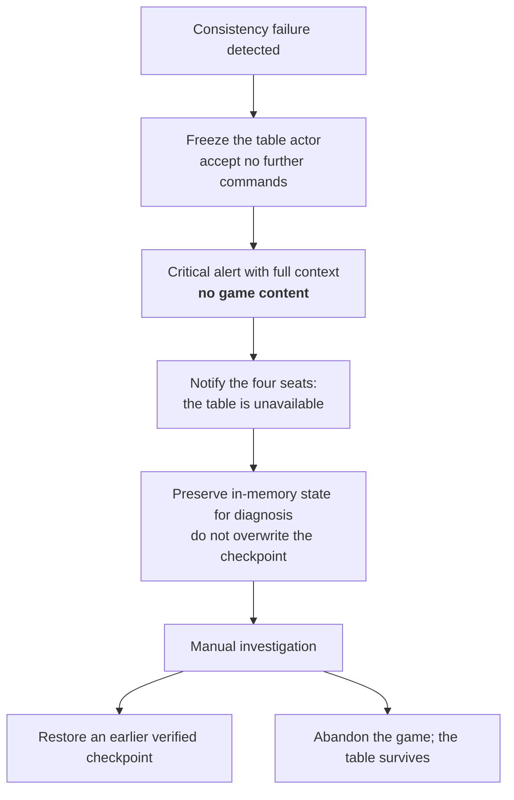

# 21 — Error Handling and Recovery

| | |
|---|---|
| **Project** | American Mahjong Dealer |
| **Document** | 21_Error_Handling_and_Recovery.md |
| **Status** | Ratified v0.1 — approved by the project owner, 2026-09-02 |
| **Last Updated** | 2026-09-02 |
| **Role in SSOT** | Owns the error taxonomy, the client-facing error contract, server-side recovery, and the fail-safe stance. Does **not** own the code catalogs (`19`, `33_API/Error_Code_Catalog.md`), logging (`20`), connection recovery (`22`), or disaster recovery (`29`). |

---

## 1. Executive Summary

Errors here divide by **what the system should do next**, not by where they arose. Four classes:

A **rejection** is a normal outcome — the player asked for something the table cannot do. State is
untouched, the connection continues, and the player sees a plain explanation. A **protocol
violation** means the client is not speaking the protocol correctly, and the connection closes so it
can resume cleanly. A **transient failure** is infrastructure misbehaving; it is retried. A
**consistency failure** means the system's own state is wrong, and the response is to **stop**.

The last class is the one that distinguishes this chapter. Most systems degrade gracefully under
internal inconsistency, on the reasonable theory that partial service beats none. Here, a
consistency failure means the tile accounting is wrong — a player could hold a tile that does not
exist, or two players could hold the same one. Continuing would let a corrupt game proceed as though
it were sound, and the corruption would be woven into every subsequent action. A table that stops is
recoverable from a checkpoint; a table that has been playing with impossible tiles for twenty
minutes is not.

Two rules run through everything. **A rejection never mutates state.** And **an error message never
carries game content** — for privacy (`20 §5`) and because the honest message is about the mechanism
anyway.

---

## 2. Objectives

Serves `OBJ-05` (an ordinary failure is uneventful), `OBJ-08` (tiles stay accounted for, or the
system stops), and `OBJ-06` (errors leak nothing).

---

## 3. The taxonomy

| Class | Meaning | State | Connection | Player sees |
|---|---|---|---|---|
| **Rejection** | A valid request the table cannot fulfil | Unchanged | Continues | A plain explanation |
| **Protocol violation** | The client is not speaking the protocol | Unchanged | **Closes** | A reconnection |
| **Transient failure** | Infrastructure misbehaved | Unchanged or retried | Continues | Usually nothing |
| **Consistency failure** | The system's own state is wrong | **Frozen** | Continues, table unavailable | The table is unavailable |

### 3.1 Rejections

The largest class and an entirely normal one. A rejection is not a bug — a player clicking a tile
someone else just claimed is playing the game.

| Property | Rule |
|---|---|
| State | Never mutated. The command did not happen |
| Delivery | **Only to the originating seat** (`05 §6.1`) — a rejection reveals intent |
| Content | A code from the closed catalog plus a human explanation |
| Accompaniment | A current view on `STALE_STATE`, so the client resynchronizes |
| Logging | Code and `cmdId` only; counted as a metric |

### 3.2 Protocol violations

Malformed JSON, a `cseq` gap, a frame in the wrong state, an oversized frame.

The connection closes with `PROTOCOL_VIOLATION`. The severity is deliberate: a client that has lost
frames or is sending malformed data has a view that may differ from the server's in ways neither side
can enumerate, and resumption from a known sequence is cheap and unambiguous (`13 §5.1`).

### 3.3 Transient failures

A database timeout, a connection-pool exhaustion, a temporary resource limit.

| Failure | Response |
|---|---|
| Checkpoint write | Retry with backoff, three attempts; alert on repeated failure. **Play continues** — the checkpoint is durability, not correctness |
| Event log write | Same |
| Session lookup | Retry once, then fail the request as `503` |
| Purge | Retry with backoff; alert on repeated failure, because retained concealed material is a privacy defect |

A failed checkpoint does not interrupt a game. This is the right stance: the in-memory state is
authoritative and correct, and stopping a healthy game because durability is degraded would trade a
certain harm for a possible one. It does raise the loss window, which is why it alerts.

### 3.4 Consistency failures

The distinctive class. Triggered by: a conservation violation (`07 §7`), a checkpoint that fails
verification on restore, a state transition producing an impossible result, or an internal invariant
breaking.

Four properties:

- **Freeze rather than crash.** A crash would discard the evidence and, worse, could trigger a
  restart that reloads the same corrupt checkpoint.
- **Do not overwrite the checkpoint.** The last known-good state is more valuable than the corrupt
  one.
- **Tell the players something true.** "This table is unavailable" rather than a silent stall.
- **Only this table.** One table's corruption does not affect any other.

---

## 4. Fail-safe stance

Where a failure could be resolved either way, the resolution is fixed in advance so it is not decided
under pressure.

| Situation | Resolution | Why |
|---|---|---|
| Cannot verify a command is authorized | **Reject** | Never act on an unverified authorization |
| Cannot verify a tile's ownership | **Reject** | Never move a tile that might not be the actor's |
| Cannot determine whether a command was already applied | **Reject** | Better to make a player retry than to apply twice |
| Cannot write a checkpoint | **Continue** | Memory is authoritative; durability is degraded, not correctness |
| Cannot purge concealed material | **Alert and retry** | A privacy defect, not a gameplay one |
| Cannot verify conservation | **Freeze** | Continuing compounds corruption |
| A rate limiter is unavailable | **Fail closed on security-critical limits; open on convenience limits** | A missing lockout is exploitable; a missing chat throttle is not |
| A proposal timeout elapses | **Refuse** | The system never performs a binding action (`NR-210`) |

The rate-limiter row is the only split decision, and the split is principled: `§4` fails closed
where a missing control is exploitable and open where it merely inconveniences.

---

## 5. Client contract

| Class | Client behaviour |
|---|---|
| Rejection | Reconcile to server state; show the explanation; **do not retry automatically** |
| `STALE_STATE` | Replace the view from the accompanying snapshot; the player may act again |
| `DUPLICATE_COMMAND` | Treat as success — the original outcome is attached |
| `RATE_LIMITED` | Back off; do not retry immediately |
| Protocol violation close | Report a defect; do not reconnect blindly |
| Transport loss | Reconnect with exponential backoff and jitter (`12 §10.1`) |
| Table unavailable | Show a clear message; offer to leave; do not retry |

### 5.1 No automatic retry of rejections

A rejection is a definite answer, and retrying it produces the same answer while making the interface
appear stuck. The one exception is `RATE_LIMITED`, which is explicitly temporary and carries a
backoff.

### 5.2 Messages a player can act on

| Situation | Message |
|---|---|
| `NOT_YOUR_TURN` | "It's not your turn to draw." |
| `NOT_YOUR_TILE` | "You don't have that tile." |
| `TILE_NOT_AVAILABLE` | "That tile was already taken." |
| `TABLE_PAUSED` | "The table is paused — South is disconnected." |
| `CORRECTION_PENDING` | "Waiting on the correction vote." |
| `PASS_ROUND_OPEN` | "A pass round is in progress." |
| `WALL_EMPTY` | "The wall is empty." |
| `NO_CHECKPOINT` | "That's too far back to undo." |
| `STALE_STATE` | "The table changed — try again." |

Each names the mechanism and never the rules. There is no message anywhere in the system of the form
"that isn't allowed" in a rule sense, because the system does not know (`NR-004`).

---

## 6. Errors carry no game content

| Surface | Rule |
|---|---|
| Rejection messages | Mechanism only; no tile faces (`§5.2`) |
| Server error responses | A correlation identifier; no state |
| Crash reports | Identifiers, code, stack; **the reporter accepts no state parameter** (`20 §9`) |
| Stack traces | Never sent to a client |
| Log lines | Code and `cmdId` only |

The reporter's signature accepting no state is deliberate: it removes the possibility rather than
relying on a developer resisting the temptation while debugging an incident.

---

## 7. Startup and shutdown

**Startup.** Verify configuration and secrets — refusing to start on a missing or default secret
(`NFR-044`) — then verify schema version, then accept traffic. Table actors start lazily on first
binding, so a checkpoint that fails verification affects one table rather than the service.

**Graceful shutdown.** Stop accepting new connections; send `notice { service_restarting }`; flush
every checkpoint synchronously; close sockets with `1012 SERVICE_RESTART`; exit. Clients reconnect
with jitter and resume from their checkpoints.

The synchronous flush is the one place checkpoint writes are not asynchronous, and it is the reason a
planned restart loses nothing at all.

---

## 8. Design Decisions

| ID | Decision | Rationale |
|---|---|---|
| D-21-01 | Classify errors by required response, not by origin | The taxonomy's job is to determine what happens next. |
| D-21-02 | Consistency failures freeze rather than degrade | Continuing weaves corruption into every subsequent action; a frozen table is recoverable. |
| D-21-03 | Freeze rather than crash | A crash discards evidence and may reload the corrupt checkpoint. |
| D-21-04 | Do not overwrite the checkpoint after a consistency failure | The last known-good state is the more valuable artifact. |
| D-21-05 | A checkpoint failure does not interrupt play | Memory is authoritative; stopping a healthy game trades a certain harm for a possible one. |
| D-21-06 | Rejections are private to the actor | A rejection reveals intent. |
| D-21-07 | No automatic retry of rejections | A definite answer retried looks like a stuck interface. |
| D-21-08 | Fail closed on security-critical limits, open on convenience limits | A missing lockout is exploitable; a missing chat throttle is not. |
| D-21-09 | The error reporter accepts no state parameter | Removes the possibility, not just the temptation. |
| D-21-10 | Messages name mechanisms, never rules | The system does not know the rules, and a message implying otherwise would be a lie. |
| D-21-11 | Synchronous checkpoint flush on graceful shutdown | Makes a planned restart lossless. |

---

## 9. Alternative Designs

| Alternative | Why rejected |
|---|---|
| Degrade gracefully on consistency failure | Lets a corrupt game continue as though sound. |
| Crash the process on a consistency failure | Discards evidence, affects every table, may reload the corruption. |
| Halt play when a checkpoint fails | Trades a certain harm for a possible one. |
| Broadcast rejections to the table | Leaks intent. |
| Automatic rejection retry | Same answer, appearing stuck. |
| Rich diagnostic errors including state | The privacy violation this design exists to prevent. |
| Fail open on all rate limits | A missing lockout is directly exploitable. |
| Eagerly start all actors at boot | One bad checkpoint would delay or prevent service start. |

---

## 10. Trade-offs

**Freezing a table is visible and unpleasant.** Accepted: it is far better than a table quietly
playing with impossible tiles.

**Terse errors make some player questions unanswerable.** Accepted: the honest answer is about the
mechanism, and a message implying rule knowledge would be false.

**Continuing on checkpoint failure raises the loss window.** Accepted, and it alerts.

**Closing the connection on a protocol violation is severe for a client bug.** Accepted: resumption
is sub-second and the alternative is processing commands from an incoherent client.

---

## 11. Risks

| Risk | Mitigation |
|---|---|
| A consistency failure goes undetected | Conservation checked at every boundary and on restore; critical alert |
| A frozen table is never investigated | Critical alert with paging (`28 §5`) |
| An error message leaks a tile | Messages are from a closed catalog; log scanner (`20 §7`) |
| A client retry loop on rejections | Client contract (`§5.1`); rejection-rate alert |
| Purge failures accumulate silently | High-severity alert; retried with backoff |
| A checkpoint is overwritten after corruption | `D-21-04`; the freeze path writes nothing |

---

## 12. Future Considerations

Not committed: automatic restoration from the last verified checkpoint on a consistency failure,
after operational experience shows it is safe; a player-visible incident notice with a reference so
support can correlate.

---

## 13. Cross References

| Document | Focus |
|---|---|
| `19_WebSocket_Event_Catalog.md §7` | Rejection and close codes |
| `33_API/Error_Code_Catalog.md` | Every code with client guidance |
| `20_Logging_and_Observability.md` | What errors may carry |
| `13_Input_Integrity.md` | Where rejections originate |
| `07_Tile_Model.md §7` | The conservation invariant |
| `22_Disconnect_and_Reconnect.md` | Connection-level recovery |
| `29_Disaster_Recovery.md` | Recovery beyond one table |

---

## 14. Revision History

| Version | Date | Author | Changes |
|---|---|---|---|
| 0.1 | 2026-09-02 | Design (architect role), owner-approved | Initial chapter |
