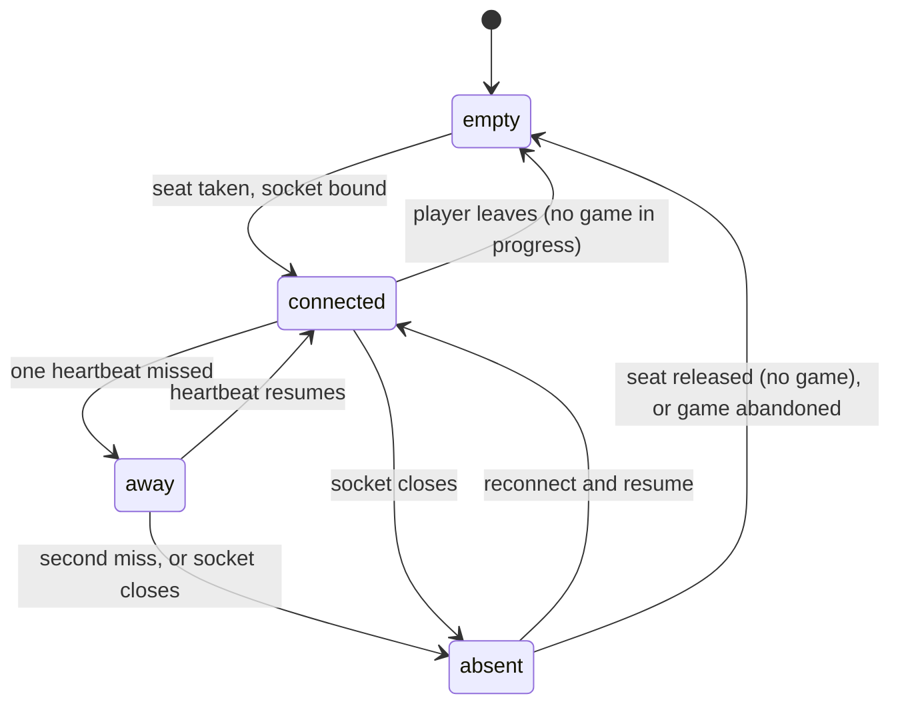
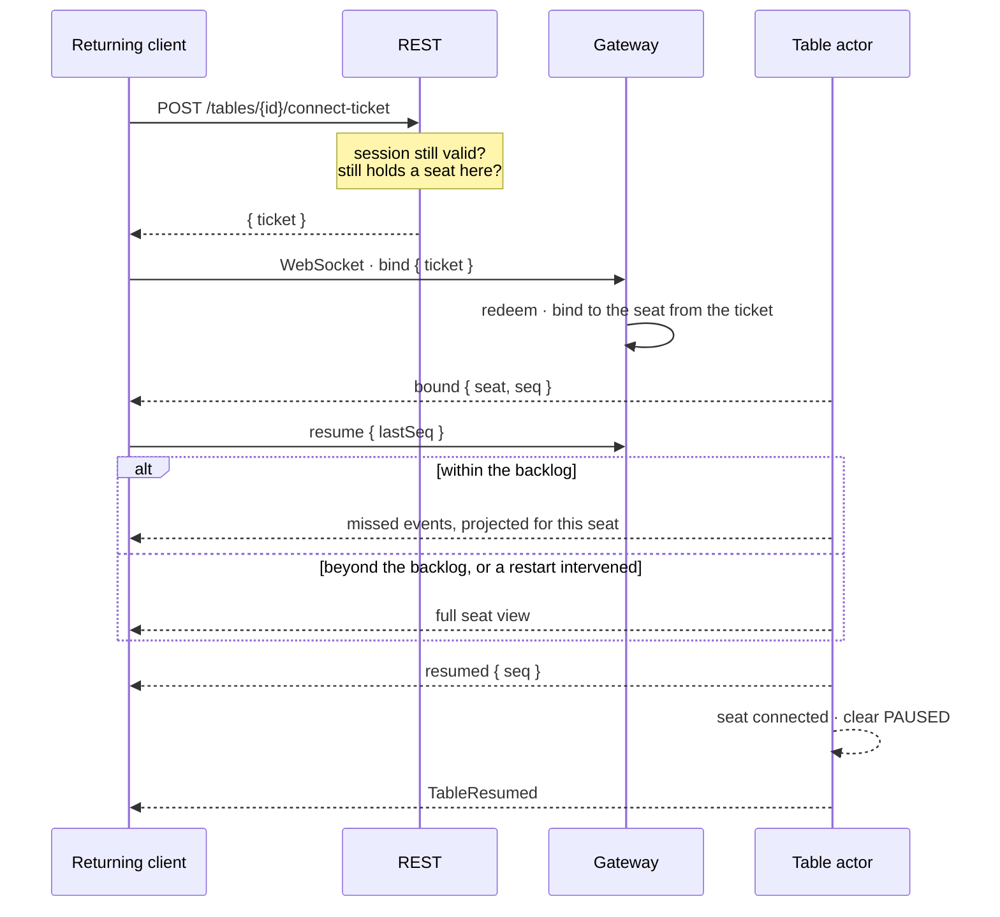

# 22 — Disconnect and Reconnect

| | |
|---|---|
| **Project** | American Mahjong Dealer |
| **Document** | 22_Disconnect_and_Reconnect.md |
| **Status** | Ratified v0.1 — approved by the project owner, 2026-09-02 |
| **Last Updated** | 2026-09-02 |
| **Role in SSOT** | Owns presence states, detection, grace periods, auto-pause, resumption experience, and abandonment. Does **not** own the transport (`12`), checkpoints (`16`), or the error taxonomy (`21`). |

---

## 1. Executive Summary

Four players and no substitutes (`ADR-0004`) means a disconnection is not one person's
inconvenience — it stops three other people. That raises the stakes on this chapter well above the
usual.

The design principle is the physical table again: **when someone stands up, play stops.** Nobody
votes on it, nobody plays their tiles for them, and the game is exactly where they left it when they
sit back down. So the table auto-pauses on absence (`FR-142`) and auto-resumes on return
(`FR-146`), and no timer ever acts on an absent player's behalf (`NR-202`, `NR-210`).

The engineering follows from making the common case invisible. Most disconnections are brief — a
sleeping laptop, a tunnel, a switched network — and for those the player should return to find
nothing happened, because nothing did. A 200-event backlog (`12 §8`) covers a several-minute absence
with no snapshot; a longer absence gets a snapshot; and a server restart is handled by the same
resumption path from a checkpoint.

Detection is deliberately **not** fast. A five-second timeout would mark seats absent during ordinary
mobile network transitions, and a table that pauses and resumes every few minutes is worse than one
that takes half a minute to notice a real departure.

---

## 2. Objectives

Serves `OBJ-05` directly: a game survives an ordinary network hiccup without ceremony, and a dropped
player rejoins the seat they left.

---

## 3. Presence states

Public to all four seats (`PUB`).

| State | Meaning | Effect |
|---|---|---|
| `connected` | A bound socket with healthy heartbeats | Normal |
| `away` | Heartbeats missed; not yet confirmed gone | Shown as unsteady; no pause |
| `absent` | Socket closed or detection confirmed | **Table pauses** if a game is in progress |
| `empty` | No account occupies the seat | Table is `OPEN` |

`away` exists so a two-second hiccup does not produce a pause-and-resume flicker. It is a warning
state, visible but consequence-free.

---

## 4. Detection

| Parameter | Value | Rationale |
|---|---|---|
| Server ping interval | 15 s | Frequent enough for prompt detection, light enough to be free |
| Misses before `away` | 1 | A single miss is a hiccup |
| Misses before `absent` | 2 | Two is a pattern |
| Worst case to `absent` | ~35 s | Meets `NFR-020` |
| Clean close | Immediate `absent` | No waiting when the socket closed properly |
| Client-initiated ping | Permitted | Lets a client detect a half-open connection itself |

A clean close short-circuits the heartbeat entirely: a closed tab is known immediately, and only an
unclean loss — the case a heartbeat exists for — waits.

---

## 5. Auto-pause

When a seat becomes `absent` during `DEALING`, `IN_PLAY`, or `CONCLUDING`, the `PAUSED` flag is set
(`09 §5`) and `TablePaused { seat, reason: 'seat_absent' }` is emitted publicly.

| While paused | Behaviour |
|---|---|
| Game commands | Refused with `TABLE_PAUSED` |
| Chat and signals | **Available** — this is exactly when players need to talk |
| Correction proposals and responses | Available — often what the pause is for |
| An open pass round | Held; commitments retained; no timeout runs |
| An open declaration or correction vote | Held; **the 60-second timeout is suspended** |
| The turn pointer | Unchanged |

### 5.1 Timeouts suspend while paused

A correction vote or an unanswered declaration must not expire because a player is disconnected —
that would let a network failure decide a vote. Timeouts suspend on pause and resume on unpause,
which is the only behaviour consistent with `NR-210`.

### 5.2 Resume is automatic

On return, the flag clears and `TableResumed { seat }` is emitted. No vote and no acknowledgement:
the table is exactly where it was, and asking three people to confirm that would be ceremony for
nothing.

An explicit pause requested by a player (`request_pause`) is separate and is released only by that
player. If both hold, the table stays paused until both clear.

---

## 6. Grace and the seat

| Period | Duration | Behaviour |
|---|---|---|
| Reconnection grace | **10 minutes** from `absent` | The seat is held; the actor stays live; the backlog is retained |
| Actor idle retirement | 5 minutes after the **last** connection closes | The final checkpoint is flushed and the actor retires; the seat is still held |
| Seat hold | Until the table closes or the game is abandoned | A seat is never taken from a disconnected player automatically |

**The seat is never reassigned automatically.** Ten minutes is the window in which reconnection is
cheap — the actor is live and the backlog is warm — not a deadline after which the player loses their
place. Beyond it, they reconnect to a restored actor and receive a snapshot.

Only the other three players can end a game the absent player has not returned to, and only
unanimously (`§8`).

---

## 7. Reconnection

### 7.1 What comes back

| Restored | Source |
|---|---|
| Public table state | Authoritative state |
| This seat's concealed hand | `OWN` projection |
| **The player's own rack order and gaps** | Persisted with the hand (`FR-144`) |
| Selection state | `OWN` projection |
| Any open pass round, including this seat's commitment | `OWN` projection |
| Any open correction or declaration vote | Public state |

The rack order is the detail players notice. Returning to a hand that has been reordered — or worse,
sorted — would be the single most jarring possible failure, and it is the one `NR-304` and `FR-101`
exist to prevent.

### 7.2 A new device

Reconnection requires only a valid session and a held seat, so a player can resume on a different
device. The older connection, if still open, is closed with `4003 REPLACED_BY_NEWER_BIND`
(`12 §4.2`).

---

## 8. Abandonment

If a player does not return, the other three may unanimously abandon (`FR-147`).

| Property | Value |
|---|---|
| Who | The three present seats, all three |
| When | Only while a seat is `absent` |
| Effect | Game `CONCLUDED` with outcome `abandoned`; concealed material purged; the **table survives** |
| Record | `GameConcluded { outcome: 'abandoned' }` — no fault attributed to anyone |
| Seats | Retained, so the table can play again if the fourth returns |

Unanimity, and only while a seat is absent, are both deliberate: abandonment ends a game other people
were playing, and it must not be usable as a way to escape a game that is going badly.

The outcome attributes nothing. A disconnection is a network event, not a transgression, and the
record says only that the game ended.

---

## 9. Server restart

| Restart | Player experience |
|---|---|
| **Graceful** | `notice { service_restarting }`; checkpoints flushed synchronously; sockets close `1012`; clients reconnect with jitter and get a snapshot. **Nothing is lost** (`21 §7`) |
| **Unclean** | Sockets drop; clients reconnect with backoff; actors restore from checkpoints; at most one action lost (`NFR-031`) |

Either way the path is the ordinary reconnection path. There is no separate recovery flow for
clients, which is why crash recovery is tested by the same suite as reconnection (`TC-F01`).

Jitter in the client's backoff matters here specifically: a restart disconnects every client at once,
and without jitter they would reconnect in lockstep (`12 §10.1`).

---

## 10. Design Decisions

| ID | Decision | Rationale |
|---|---|---|
| D-22-01 | Auto-pause on absence, no vote | At a physical table, play stops when someone stands up. |
| D-22-02 | Auto-resume on return, no acknowledgement | The table is exactly where it was; confirming that is ceremony. |
| D-22-03 | An `away` state between connected and absent | Prevents pause-and-resume flicker on a two-second hiccup. |
| D-22-04 | 15 s heartbeat, 2 misses | Fast enough for `NFR-020`, slow enough to survive mobile transitions. |
| D-22-05 | A clean close is immediate | No reason to wait when the socket closed properly. |
| D-22-06 | Chat and correction remain available while paused | A pause is exactly when players need to talk and to fix things. |
| D-22-07 | Timeouts suspend while paused | Otherwise a network failure decides a vote. |
| D-22-08 | The seat is never reassigned automatically | There is no substitution (`NR-202`); only the players may end the game. |
| D-22-09 | 10-minute grace, 5-minute actor retirement | Covers realistic interruptions cheaply; longer absences still work via snapshot. |
| D-22-10 | Rack order restored exactly | The most jarring possible failure, and the one `NR-304` prevents. |
| D-22-11 | Abandonment is unanimous and only while absent | Ends other people's game; must not be an escape from a losing one. |
| D-22-12 | Abandonment attributes no fault | A disconnection is a network event. |
| D-22-13 | Crash recovery uses the ordinary reconnection path | One path, tested once. |

---

## 11. Alternative Designs

| Alternative | Why rejected |
|---|---|
| A vote to pause | Nobody votes at a physical table. |
| No pause; the game continues | Turn-gated actions would stall anyway, and other players could act on information the absent player has not seen. |
| An automatic action on a timer for an absent player | `NR-202`, `NR-210`. |
| A substitute or bot | `NR-201`, and it would need the rules. |
| Reassigning a seat after a timeout | Takes someone's place in a game they are trying to rejoin. |
| Aggressive 5-second detection | Marks seats absent during ordinary mobile transitions. |
| Majority abandonment | Lets three players end a game the fourth is winning. |
| A separate crash-recovery flow for clients | A second path, tested less. |
| Persisting the event backlog | Complexity to avoid a snapshot that already works (`D-16-06`). |

---

## 12. Trade-offs

**A disconnected player can stall a table for ten minutes.** Accepted: the alternative is taking
someone's seat while they are trying to return. Unanimous abandonment is the escape.

**35-second detection means play stalls silently for half a minute.** Accepted: the `away` state
gives a visible warning at 15 seconds, and faster detection would produce false positives.

**Suspending timeouts means a vote can hang indefinitely if a player never returns.** Accepted:
abandonment ends the game, and a vote resolved by a network failure would be worse.

**A 200-event backlog is memory per table.** Accepted: a few hundred kilobytes, and it makes the
common case invisible.

---

## 13. Risks

| Risk | Mitigation |
|---|---|
| A table stalls with nobody able to end it | Unanimous abandonment; administrative force-close as a last resort (`FR-161`) |
| Rack order lost on reconnection | Persisted with the hand; `TC-A09`; `AC-013` |
| False `absent` on a flaky network | `away` state; two-miss tolerance; 15 s interval |
| A vote expires because of a disconnection | Timeouts suspend while paused (`§5.1`) |
| Reconnection storms after a restart | Backoff with jitter; `1012` signals a planned restart |
| A seat is silently reassigned | `D-22-08`; no reassignment path exists |

---

## 14. Future Considerations

Not committed: a `SUSPENDED` table condition for a long absence, letting a table be resumed hours
later (`09 §13`); a player-visible countdown of the reconnection grace period; notifying the other
three by email if a seat is absent for an extended period.

---

## 15. Cross References

| Document | Focus |
|---|---|
| `12_Realtime_WebSocket_Architecture.md §4`, `§8`, `§10` | Binding, resumption, close codes |
| `09_Game_State_Machine.md §5` | The `PAUSED` overlay flag |
| `05_Game_Table_Architecture.md §10` | Pause at the table level |
| `16_Data_Architecture.md §5` | Checkpoints and restore |
| `21_Error_Handling_and_Recovery.md §7` | Startup and graceful shutdown |
| `ADR-0004`, `ADR-0011` | Four seats and reconnection |

---

## 16. Revision History

| Version | Date | Author | Changes |
|---|---|---|---|
| 0.1 | 2026-09-02 | Design (architect role), owner-approved | Initial chapter |
