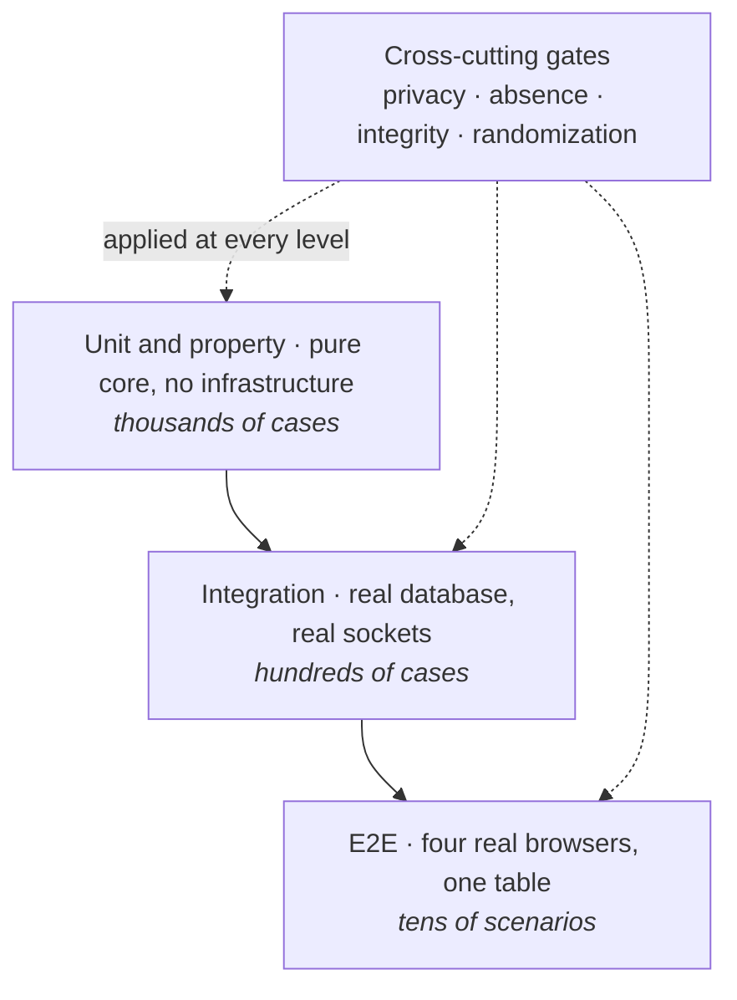

# 25 — Testing Strategy

| | |
|---|---|
| **Project** | American Mahjong Dealer |
| **Document** | 25_Testing_Strategy.md |
| **Status** | Ratified v0.1 — approved by the project owner, 2026-09-02 |
| **Last Updated** | 2026-09-02 |
| **Role in SSOT** | Owns what is tested, what deliberately is not, the suite catalog, and the release gates. Does **not** own harness design (`26`), the detailed suite specifications (`34_Testing/`), or acceptance criteria (`01 §7`). |

---

## 1. Executive Summary

The testing strategy has one unusual property, and it follows directly from the product: **there are
no tests of Mahjong rule correctness, because the system does not know the rules.** A test asserting
that a particular hand wins would be asserting something the system has no opinion about, and its
existence would be evidence that a rules engine had appeared.

What replaces rule tests is **technical correctness** — conservation of tiles, exactly-once
application, correct projection — and two categories that are unusual enough to name in the summary.

The **privacy suite** plays complete randomized games and inspects **every frame emitted to every
seat**, asserting that no concealed material ever reaches a seat not entitled to it. It does the same
for every log line, metric, and trace. It is zero-tolerance: one leak in one frame fails the build.

The **absence suite** asserts that forbidden things do not exist. Each of the 62 negative
requirements in `SCOPE_BOUNDARIES.md §4` is phrased as a checkable condition, and this suite checks
it. Absence testing is unusual, and it is the most valuable category here, because most of what this
project promises is a promise about what it will not do.

The strategy's overall shape: **push correctness testing into the pure core**, where it is cheap,
fast, and exhaustive, and reserve integration and end-to-end testing for the things purity cannot
cover — the network, the database, and four real browsers at one table.

---

## 2. Objectives

Serves `OBJ-10` (drift is mechanically detectable) and every integrity and privacy objective by
making each verifiable rather than asserted.

---

## 3. What is not tested, and why

| Not tested | Because |
|---|---|
| Whether a hand wins | The system does not decide (`NR-002`) |
| Whether a discard, claim, exposure, joker use, or pass is legal | The system does not decide (`NR-004`–`NR-008`) |
| Whether a declaration is correct | The system records it (`NR-003`) |
| Scoring | There is none (`NR-013`) |
| Hand-size correctness after the deal | Not enforced (`NR-009`) |
| Rule variants or editions | No rules exist |

A test in any of these categories would be a defect in the test suite, and the absence suite checks
that none exists — a test file matching a rule-testing pattern fails `TC-A01`.

What **is** tested about these areas is the opposite: that the system accepts actions a rules engine
would reject. `TC-A04` plays a game in which seats hold wildly varying hand sizes, expose single
tiles, pass unequal counts, and discard out of turn, and asserts every action succeeds.

---

## 4. The pyramid

The cross-cutting gates are not a layer. They apply at whichever level can observe the property:
absence is checked statically, privacy at integration and end-to-end, integrity at unit and
integration.

---

## 5. Suite catalog

### 5.1 Mechanics — `TC-M*`

Pure, no infrastructure. The core's determinism makes these exhaustive and fast.

| Case | Asserts |
|---|---|
| `TC-M01` | **Conservation**: property test over randomized play; the tile multiset always equals the set |
| `TC-M02` | Tile-set construction produces exactly the confirmed inventory (`07 §3`) |
| `TC-M03` | The comparator is total — never equal for distinct tiles |
| `TC-M04` | Every state transition, exhaustively, from constructed states |
| `TC-M05` | Rack order preserved across every transition |
| `TC-M06` | Turn pointer moves only on wall draw and claim |
| `TC-M07` | Pass rounds are atomic: no partial application under any interleaving |
| `TC-M08` | Checkpoint round trip is byte-identical |
| `TC-M09` | Rewind restores exactly, with conservation intact |
| `TC-M10` | Canonical encoding is stable across platforms |

`TC-M01` is the highest-value single test in the suite. One property, fuzzed over thousands of
randomized games, catches double-spending a tile, losing one in a partial transition, duplicating one
across a rewind, and dropping one in a cancelled pass round.

### 5.2 Privacy — `TC-P*` (zero tolerance)

Specified in `34_Testing/Privacy_and_Absence_Suites.md`.

| Case | Asserts |
|---|---|
| `TC-P01` | **Frame inspection**: complete randomized games; every frame to every seat contains no other seat's concealed faces, no wall order, no salt. Covers live, backlog, and snapshot frames |
| `TC-P02` | No REST response — including every administrative endpoint — contains tile data |
| `TC-P03` | **Log scanning**: no tile-face pattern in any log, metric, or trace from a full game; a planted violation must fire; an honest line must not |
| `TC-P04` | Storage inspection: private regions encrypted; no concealed material after game close; no public event carries a non-public face |
| `TC-P05` | No egress carries game data; no concealed material in the client bundle, source maps, or browser storage |
| `TC-P06` | The type-level proof file rejects every forbidden shape; **assertion count matches** |
| `TC-P07` | Exactly one seat-view serializer exists; nothing else writes to a socket |
| `TC-P08` | The `19` catalog and the implemented protocol agree, in both directions |

### 5.3 Absence — `TC-A*` (zero tolerance)

| Case | Asserts |
|---|---|
| `TC-A01` | No rule module, symbol, dependency, rule-pattern data, or rule-testing test file exists |
| `TC-A02` | No win predicate, scoring function, or hand evaluator exists |
| `TC-A03` | **Command-path audit**: no branch in any command path inspects a tile face |
| `TC-A04` | A game of deliberately rule-violating but mechanically valid actions succeeds throughout |
| `TC-A05` | The table setup surface admits only the three values in `05 §7` |
| `TC-A06` | No economic vocabulary in schema, routes, symbols, or protocol |
| `TC-A07` | No solver, advisor, recommender, or hand analyzer |
| `TC-A08` | No timer performs a binding action; every timeout expires as a refusal |
| `TC-A09` | **Order preservation**: no system action reorders a rack, across draw, pass, claim, retract, reconnect, and rewind |
| `TC-A10` | No spectator role, route, or delivery path to an unbound connection |
| `TC-A11` | No replay artifact, endpoint, or export |

`TC-A03` deserves note as the sharpest of these. Every rule must eventually ask what a tile is, so a
static audit for face-inspecting branches in command paths catches rule creep at its narrowest point.

### 5.4 Integrity — `TC-I*`

| Case | Asserts |
|---|---|
| `TC-I01` | No interface accepts a client-supplied seat or player identifier |
| `TC-I02` | A client cannot act on, or reference, another seat's tiles |
| `TC-I03` | No state change originates outside the table actor |
| `TC-I04` | Deliberate replays apply exactly once and return the original outcome |
| `TC-I05` | Gaps and reordering are detected; the socket closes on a gap |
| `TC-I06` | Schema fuzzing: malformed frames rejected without state change |
| `TC-I07` | Stale order-sensitive commands refused with a resynchronization |
| `TC-I08` | Concurrent claims: exactly one succeeds; the others receive `TILE_NOT_AVAILABLE` |

### 5.5 Randomization — `TC-R*`

| Case | Asserts |
|---|---|
| `TC-R01` | Every shuffle preserves the exact tile set |
| `TC-R02` | No command permits choosing a drawn tile |
| `TC-R03` | Chi-squared over face-by-position frequency, 100 000 shuffles, α = 0.001 |
| `TC-R04` | Successive shuffles are uncorrelated |
| `TC-R05` | No client-derived value reaches the shuffle |
| `TC-R06` | Seed injection is unreachable in a production build |
| `TC-R07` | The commitment recomputes from the retained wall and salt |
| `TC-R08` | A reshuffle leaves hands, discards, and exposures byte-identical |

### 5.6 Failure recovery — `TC-F*`

| Case | Asserts |
|---|---|
| `TC-F01` | Kill the process mid-game; restore from checkpoints; all four clients observe a consistent table no more than one action behind |
| `TC-F02` | Disconnection detected within budget; the table pauses |
| `TC-F03` | Reconnection restores the full seat view including rack order |
| `TC-F04` | Backlog resumption and snapshot fallback both produce correct state |
| `TC-F05` | A checkpoint failing verification is refused; the table is unavailable rather than corrupt |
| `TC-F06` | Database unavailability does not interrupt live play |
| `TC-F07` | Graceful shutdown loses nothing |

### 5.7 Accessibility — `TC-X*`

`TC-X01`–`TC-X08` per `24 §9`.

### 5.8 Performance — `TC-PF*`

| Case | Asserts |
|---|---|
| `TC-PF01` | Free-act paint budget on the throttled reference profile |
| `TC-PF02` | Free acts perform zero network round trips |
| `TC-PF03` | Core command processing within budget |
| `TC-PF04` | Four-client propagation to the last client within budget |
| `TC-PF05` | Load: measured concurrent-table capacity with all targets met |

### 5.9 End-to-end — `TC-E*`

Four real browser contexts at one table. Each acceptance criterion in `01 §7` becomes a scenario, one-to-one: `TC-E01` through `TC-E18` correspond to `AC-001` through `AC-018`. The full mapping is tabulated in `REQUIREMENTS_TRACEABILITY_MATRIX.md §7`.

### 5.10 Security — `TC-S*`

Authentication, session, and isolation behaviour. Verifies the `SEC-###` catalog in
`SECURITY_REQUIREMENTS_MATRIX.md`.

| Case | Asserts |
|---|---|
| `TC-S01` | Passwords below the minimum length and passwords on the breach list are rejected |
| `TC-S02` | A wrong password and an unknown account produce identical responses and comparable timing; six rapid failures lock the account, and **the lock survives a server restart** |
| `TC-S03` | Session revocation invalidates REST within one request and closes a bound socket within 5 seconds |
| `TC-S04` | Every rate limit in `15 §7.1` engages at its stated threshold; security-critical limits survive a restart |
| `TC-S05` | Every administrative endpoint refuses a session without a satisfied second factor |
| `TC-S06` | Session cookies carry `Secure`, `HttpOnly`, `SameSite`, and the host prefix; the token is unreachable by script |
| `TC-S07` | Idle and absolute session expiry are enforced server-side; a client-held token cannot extend either; administrator sessions use the shorter limits |
| `TC-S08` | A non-safe request without a matching anti-forgery token is rejected |
| `TC-S09` | A wrong join code, an unknown table, and a full table are indistinguishable in response and timing; no listing or search endpoint exists |
| `TC-S10` | A connect ticket is single-use, expires in 30 seconds, and never appears in a URL; a replayed ticket closes the socket with `4002` |
| `TC-S11` | One account cannot occupy two seats, enforced under concurrent join attempts |
| `TC-S12` | A player who has vacated a seat is refused a binding exactly as a stranger is |
| `TC-S13` | Response headers carry the strict CSP, HSTS, frame protection, and no-sniff settings; no inline script executes |
| `TC-S14` | CORS and the socket upgrade both reject an origin outside the allow-list |
| `TC-S15` | Every administrative mutation is refused without a reason and produces an append-only audit record that cannot be updated or deleted |
| `TC-S16` | A production build refuses to start with each required secret in turn absent or set to a development default |

---

## 6. Test data

| Rule | Reason |
|---|---|
| No production data in any environment below production | Concealed hands must not be copied anywhere |
| Fixtures are synthetic, generated | No real accounts, no real games |
| **No fixture encodes a Mahjong rule, hand pattern, or winning hand** | It would be rule data by another name (`NR-010`) |
| Fixtures for deliberately invalid play are required | `TC-A04` needs them |
| Seeded shuffles in test builds only | `TC-R06` |

The third rule is subtle and worth stating: a fixture named `winningHand` would be hand-pattern data
sitting in the repository, and its presence would tempt a future implementer to use it. Fixtures name
tiles by position and count, never by meaning.

---

## 7. Gates

| Stage | Contents | Gate |
|---|---|---|
| **L** — Lint | Format, types, dependency law, core purity, naming law | Zero violations |
| **T1** — Unit | Mechanics, property tests, integrity units | All pass; core branch coverage 100% |
| **T2** — Integration | Real database and sockets; failure recovery | All pass; service coverage ≥ 85% |
| **T3** — Privacy and absence | `TC-P*`, `TC-A*` | **Zero tolerance** |
| **T4** — Randomization | `TC-R*` | All pass |
| **S** — Browser | E2E across two engines; accessibility audit | All pass; zero axe violations |
| **P** — Performance | `TC-PF*` | Targets met on the reference profile |
| **Gate** | All of the above | Required for release |

### 7.1 Why T3 is a separate zero-tolerance stage

A privacy leak or a forbidden capability is not a bug to be triaged and scheduled. It is a violation
of what the product is. Separating the stage makes the failure unambiguous and makes it impossible to
ship "with two known privacy test failures."

The core's 100% branch coverage requirement is similarly deliberate: the core is small, pure, and
carries the correctness properties, so full coverage is achievable and any uncovered branch there is
a genuine gap rather than a metric artifact.

---

## 8. Design Decisions

| ID | Decision | Rationale |
|---|---|---|
| D-25-01 | No rule-correctness tests; test that rule-violating play is accepted instead | A rule test would assert something the system has no opinion about, and its presence would be evidence of a rules engine. |
| D-25-02 | Privacy and absence as separate zero-tolerance gates | These are not bugs to triage; they are violations of the product definition. |
| D-25-03 | Frame inspection over complete games, not spot checks | A leak is a property of the worst frame, not the average one. |
| D-25-04 | The log scanner requires both a planted and an honest control | A never-firing scanner is indistinguishable from a broken one. |
| D-25-05 | Count the type-proof assertions | A silently-satisfied proof looks like a passing test. |
| D-25-06 | 100% branch coverage on the core only | Small, pure, and carrying the correctness properties; achievable, so a gap is real. |
| D-25-07 | Conservation as a property test over randomized play | One property covering a large class of mechanical defect. |
| D-25-08 | Acceptance criteria map one-to-one to E2E scenarios | Specification and tests cannot drift. |
| D-25-09 | No fixture encodes a rule or hand pattern | It would be rule data in the repository, and a temptation. |
| D-25-10 | Static command-path audit for face-inspecting branches | Every rule must eventually ask what a tile is; this is the narrowest point to catch it. |

---

## 9. Alternative Designs

| Alternative | Why rejected |
|---|---|
| Rule tests, to validate against a reference implementation | There is nothing to validate; the system has no rule behaviour. |
| Privacy assertions folded into integration tests | Buries a zero-tolerance property among triageable failures. |
| Sampling frames rather than inspecting all | Reduces the probability of catching a leak rather than catching it. |
| 100% coverage everywhere | Produces coverage-driven tests in code where coverage is a poor proxy. |
| E2E as the primary correctness layer | Slow, flaky, and worse at the properties the core tests exhaustively. |
| Manual privacy review instead of automated inspection | Does not scale and does not run on every commit. |
| Production data in staging, anonymized | Concealed hands cannot be anonymized — they are the payload. |

---

## 10. Trade-offs

**No rule tests means a category of user-visible surprise is untested** — a player expecting the
system to catch an illegal move. Accepted: it is the product, and `TC-A04` tests the actual behaviour.

**Zero-tolerance gates will block releases on a test-harness bug.** Accepted: the alternative is a
mechanism for shipping with known privacy failures.

**Full frame inspection is slow.** Accepted: it runs on complete games in T3 rather than on every
unit test.

**100% core coverage costs effort at the margins.** Accepted: the core is small and its branches
carry the properties that matter.

---

## 11. Risks

| Risk | Mitigation |
|---|---|
| A rule test appears | `TC-A01` scans test files for rule-testing patterns |
| The privacy suite is weakened to unblock a release | Zero-tolerance gate; weakening requires an amendment |
| Absence checks produce false positives and get disabled | Honest controls in each scanner; patterns tuned rather than removed |
| A new event leaks and no test covers it | `TC-P01` inspects all frames from randomized play, so new events are covered automatically |
| Coverage becomes the goal rather than correctness | Coverage is required only where it is a good proxy — the pure core |
| Fixtures acquire rule meaning | `§6`; `TC-A01` |

---

## 12. Future Considerations

Not committed: mutation testing on the core, to verify the tests are as strong as the coverage
suggests; a continuous fuzzing job for the protocol; a long-running soak test playing thousands of
games unattended.

---

## 13. Cross References

| Document | Focus |
|---|---|
| `26_Test_Architecture.md` | Harness design and fixtures |
| `34_Testing/Privacy_and_Absence_Suites.md` | `TC-P*`, `TC-A*` in full |
| `34_Testing/Integrity_and_Randomization_Suites.md` | `TC-I*`, `TC-R*` in full |
| `01_Product_Requirements.md §7` | The acceptance criteria E2E scenarios implement |
| `SCOPE_BOUNDARIES.md §4` | The negative requirements the absence suite checks |
| `DEFINITION_OF_DONE.md` | The gates a feature passes |

---

## 14. Revision History

| Version | Date | Author | Changes |
|---|---|---|---|
| 0.1 | 2026-09-02 | Design (architect role), owner-approved | Initial strategy: 9 suite families, 8 gate stages |
