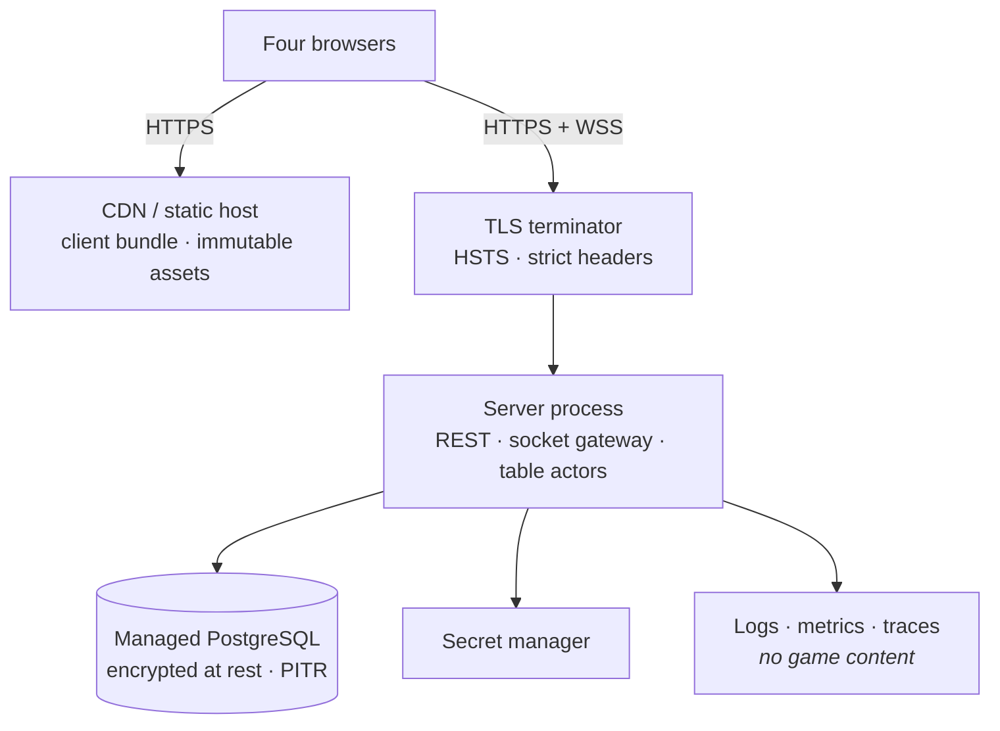
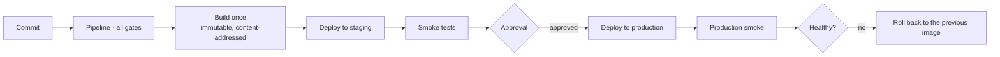

# 27 — Deployment Architecture

| | |
|---|---|
| **Project** | American Mahjong Dealer |
| **Document** | 27_Deployment_Architecture.md |
| **Status** | Ratified v0.1 — approved by the project owner, 2026-09-02 |
| **Last Updated** | 2026-09-02 |
| **Role in SSOT** | Owns the production topology, environments, configuration isolation, the delivery pipeline, and the multi-node seam. Does **not** own operational procedures (`28`), disaster recovery (`29`), or the security controls themselves (`15`). |

---

## 1. Executive Summary

The deployment is deliberately small: **a static client, one server process, one managed
PostgreSQL**. No cache tier, no message broker, no orchestrator, no service mesh
(`ADR-0014`).

That is not minimalism for its own sake. Each additional component in a system holding concealed
hands is another place that data exists, another authorization boundary, another set of logs, and
another failure mode — so infrastructure carried without a motivating requirement is not merely
wasted cost, it is added privacy surface. At four connections per table, the conventional
multiplayer toolkit has no requirement to motivate it.

The chapter's most important section is `§8`, the **multi-node seam**. Deciding not to scale
horizontally is only responsible if the later decision is cheap, so the seam is specified now — what
changes, what does not, and the concrete trigger that takes it — while the design is fresh. The
database already carries an owner column for exactly this reason (`D-03-08`), so the move is a change
of logic rather than a migration on live data.

---

## 2. Objectives

Serves `OBJ-11` (proportionate architecture) and `OBJ-06`, since a smaller deployment is a smaller
privacy surface.

---

## 3. Production topology

| Component | Choice | Notes |
|---|---|---|
| Client | Static bundle on a CDN | Immutable, content-hashed assets; **no source maps in production** |
| TLS | Managed terminator | Modern ciphers; HSTS with a long max-age |
| Server | One container, one process | REST plus the socket gateway plus table actors (`03 §6`) |
| Database | Managed PostgreSQL | Encryption at rest, point-in-time recovery, automated backup |
| Secrets | Platform secret manager | Never in images, environment files, or configuration in the repository |
| Observability | Managed collector | Subject to `20` — no game content |

### 3.1 Why one process

Splitting REST from the socket gateway is the obvious first decomposition and is not taken, because
table actors must live with the gateway that serves their connections, and the REST surface is
fourteen endpoints (`18`). Splitting would produce a substantial service and a trivial one, plus a
network hop for the ticket handshake.

### 3.2 Container

| Property | Value |
|---|---|
| Base | Minimal distribution image |
| User | Non-root |
| Filesystem | Read-only, with an explicit writable temporary mount |
| Capabilities | All dropped |
| Health | A readiness endpoint reporting database reachability and schema version |
| Signals | `SIGTERM` initiates graceful shutdown (`21 §7`) |

Graceful shutdown handling is the property that makes a deploy lossless: checkpoints flush
synchronously, sockets close with `1012`, and clients reconnect with jitter.

---

## 4. Environments

| Environment | Purpose | Data | Lifetime |
|---|---|---|---|
| **Development** | Local work | Synthetic, generated | Ephemeral |
| **Test** | Automated suites in CI | Synthetic, per-run | Per pipeline run |
| **Staging** | Pre-release verification | Synthetic only | Persistent |
| **Production** | Live play | Real | Persistent |

### 4.1 No production data outside production, ever

| Rule | Reason |
|---|---|
| No production database copy in any lower environment | It would contain concealed hands from live games |
| No production backup restored to staging | Same |
| **Concealed hands cannot be anonymized** | They *are* the payload. There is no transformation that preserves their usefulness for testing while removing their sensitivity |
| Staging data is generated | The randomized generator (`26 §6`) produces better test data than real games anyway |

The third row is the one that closes the usual escape route. "Anonymized production data" is a
standard practice and it does not apply here: anonymizing a hand means changing the tiles, at which
point it is synthetic data with extra steps and residual risk.

### 4.2 Configuration isolation

| Aspect | Rule |
|---|---|
| Secrets | Separate stores per environment; no shared credential |
| Database | Separate instances; no network path from a lower environment to production |
| Configuration | Environment variables only; never committed |
| Feature differences | Development-only code paths **compiled out** of production builds (`08 §4.4`, `20 §6.5`) |
| Startup | Production refuses to start on a missing or default secret (`NFR-044`) |

Compiling development paths out rather than gating them at runtime matters: a runtime-gated seed
injector is a code path an attacker can try to reach, and a compiled-out one is not there.

---

## 5. Promotion

**One artifact.** The image deployed to production is the identical image verified in staging;
nothing is rebuilt for production. Rebuilding would mean the thing tested is not the thing shipped.

**Migrations run before the application.** Forward-only and backward-compatible with the previous
version, so a rollback of the application does not require a rollback of the schema — schema
rollbacks on live data are the operation most likely to lose something.

---

## 6. Pipeline

| Stage | Contents | Blocking |
|---|---|---|
| L | Format, types, dependency law, core purity, naming law | Yes |
| T1 | Unit, property, mechanics | Yes |
| T2 | Integration, real database, recovery | Yes |
| **T3** | **Privacy and absence** | **Yes — zero tolerance** |
| T4 | Randomization | Yes |
| S | Browser E2E, accessibility | Yes |
| P | Performance budgets | Yes |
| Sec | Dependency vulnerability scan | Yes on high severity in a runtime dependency |
| Build | Container image, provenance attestation | Yes |
| Deploy | Staging, then production on approval | — |

T3's separation is deliberate (`25 §7.1`): a privacy or absence failure must be unambiguous and
unshippable, not a triageable item among other failures.

---

## 7. Deployment characteristics

| Property | Value |
|---|---|
| Strategy | Replace, with graceful shutdown |
| Player impact | Every live table pauses briefly and resumes automatically (`22 §9`) |
| Data loss on a planned deploy | **None** — checkpoints flush synchronously |
| Rollback | Redeploy the previous image; typically under two minutes |
| Frequency | As needed; deploying during quiet hours is preferred but not required |

Single-process replacement means a deploy interrupts **all** live tables at once rather than a
fraction. That is stated plainly because it is the main operational cost of `ADR-0014`, and it is one
of the three triggers in `§8.3`.

---

## 8. The multi-node seam

Specified now so the later decision is a change rather than a redesign.

### 8.1 What v1 relies on

| Assumption | Where |
|---|---|
| One process owns every live table | `03 §6.2` |
| Table ownership needs no coordination | `05 §6` |
| Connect tickets are a database row | `12 §4.1` |
| Per-connection throttles are in process memory | `13 §10` |
| A socket always lands on the owning process | Implicit |

### 8.2 What would change

| Concern | Multi-node design |
|---|---|
| Table ownership | A short-lived lease in Redis; PostgreSQL's `owner_node` column is the arbiter (`17 §5.4`) |
| Ownership conflict | Every ownership change increments an epoch; a stale owner's writes are rejected by a database constraint |
| Connection routing | A socket landing on a non-owner either redirects or relays over one internal hop, authenticated by a cluster secret |
| Connect tickets | Move to Redis, with atomic get-and-delete |
| Per-connection throttles | Move to Redis counters |
| **Login lockout** | **Stays in PostgreSQL** — durable regardless of topology (`ADR-0014`) |
| Deployment | Rolling, so only tables on the replaced node pause |

### 8.3 The trigger

Taken when **any** of these becomes true, and not before:

1. Sustained concurrent live tables exceed **60% of measured** single-process capacity (`NFR-070`).
2. Simultaneous interruption of every live table on deploy becomes unacceptable.
3. Availability requires redundancy a single process cannot provide.

Trigger 1 depends on `NFR-070` being **measured** rather than assumed, which is why the load harness
is a release requirement (`26 §7`). A trigger set against a guessed capacity is not a trigger.

### 8.4 What does not change

The privacy model, the projector, the protocol, the core, the state machine, the correction
mechanism, and the checkpoint format. The seam is entirely about *where a table lives*, and none of
the system's guarantees depend on that.

---

## 9. Design Decisions

| ID | Decision | Rationale |
|---|---|---|
| D-27-01 | One process, one database, nothing else | Each component is added privacy surface as well as cost, and nothing at this scale motivates more. |
| D-27-02 | Do not split REST from the gateway | Actors must live with their connections, and the REST surface is fourteen endpoints. |
| D-27-03 | No production data outside production; concealed hands cannot be anonymized | Anonymizing a hand means changing the tiles, which makes it synthetic data with residual risk. |
| D-27-04 | Development paths compiled out, not runtime-gated | A gated path can be reached; a compiled-out one cannot. |
| D-27-05 | One artifact promoted unchanged | Rebuilding for production means shipping something untested. |
| D-27-06 | Forward-only, backward-compatible migrations | An application rollback must not require a schema rollback on live data. |
| D-27-07 | Read-only filesystem, non-root, no capabilities | Standard hardening, free to adopt. |
| D-27-08 | Specify the multi-node seam before it is needed | The decision not to scale is only responsible if the later move is cheap. |
| D-27-09 | State the simultaneous-interruption cost plainly | It is the main operational cost of the topology and one of the triggers. |
| D-27-10 | No source maps in production | The client runs in the context holding a seat's hand. |

---

## 10. Alternative Designs

| Alternative | Why rejected |
|---|---|
| Multi-node from the start | Directory, leases, epochs, and a relay built and operated before any load justifies them; each is added privacy surface (`ADR-0014`). |
| Kubernetes | An orchestrator for one process. |
| Serverless functions | Long-lived sockets and in-memory table state do not fit. |
| Self-managed PostgreSQL | Backups, patching, and failover to operate for no benefit. |
| Anonymized production data in staging | `D-27-03`. |
| Blue-green deployment | Two live processes would both own tables; ownership is the thing v1 assumes away. |
| Backward-incompatible migrations with coordinated rollback | Schema rollback on live data is the operation most likely to lose something. |

---

## 11. Trade-offs

**A deploy interrupts every live table.** Accepted, stated, and a documented trigger for the seam.
Recovery is automatic and lossless on a planned deploy.

**One process is a single point of failure.** Accepted and bounded by checkpoints; `29` sets the
expectations. Four players noticing a brief interruption is a different cost from a payment system
losing a transaction.

**Synthetic-only staging means production-specific issues surface in production.** Accepted: the
alternative copies concealed hands into a less-protected environment.

**Specifying the seam costs effort for something that may never happen.** Accepted: the cost is a
section of documentation and one database column.

---

## 12. Risks

| Risk | Mitigation |
|---|---|
| A development path reaches production | Compiled out; startup assertion; `TC-R06`, `TC-P02` |
| Production data copied to a lower environment | `§4.1`; no network path from lower environments to production |
| A migration breaks rollback | Backward compatibility required and reviewed; migrations applied twice in T2 for idempotence |
| Capacity is never measured, so trigger 1 is meaningless | Load harness is a release requirement (`IMPLEMENTATION_READINESS_CHECKLIST.md`) |
| Secrets committed or logged | Secret manager; startup refusal; log scanner |
| The seam is never taken because it looks large | `§8` specifies it concretely; `owner_node` already exists |

---

## 13. Future Considerations

Not committed: regional deployment to reduce cross-region latency (`23 §13`); a read replica for
operational queries; provenance verification enforced at deploy time.

---

## 14. Cross References

| Document | Focus |
|---|---|
| `03_System_Architecture.md §6` | Runtime topology |
| `15_Security_Architecture.md` | TLS, headers, secrets |
| `17_Database_Design.md` | Schema and migrations |
| `25_Testing_Strategy.md §7` | The gates this pipeline runs |
| `28_Operations.md` | Running the deployment |
| `29_Disaster_Recovery.md` | Backup, restore, RPO and RTO |
| `ADR-0014` | Single-node v1 and the trigger |

---

## 15. Revision History

| Version | Date | Author | Changes |
|---|---|---|---|
| 0.1 | 2026-09-02 | Design (architect role), owner-approved | Initial chapter |
