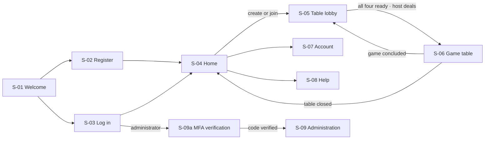

# Screen Inventory

| | |
|---|---|
| **Project** | American Mahjong Dealer |
| **Document** | 32_UX/Screen_Inventory.md |
| **Status** | Detail for ratified chapters — Ch. 11 and Ch. 24 remain authoritative |
| **Last Updated** | 2026-09-03 |
| **Role in SSOT** | Owns the `S-##` screen catalog and each screen's purpose and states. Does **not** own interaction design (`11`), accessibility requirements (`24`), or the table layout (`Table_Layout_and_Perspective.md`). |

---

## 1. Overview

Nine screens. The product is one table and the minimum needed to reach it.

| ID | Screen | Purpose | Requirements |
|---|---|---|---|
| S-01 | Welcome | Entry; log in or register | `FR-001`, `FR-002` |
| S-02 | Register | Create an account | `FR-001` |
| S-03 | Log in | Authenticate | `FR-002`, `FR-006` |
| S-04 | Home | Create a table, join by code, resume a seat | `FR-020`–`FR-022`, `FR-029` |
| S-05 | Table lobby | Four seats filling; readiness; the join code | `FR-023`–`FR-027` |
| **S-06** | **Game table** | **The product** | `FR-040`–`FR-135` |
| S-07 | Account | Display name, password, sessions | `FR-004`, `FR-005`, `FR-008` |
| S-08 | Help | What the system does and does not do | `D-28-06` |
| S-09 | Administration | Accounts, tables, health, audit | `FR-160`–`FR-166` |

`S-06` carries essentially the whole product. The other eight exist to get a player into it or to
explain it.

---

## 2. Flow

A concluded game returns to `S-05` rather than `S-04`: the table survives, readiness clears, and the
same four players agree to play again (`FR-117`, `D-05-12`).

---

## 3. Screens

### S-01 Welcome
Product name, the one-line definition, and two actions. States: default, already authenticated
(redirects to `S-04`).

### S-02 Register
Email, password, display name. Password requirements stated before entry, not after failure: minimum
12 characters, checked against a breach list, no composition rules (`15 §4.1`). States: default,
validating, submitted, rate-limited.

A duplicate email produces the same success state as a new registration (`D-18-04`). The screen
cannot reveal what the API does not.

### S-03 Log in
Email, password. States: default, submitting, failed, locked, rate-limited.

The failure state says "email or password is incorrect" and never distinguishes the two. The locked
state states when the lock expires — a player who has forgotten their password deserves to know they
are locked out rather than repeatedly wrong.

### S-04 Home
Three regions: **create a table**, **join by code**, and **your seats** (tables where this account
holds a seat, resumable).

The "your seats" region is what makes reconnection after closing a browser natural rather than
mysterious. States: default, no seats, creating, joining, join failed.

### S-05 Table lobby
Four seat slots in compass positions, filling as players arrive. The join code is displayed
prominently with a copy action — this is the only screen that shows it, and it shows it for the
table's whole open life so a host can share it again.

Each seat shows occupancy, display name, connection, and readiness. The host has a deal control,
enabled only when all four seats are occupied and ready (`FR-027`).

States: waiting for players, all seated, all ready, dealing, host view, non-host view.

### S-06 Game table
Specified in `Table_Layout_and_Perspective.md`. Summarized here for the inventory: own rack along the
bottom, three opponents around the table in true relative position, wall and discard pile at centre,
exposures on each rack ledge, action bar, chat panel, connection banner.

States: dealing, in play (own turn / other's turn), pass round open, correction pending, declaration
pending, paused, concluded, disconnected.

### S-07 Account
Display name, password change, session list with revoke. Email shown but not editable in v1
(`18 §11`).

### S-08 Help
Two parts. **How to use the table** — how to move a tile, discard, claim, expose, pass, declare,
correct. And **what the system does not do**, stated plainly: it does not know the rules, does not
check legality, does not decide who won, keeps no score, retains nothing after a game, cannot show
you a past game, and nobody — including the operator — can see your tiles.

The second part is unusual for a help page and is deliberate (`D-28-06`). It is cheaper than
explaining it one support request at a time, and it is the product's most distinctive claim.

### S-09a MFA verification (`docs/15 §8.1`, `ADR-0017`)
Not one of the nine (`D-32-01`) — a narrow gate on the way to `S-09`, never independently reachable
and never linked from anywhere else. One field: a 6-digit code, submitted to `POST /sessions/mfa`.
States: entering a code; a wrong code (the same message every time, never distinguishing "wrong" from
"expired"); the durable lockout (`423 MFA_LOCKED`), stating its expiry the same way `S-03`'s account
lockout does (`D-32-04`). No "forgot your code" link and no recovery flow — a lost device is an
out-of-band operational procedure (`docs/28 §3.2`), not something this screen can help with, so it
doesn't offer to.

### S-09 Administration
Accounts list with disable, tables list with force-close, health, audit log. Every mutation requires
a reason (`FR-166`).

**No screen, tab, panel, or detail view shows any game content** (`FR-164`). The tables list shows a
seat count, not occupants (`D-18-07`).

---

## 4. Global elements

| Element | Present on | Behaviour |
|---|---|---|
| Connection banner | `S-05`, `S-06` | Appears on degradation; states what is happening |
| Error toast | All | Plain language; never a stack trace or an internal code |
| Focus ring | All | 2 px, 3:1 contrast, never colour alone (`24 §3`) |
| Skip link | All | To the main region |
| Reduced-motion | All | Honoured throughout (`24 §8`) |

---

## 5. Design Decisions

| ID | Decision | Rationale |
|---|---|---|
| D-32-01 | Nine screens; the table is one of them | The product is a table. Everything else is a corridor to it. |
| D-32-02 | A concluded game returns to the lobby, not home | The table survives, and the same four players decide whether to play again. |
| D-32-03 | The join code is visible for the table's open life | A host may need to share it more than once. |
| D-32-04 | The lock state states its expiry | A player repeatedly failing deserves to know they are locked rather than wrong. |
| D-32-05 | Password requirements stated before entry | Requirements revealed by failure are a needless annoyance. |
| D-32-06 | Help states what the system does **not** do, prominently | The most distinctive thing about the product, and the answer to most support questions. |
| D-32-07 | No administrative screen shows game content | `FR-164`; the constraint is enforced by the absence of the data, and the screen inventory records it. |

---

## 6. Cross References

`11_Tile_Interaction_UX.md` · `24_Accessibility.md` · `Table_Layout_and_Perspective.md` ·
`Interaction_Patterns.md` · `01_Product_Requirements.md`

## 7. Revision History

| Version | Date | Author | Changes |
|---|---|---|---|
| 0.1 | 2026-09-02 | Design (architect role) | Initial inventory: 9 screens |
| 0.2 | 2026-09-03 | Design (architect role), owner-approved | Added `S-09a` MFA verification (`ADR-0017`) — a gate on `S-09`, not a tenth screen |
